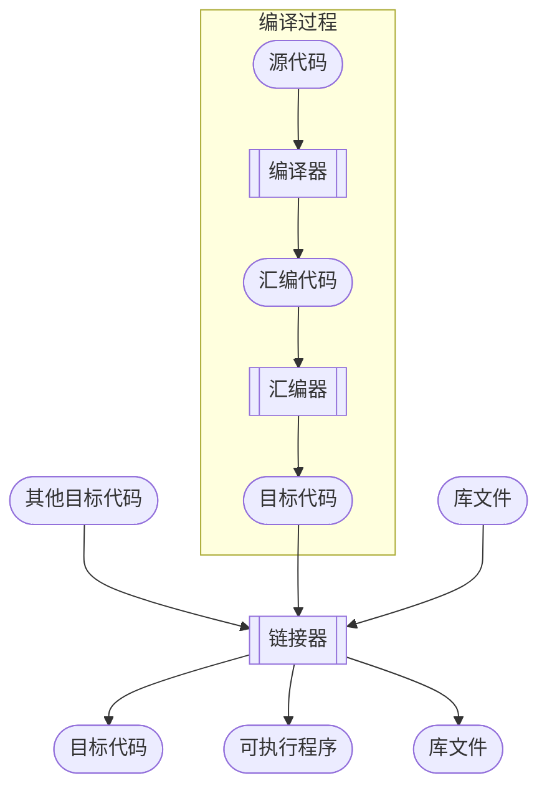

**阅读更多**

<!--more-->

# 1 编译过程



# 2 lib

## 2.1 静态链接库

**后缀：`*.a`**

## 2.2 动态链接库

**后缀：`*.so`**

**如何查看二进制的动态链接库：`ldd`**

**查看动态链接库绑定信息：`ldconfig -v`、`ldconfig -p`**

### 2.2.1 动态库搜索顺序

**搜索如下：详见`man ld.so`**

1. 在环境变量`LD_LIBRARY_PATH`指定的目录下搜索
1. 在`/etc/ld.so.cache`指定的目录中搜索
1. 在`/lib`、`/lib64`中搜索（系统发行版安装的）
1. 在`/usr/lib`、`/usr/lib64`中搜索（其他软件安装的）

### 2.2.2 Linux下so的版本机制介绍

**本小节转载摘录自[一文读懂Linux下动态链接库版本管理及查找加载方式](https://blog.ideawand.com/2020/02/15/how-does-linux-shared-library-versioning-works/)**

在`/lib64`、`/usr/lib64`、`/usr/local/lib64`目录下，会看到很多具有下列特征的软连接，其中`x`、`y`、`z`为数字, 那么这些软连接和他们后面的数字有什么用途呢？

```
libfoo.so    ->  libfoo.so.x
libfoo.so.x  ->  libfoo.so.x.y.z
libbar.so.x  ->  libbar.so.x.y
```

这里的`x`、`y`、`z`分别代表的是这个`so`的主版本号（`MAJOR`），次版本号（`MINOR`），以及发行版本号（`RELEASE`），对于这三个数字各自的含义，以及什么时候会进行增长，不同的文献上有不同的解释，不同的组织遵循的规定可能也有细微的差别，但有一个可以肯定的事情是：主版本号（`MAJOR`）不同的两个`so`库，所暴露出的`API`接口是不兼容的。而对于次版本号，和发行版本号，则有着不同定义，其中一种定义是：次要版本号表示`API`接口的定义发生了改变（比如参数的含义发生了变化），但是保持向前兼容；而发行版本号则是函数内部的一些功能调整、优化、BUG修复，不涉及`API`接口定义的修改

#### 2.2.2.1 几个so库有关名字的介绍

**介绍一下在`so`查找过程中的几个名字**

* **`SONAME`：一组具有兼容`API`的`so`库所共有的名字，其命名特征是`lib<库名>.so.<数字>`这种形式的**
* **`real name`：是真实具有`so`库可执行代码的那个文件，之所以叫`real`是相对于`SONAME`和`linker name`而言的，因为另外两种名字一般都是一个软连接，这些软连接最终指向的文件都是具有`real name`命名形式的文件。`real name`的命名格式中，可能有`2`个数字尾缀，也可能有`3`个数字尾缀，但这不重要。你只要记住，真实的那个，不是以软连接形式存在的，就是一个`real name`**
* **`linker name`：这个名字只是给编译工具链中的连接器使用的名字，和程序运行并没有什么关系，仅仅在链接得到可执行文件的过程中才会用到。它的命名特征是以`lib`开头，以`.so`结尾，不带任何数字后缀的格式**

#### 2.2.2.2 SONAME的作用

假设在你的Linux系统中有3个不同版本的`bar`共享库，他们在磁盘上保存的文件名如下：

* `/usr/lib64/libbar.so.1.3`
* `/usr/lib64/libbar.so.1.5`
* `/usr/lib64/libbar.so.2.1`

假设以上三个文件，都是真实的`so`库文件，而不是软连接，也就是说，上面列出的名字都是`real name`

根据我们之前对版本号的定义，我们可以知道：

* `libbar.so.1.3`和`libbar.so.1.5`之间是互相兼容的
* `libbar.so.2.1`和上述两个库之间互相不兼容

**引入软连接的好处是什么呢？假设有一天，`libbar.so.2.1`库进行了升级，但`API`接口仍然保持兼容，升级后的库文件为`libbar.so.2.2`，这时候，我们只要将之前的软连接重新指向升级后的文件，然后重新启动B程序，B程序就可以使用全新版本的`so`库了，我们并不需要去重新编译链接来更新B程序**

**总结一下上面的逻辑：**

* 通常`SONAME`是一个指向`real name`的软连接
* 应用程序中存储自己所依赖的`so`库的`SONAME`，也就是仅保证主版本号能匹配就行
* 通过修改软连接的指向，可以让应用程序在互相兼容的`so`库中方便切换使用哪一个
* 通常情况下，大家使用最新版本即可，除非是为了在特定版本下做一些调试、开发工作

#### 2.2.2.3 linker name的作用

上一节中我们提到，可执行文件里会存储精确到主版本号的`SONAME`，但是在编译生成可执行文件的过程中，编译器怎么知道应该用哪个主版本号呢？为了回答这个问题，我们从编译链接的过程来梳理一下

假设我们使用`gcc`编译生成一个依赖`foo`库的可执行文件`A`：`gcc A.c -lfoo -o A`

熟悉`gcc`编译的读者们肯定知道，上述的`-l`标记后跟随了`foo`参数，表示我们告诉`gcc`在编译的过程中需要用到一个外部的名为`foo`的库，但这里有一个问题，我们并没有说使用哪一个主版本，我们只给出了一个名字。为了解决这个问题，软链接再次发挥作用，具体流程如下：

**根据linux下动态链接库的命名规范，`gcc`会根据`-lfoo`这个标识拼接出`libfoo.so`这个文件名，这个文件名就是`linker name`，然后去尝试读取这个文件，并将这个库链接到生成的可执行文件`A`中。在执行编译前，我们可以通过软链接的形式，将`libfoo.so`指向一个具体`so`库，也就是指向一个`real name`，在编译过程中，`gcc`会从这个真实的库中读取出`SONAME`并将它写入到生成的可执行文件`A`中。例如，若`libfoo.so`指向`libfoo.so.1.5`,则生成的可执行文件A使用主版本号为`1`的`SONAME`，即`libfoo.so.1`**

在上述编译过程完成之后，`SONAME`已经被写入可执行文件`A`中了，因此可以看到`linker name`仅仅在编译的过程中，可以起到指定连接那个库版本的作用，除此之外，再无其他作用

**总结一下上面的逻辑：**

* 通常`linker name`是一个指向`real name`的软连接
* 通过修改软连接的指向，可以指定编译生成的可执行文件使用那个主版本号`so`库
* 编译器从软链接指向的文件里找到其`SONAME`，并将`SONAME`写入到生成的可执行文件中
* 通过改变`linker name`软连接的指向，可以将不同主版本号的`SONAME`写入到生成的可执行文件中

## 2.3 LD_PRELOAD

**环境变量`LD_PRELOAD`指定的目录拥有最高优先级**

### 2.3.1 demo

```sh
cat > sample.c << 'EOF'
#include <stdio.h>
int main(void) {
    printf("Calling the fopen() function...\n");
    FILE *fd = fopen("test.txt","r");
    if (!fd) {
        printf("fopen() returned NULL\n");
        return 1;
    }
    printf("fopen() succeeded\n");
    return 0;
}
EOF
gcc -o sample sample.c

./sample 
#-------------------------↓↓↓↓↓↓-------------------------
Calling the fopen() function...
fopen() returned NULL
#-------------------------↑↑↑↑↑↑-------------------------

touch test.txt
./sample
#-------------------------↓↓↓↓↓↓-------------------------
Calling the fopen() function...
fopen() succeeded
#-------------------------↑↑↑↑↑↑-------------------------

cat > myfopen.c << 'EOF'
#include <stdio.h>
FILE *fopen(const char *path, const char *mode) {
    printf("This is my fopen!\n");
    return NULL;
}
EOF

gcc -o myfopen.so myfopen.c -Wall -fPIC -shared

LD_PRELOAD=./myfopen.so ./sample
#-------------------------↓↓↓↓↓↓-------------------------
Calling the fopen() function...
This is my fopen!
fopen() returned NULL
#-------------------------↑↑↑↑↑↑-------------------------
```

## 2.4 libc、glic、libm、libz以及其他常用动态库

`libc`实现了C的标准库函数（例如`strcpy()`），以及`POSIX`函数（例如系统调用`getpid()`）。此外，不是所有的C标准库函数都包含在`libc`中，比如大多数`math`相关的库函数都封装在`libm`中，大多数压缩相关的库函数都封装在`libz`中

系统调用有别于普通函数，它无法被链接器解析。实现系统调用必须引入平台相关的汇编指令。我们可以通过手动实现这些汇编指令来完成系统调用，或者直接使用`libc`（它已经为我们封装好了）

`glibc, GNU C Library`可以看做是`libc`的另一种实现，它不仅包含`libc`的所有功能还包含`libm`以及其他核心库，比如`libpthread`

**其他常用动态库可以参考[Library Interfaces and Headers](https://docs.oracle.com/cd/E86824_01/html/E54772/makehtml-id-7.html#scrolltoc)中的介绍**

1. `libdl`：dynamic linking library
    * **`libdl`主要作用是将那些早已存在于`libc`中的`private dl functions`对外露出，便于用户实现一些特殊的需求。[dlopen in libc and libdl](https://stackoverflow.com/questions/31155824/dlopen-in-libc-and-libdl)**
    * 可以通过`readelf -s /lib64/ld-linux-x86-64.so.2 | grep PRIVATE`查看露出的这些方法

## 2.5 参考

* [Program Library HOWTO](https://tldp.org/HOWTO/Program-Library-HOWTO/shared-libraries.html)
* [Shared Libraries: Understanding Dynamic Loading](https://amir.rachum.com/blog/2016/09/17/shared-libraries/)
* [wiki-Rpath](https://en.wikipedia.org/wiki/Rpath)
* [RPATH handling](https://gitlab.kitware.com/cmake/community/-/wikis/doc/cmake/RPATH-handling)
* [Linux hook：Ring3下动态链接库.so函数劫持](https://www.cnblogs.com/reuodut/articles/13723437.html)
* [What is the difference between LD_PRELOAD_PATH and LD_LIBRARY_PATH?](https://stackoverflow.com/questions/14715175/what-is-the-difference-between-ld-preload-path-and-ld-library-path)
* [What is libstdc++.so.6 and GLIBCXX_3.4.20?](https://unix.stackexchange.com/questions/557919/what-is-libstdc-so-6-and-glibcxx-3-4-20)

# 3 内存管理

**涉及的系统调用（只涉及虚拟内存，物理内存只能通过缺页异常来分配）**

* `brk`：详见`man brk`
* `sbrk`：详见`man sbrk`
* `mmap/munmap`：详见`man mmap/munmap`

而内存管理的`lib`工作在用户态，底层还是通过上述系统调用来分配虚拟内存，不同的`lib`管理内存的算法可能有差异

## 3.1 [tcmalloc](https://github.com/google/tcmalloc)

**如何安装：**

```sh
yum -y install gperftools gperftools-devel
```

### 3.1.1 heapprofile

**`main.cpp`：**

```cpp
#include <stdlib.h>

void* create(unsigned int size) {
    return malloc(size);
}

void create_destory(unsigned int size) {
    void* p = create(size);
    free(p);
}

int main(void) {
    const int loop = 4;
    char* a[loop];
    unsigned int mega = 1024 * 1024;

    for (int i = 0; i < loop; i++) {
        const unsigned int create_size = 1024 * mega;
        create(create_size);

        const unsigned int malloc_size = 1024 * mega;
        a[i] = (char*)malloc(malloc_size);

        const unsigned int create_destory_size = mega;
        create_destory(create_destory_size);
    }

    for (int i = 0; i < loop; i++) {
        free(a[i]);
    }

    return 0;
}
```

**编译：**

```sh
gcc -o main main.cpp -Wall -O3 -lstdc++ -ltcmalloc -std=gnu++17
```

**运行：**

```sh
# 开启 heap profile 功能
export HEAPPROFILE=/tmp/test-profile

./main
```

**输出如下：**

```
Starting tracking the heap
tcmalloc: large alloc 1073741824 bytes == 0x2c46000 @  0x7f6a8fd244ef 0x7f6a8fd43e76 0x400571 0x7f6a8f962555 0x4005bf
Dumping heap profile to /tmp/test-profile.0001.heap (1024 MB allocated cumulatively, 1024 MB currently in use)
Dumping heap profile to /tmp/test-profile.0002.heap (2048 MB allocated cumulatively, 2048 MB currently in use)
Dumping heap profile to /tmp/test-profile.0003.heap (3072 MB allocated cumulatively, 3072 MB currently in use)
Dumping heap profile to /tmp/test-profile.0004.heap (4096 MB allocated cumulatively, 4096 MB currently in use)
Dumping heap profile to /tmp/test-profile.0005.heap (Exiting, 0 bytes in use)
```

**使用`pprof`分析内存：**

```sh
# 文本格式
pprof --text ./main /tmp/test-profile.0001.heap | head -30

# 图片格式
pprof --svg ./main /tmp/test-profile.0001.heap > heap.svg 
```

## 3.2 [jemalloc](https://github.com/jemalloc/jemalloc)

## 3.3 [mimalloc](https://github.com/microsoft/mimalloc)

## 3.4 对比

[What are the differences between (and reasons to choose) tcmalloc/jemalloc and memory pools?](https://stackoverflow.com/questions/9866145/what-are-the-differences-between-and-reasons-to-choose-tcmalloc-jemalloc-and-m)

## 3.5 参考

* [heapprofile.html](https://gperftools.github.io/gperftools/heapprofile.html)
* [Apache Doris-调试工具](https://doris.apache.org/developer-guide/debug-tool.html)

# 4 Address Sanitizer

## 4.1 memory leak

```sh
cat > test_memory_leak.cpp << 'EOF'
#include <iostream>

int main() {
    int *p = new int(5);
    std::cout << *p << std::endl;
    return 0;
}
EOF

gcc test_memory_leak.cpp -o test_memory_leak -g -lstdc++ -fsanitize=address -static-libasan
./test_memory_leak
```

## 4.2 stack buffer underflow

```sh
cat > test_stack_buffer_underflow.cpp << 'EOF'
#include <iostream>

int main() {
    char buffer[5] = "";
    uint8_t num = 5;

    buffer[-1] = 7;

    std::cout << (void*)buffer << std::endl;
    std::cout << (void*)&buffer[-1] << std::endl;
    std::cout << (void*)&num << std::endl;
    std::cout << (uint32_t)num << std::endl;

    return 0;
}
EOF

# 非asan模式
gcc test_stack_buffer_underflow.cpp -o test_stack_buffer_underflow -g -lstdc++ 
./test_stack_buffer_underflow

# asan模式
gcc test_stack_buffer_underflow.cpp -o test_stack_buffer_underflow -g -lstdc++ -fsanitize=address -static-libasan
./test_stack_buffer_underflow
```

## 4.3 参考

* [c++ Asan(address-sanitize)的配置和使用](https://blog.csdn.net/weixin_41644391/article/details/103450401)
* [HOWTO: Use Address Sanitizer](https://www.osc.edu/resources/getting_started/howto/howto_use_address_sanitizer)
* [google/sanitizers](https://github.com/google/sanitizers)

# 5 gun工具链

1. `ld`：the GNU linker
1. `as`：the GNU assembler
1. `gold`：a new, faster, ELF only linker
1. `addr2line`：Converts addresses into filenames and line numbers
1. `ar`：A utility for creating, modifying and extracting from archives
1. `c++filt` - Filter to demangle encoded C++ symbols.
1. `dlltool` - Creates files for building and using DLLs.
1. `elfedit` - Allows alteration of ELF format files.
1. `gprof` - Displays profiling information.
1. `nlmconv` - Converts object code into an NLM.
1. `nm` - Lists symbols from object files.
1. `objcopy` - Copies and translates object files.
1. `objdump` - Displays information from object files.
1. `ranlib` - Generates an index to the contents of an archive.
1. `readelf` - Displays information from any ELF format object file.
1. `size` - Lists the section sizes of an object or archive file.
1. `strings` - Lists printable strings from files.
1. `strip` - Discards symbols.
1. `windmc` - A Windows compatible message compiler.
1. `windres` - A compiler for Windows resource files.

## 5.1 gcc

### 5.1.1 编译选项

1. `-E`：生成预处理文件（`.i`）
1. `-S`：生成汇编文件（`.s`）
    * `-fverbose-asm`：带上一些注释信息
1. `-c`：生成目标文件（`.o`）
1. 默认生成可执行文件

### 5.1.2 编译优化

1. **`-O0`（默认）：不做任何优化**
1. **`-O/-O1`：在不影响编译速度的前提下，尽量采用一些优化算法降低代码大小和可执行代码的运行速度**
1. **`-O2`：该优化选项会牺牲部分编译速度，除了执行`-O1`所执行的所有优化之外，还会采用几乎所有的目标配置支持的优化算法，用以提高目标代码的运行速度**
1. **`-O3`：该选项除了执行-O2所有的优化选项之外，一般都是采取很多向量化算法，提高代码的并行执行程度，利用现代CPU中的流水线，Cache等**
* **不同优化等级对应开启的优化参数参考`man page`**

### 5.1.3 其他参数

1. `-fsized-deallocation`：启用接收`size`参数的`delete`运算符。[C++ Sized Deallocation](http://www.open-std.org/jtc1/sc22/wg21/docs/papers/2013/n3778.html)。现代内存分配器在给对象分配内存时，需要指定大小，出于空间利用率的考虑，不会在对象内存周围存储对象的大小信息。因此在释放对象时，需要查找对象占用的内存大小，查找的开销很大，因为通常不在缓存中。因此，编译器允许提供接受一个`size`参数的`global delete operator`，并用这个版本来对对象进行析构

## 5.2 ld

**种类**

* `GNU gold`
* `LLVM lld`
* [mold](https://github.com/rui314/mold)

**`Flags`**

* -fuse-ld=gold
* -B/usr/local/bin/gcc-mold

## 5.3 参考

# 6 llvm工具链

## 6.1 clang-format

**如何安装`clang-format`**

```sh
npm install -g clang-format
```

**如何使用：在`用户目录`或者`项目根目录`中创建`.clang-format`文件用于指定格式化的方式，下面给一个示例**

* **优先使用项目根目录中的`.clang-format`；如果不存在，则使用用户目录中的`~/.clang-format`**

```
---
Language: Cpp
BasedOnStyle: Google
AccessModifierOffset: -4
AllowShortFunctionsOnASingleLine: Inline
ColumnLimit: 120
ConstructorInitializerIndentWidth: 8 # double of IndentWidth
ContinuationIndentWidth: 8 # double of IndentWidth
DerivePointerAlignment: false # always use PointerAlignment
IndentCaseLabels: false
IndentWidth: 4
PointerAlignment: Left
ReflowComments: false
SortUsingDeclarations: false
SpacesBeforeTrailingComments: 1
```

**注意：**

* 即便`.clang-format`相同，不同版本的`clang-format`格式化的结果也有差异

# 7 其他

## 7.1 动态分析


## 7.2 头文件搜索路径

**头文件`#include "xxx.h"`的搜索顺序**

1. 先搜索当前目录
1. 然后搜索`-I`参数指定的目录
1. 再搜索gcc的环境变量`CPLUS_INCLUDE_PATH`（C程序使用的是`C_INCLUDE_PATH`）
1. 最后搜索gcc的内定目录，包括：
    * `/usr/include`
    * `/usr/local/include`
    * `/usr/lib/gcc/x86_64-redhat-linux/<gcc version>/include`（C头文件）或者`/usr/include/c++/<gcc version>`（C++头文件）

**头文件`#include <xxx.h>`的搜索顺序**

1. 先搜索`-I`参数指定的目录
1. 再搜索gcc的环境变量`CPLUS_INCLUDE_PATH`（C程序使用的是`C_INCLUDE_PATH`）
1. 最后搜索gcc的内定目录，包括：
    * `/usr/include`
    * `/usr/local/include`
    * `/usr/lib/gcc/x86_64-redhat-linux/<gcc version>/include`（C头文件）或者`/usr/include/c++/<gcc version>`（C++头文件）

## 7.3 doc

1. [cpp reference](https://en.cppreference.com/w/)
1. [cppman](https://github.com/aitjcize/cppman/)
    * 安装：`pip install cppman`
    * 示例：`cppman vector::begin`

## 7.4 参考

* [C/C++ 头文件以及库的搜索路径](https://blog.csdn.net/crylearner/article/details/17013187)
