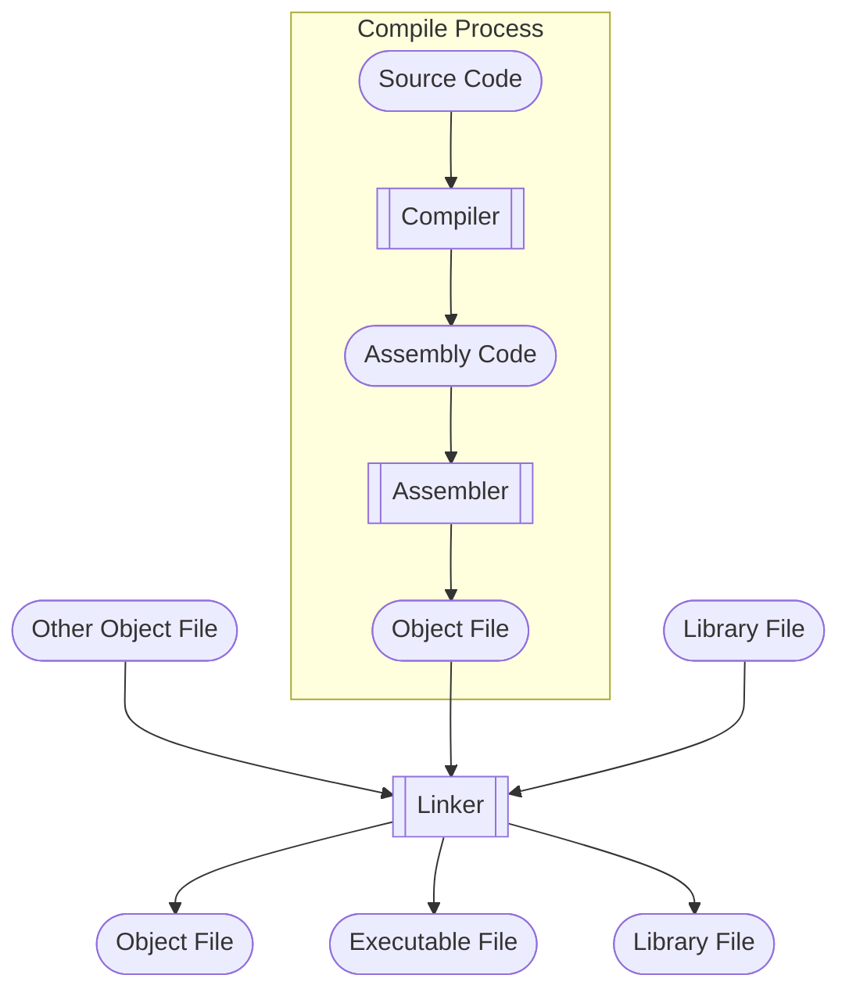

**阅读更多**

<!--more-->

# 1 Compile Process



# 2 Library

## 2.1 Header File Search Order

**头文件`#include "xxx.h"`的搜索顺序**

1. 先搜索当前目录
1. 然后搜索`-I`参数指定的目录
1. 再搜索gcc的环境变量`CPLUS_INCLUDE_PATH`（C程序使用的是`C_INCLUDE_PATH`）
1. 最后搜索gcc的内定目录，包括：
    * `/usr/include`
    * `/usr/local/include`
    * `/usr/lib/gcc/x86_64-redhat-linux/<gcc version>/include`（C头文件）或者`/usr/include/c++/<gcc version>`（C++头文件）

**头文件`#include <xxx.h>`的搜索顺序**

1. 先搜索`-I`参数指定的目录
1. 再搜索gcc的环境变量`CPLUS_INCLUDE_PATH`（C程序使用的是`C_INCLUDE_PATH`）
1. 最后搜索gcc的内定目录，包括：
    * `/usr/include`
    * `/usr/local/include`
    * `/usr/lib/gcc/x86_64-redhat-linux/<gcc version>/include`（C头文件）或者`/usr/include/c++/<gcc version>`（C++头文件）

**可以在编译的时候加上`-v`参数，就可以看到最准确的搜索路径**

* 每个版本的编译器都有自己的头文件，这个路径应该是在构建编译器的时候写到二进制里面去的
* `gcc -v -c -xc++ /dev/null`
* `clang -v -c -xc++ /dev/null`

## 2.2 Static Library

**后缀：`*.a`**

**编译时如何链接静态链接库：**

* `-L`：指定静态链接库的搜索路径
* `-l <static_lib_name>`：
    * 假设静态链接库的名称是`libgflags.a`，那么`<static_lib_name>`既不需要`lib`前缀，也不需要`.a`后缀，即`gflags`

**如何查看二进制的静态链接库：由于链接器在链接时，就会丢弃静态库的名字信息，因此，一般是看不到的**

* `-Xlinker -Map=a.map`：将链接时的信息记录到`a.map`中
* `nm/objdump/readelf/strings`或许可以找到一些静态库相关的`hint`

## 2.3 Dynamic Library

**后缀：`*.so`**

**如何查看二进制的动态链接库：`ldd` (list dynamic dependencies)**

**查看动态链接库绑定信息：`ldconfig -v`、`ldconfig -p`**

* 安装新的库后，需要`sudo ldconfig`更新缓存，否则运行时可能会找不到对应的`so`文件

### 2.3.1 Linux's so version mechanism

**本小节转载摘录自[一文读懂Linux下动态链接库版本管理及查找加载方式](https://blog.ideawand.com/2020/02/15/how-does-linux-shared-library-versioning-works/)**

在`/lib64`、`/usr/lib64`、`/usr/local/lib64`目录下，会看到很多具有下列特征的软连接，其中`x`、`y`、`z`为数字, 那么这些软连接和他们后面的数字有什么用途呢？

```
libfoo.so    ->  libfoo.so.x
libfoo.so.x  ->  libfoo.so.x.y.z
libbar.so.x  ->  libbar.so.x.y
```

这里的`x`、`y`、`z`分别代表的是这个`so`的主版本号（`MAJOR`），次版本号（`MINOR`），以及发行版本号（`RELEASE`），对于这三个数字各自的含义，以及什么时候会进行增长，不同的文献上有不同的解释，不同的组织遵循的规定可能也有细微的差别，但有一个可以肯定的事情是：主版本号（`MAJOR`）不同的两个`so`库，所暴露出的`API`接口是不兼容的。而对于次版本号，和发行版本号，则有着不同定义，其中一种定义是：次要版本号表示`API`接口的定义发生了改变（比如参数的含义发生了变化），但是保持向前兼容；而发行版本号则是函数内部的一些功能调整、优化、BUG修复，不涉及`API`接口定义的修改

#### 2.3.1.1 so Related Names

**介绍一下在`so`查找过程中的几个名字**

* **`SONAME`：一组具有兼容`API`的`so`库所共有的名字，其命名特征是`lib<库名>.so.<数字>`这种形式的**
* **`real name`：是真实具有`so`库可执行代码的那个文件，之所以叫`real`是相对于`SONAME`和`linker name`而言的，因为另外两种名字一般都是一个软连接，这些软连接最终指向的文件都是具有`real name`命名形式的文件。`real name`的命名格式中，可能有`2`个数字尾缀，也可能有`3`个数字尾缀，但这不重要。你只要记住，真实的那个，不是以软连接形式存在的，就是一个`real name`**
* **`linker name`：这个名字只是给编译工具链中的连接器使用的名字，和程序运行并没有什么关系，仅仅在链接得到可执行文件的过程中才会用到。它的命名特征是以`lib`开头，以`.so`结尾，不带任何数字后缀的格式**

#### 2.3.1.2 SONAME

假设在你的Linux系统中有3个不同版本的`bar`共享库，他们在磁盘上保存的文件名如下：

* `/usr/lib64/libbar.so.1.3`
* `/usr/lib64/libbar.so.1.5`
* `/usr/lib64/libbar.so.2.1`

假设以上三个文件，都是真实的`so`库文件，而不是软连接，也就是说，上面列出的名字都是`real name`

根据我们之前对版本号的定义，我们可以知道：

* `libbar.so.1.3`和`libbar.so.1.5`之间是互相兼容的
* `libbar.so.2.1`和上述两个库之间互相不兼容

**引入软连接的好处是什么呢？假设有一天，`libbar.so.2.1`库进行了升级，但`API`接口仍然保持兼容，升级后的库文件为`libbar.so.2.2`，这时候，我们只要将之前的软连接重新指向升级后的文件，然后重新启动B程序，B程序就可以使用全新版本的`so`库了，我们并不需要去重新编译链接来更新B程序**

**总结一下上面的逻辑：**

* 通常`SONAME`是一个指向`real name`的软连接
* 应用程序中存储自己所依赖的`so`库的`SONAME`，也就是仅保证主版本号能匹配就行
* 通过修改软连接的指向，可以让应用程序在互相兼容的`so`库中方便切换使用哪一个
* 通常情况下，大家使用最新版本即可，除非是为了在特定版本下做一些调试、开发工作

#### 2.3.1.3 linker name

上一节中我们提到，可执行文件里会存储精确到主版本号的`SONAME`，但是在编译生成可执行文件的过程中，编译器怎么知道应该用哪个主版本号呢？为了回答这个问题，我们从编译链接的过程来梳理一下

假设我们使用`gcc`编译生成一个依赖`foo`库的可执行文件`A`：`gcc A.c -lfoo -o A`

熟悉`gcc`编译的读者们肯定知道，上述的`-l`标记后跟随了`foo`参数，表示我们告诉`gcc`在编译的过程中需要用到一个外部的名为`foo`的库，但这里有一个问题，我们并没有说使用哪一个主版本，我们只给出了一个名字。为了解决这个问题，软链接再次发挥作用，具体流程如下：

**根据linux下动态链接库的命名规范，`gcc`会根据`-lfoo`这个标识拼接出`libfoo.so`这个文件名，这个文件名就是`linker name`，然后去尝试读取这个文件，并将这个库链接到生成的可执行文件`A`中。在执行编译前，我们可以通过软链接的形式，将`libfoo.so`指向一个具体`so`库，也就是指向一个`real name`，在编译过程中，`gcc`会从这个真实的库中读取出`SONAME`并将它写入到生成的可执行文件`A`中。例如，若`libfoo.so`指向`libfoo.so.1.5`,则生成的可执行文件A使用主版本号为`1`的`SONAME`，即`libfoo.so.1`**

在上述编译过程完成之后，`SONAME`已经被写入可执行文件`A`中了，因此可以看到`linker name`仅仅在编译的过程中，可以起到指定连接那个库版本的作用，除此之外，再无其他作用

**总结一下上面的逻辑：**

* 通常`linker name`是一个指向`real name`的软连接
* 通过修改软连接的指向，可以指定编译生成的可执行文件使用那个主版本号`so`库
* 编译器从软链接指向的文件里找到其`SONAME`，并将`SONAME`写入到生成的可执行文件中
* 通过改变`linker name`软连接的指向，可以将不同主版本号的`SONAME`写入到生成的可执行文件中

## 2.4 Search Order

### 2.4.1 Compilation Time

During compilation, the order in which the linker (such as GNU's `ld`) searches for library files follows certain rules, ensuring that the linker can find and link the correct version of the library. The search order typically goes as follows:

* **Library files specified directly in the command line**: If the compilation command directly specifies the full path to the library files, the linker will first use these specified paths. For example, `gcc main.c /path/to/libmylibrary.a` will link directly to the library at the specified path.
* **Directories specified with the `-L` option**: The compilation command can include the `-L` option to add additional library search directories. The linker searches for library files in these directories in the order that the `-L` options appear. For example, `gcc main.c -L/path/to/libs -lmylibrary` instructs the linker to search for a library named `libmylibrary` in `/path/to/libs`.
* **The `LIBRARY_PATH` environment variable**: If the `LIBRARY_PATH` environment variable is set, the linker also searches for library files in the directories specified by this variable. This environment variable can contain multiple directories and is commonly used to add search paths for non-standard libraries during compilation.
* **System default library search paths**: If the linker does not find the library files in the paths specified above, it will turn to the system default library search paths. These default paths typically include standard library directories such as `/lib` and `/usr/lib`, as well as architecture-specific directories (e.g., `/lib/x86_64-linux-gnu` or `/usr/lib/x86_64-linux-gnu`).
    * **Refer to `ld --verbose | grep SEARCH_DIR` for details**

**The final value of `LIBRARY_PATH`(`gcc -v` can see the actual value) may not necessarily be just the value you set due to several reasons:**

* **Combination with Default and Built-in Paths**: GCC and the linker (`ld`) combine the `LIBRARY_PATH` you set with a set of default and built-in paths. These built-in paths are determined by the GCC's configuration during its installation and are intended to ensure that the compiler and linker can find standard libraries and headers necessary for compilation and linking, even if they are not in standard locations.
* **Augmentation by GCC**: GCC might automatically augment `LIBRARY_PATH` with additional paths based on its internal logic or other environment variables. For instance, GCC might add paths related to its internal libraries or the target architecture's standard library locations.
* **Security Restrictions**: In some secure or restricted environments, modifications to environment variables like `LIBRARY_PATH` may be ignored or overridden by security policies. This is often seen in managed or shared computing environments where administrators want to control the software linking process strictly.

### 2.4.2 Runtime

The runtime search order for shared libraries (.so files) on Unix-like systems is determined by several factors and environment settings. Here’s a general overview of how the runtime search order works: (**Refer to `man ld.so` for details**)

* **`RPATH` and `RUNPATH`**: When a binary is compiled, it can be linked with shared libraries using `-rpath` or `-runpath` linker options. These options embed paths directly into the binary where the dynamic linker (`ld.so` or similar) should look for shared libraries. `RPATH` is checked first, but if `RUNPATH` is also specified, it takes precedence over `RPATH` when the dynamic linker is configured to use `DT_RUNPATH` entries (a newer feature).
    * How to check the runpath of a binary: `readelf -d <binary> | grep 'RPATH\|RUNPATH'`
* **`LD_LIBRARY_PATH` Environment Variable**: Before falling back to default system paths, the dynamic linker checks the directories listed in the `LD_LIBRARY_PATH` environment variable, if it is set. This allows users to override the system's default library paths or the paths embedded in the binary. However, for security reasons, this variable is ignored for setuid/setgid executables.
* **Default System Library Paths**: If the library is not found in any of the previously mentioned locations, the linker searches the default library paths. These typically include `/lib`, `/usr/lib`, and their architecture-specific counterparts (e.g., `/lib/x86_64-linux-gnu` on some Linux distributions). The exact default paths can vary between systems and are defined in the dynamic linker's configuration file (usually `/etc/ld.so.conf`), which can include additional directories beyond the standard ones.
* **DT_RPATH and DT_RUNPATH of Used Libraries (Dependencies)**: If the shared library being loaded has dependencies on other shared libraries, the dynamic linker also searches the `RPATH` and `RUNPATH` of those dependencies. This step ensures that all nested dependencies are resolved correctly.
* **`/etc/ld.so.cache`**: This is a compiled list of candidate libraries previously found in the configured system library paths. The dynamic linker uses this cache to speed up the lookup process. The cache can be updated with the `ldconfig` command, which scans the directories in `/etc/ld.so.conf` and the standard directories for libraries, then builds the cache file.
* **Built-in System Paths**: Finally, if the library still hasn't been found, the linker falls back to built-in system paths hardcoded into the dynamic linker. This usually includes the standard directories like `/lib` and `/usr/lib`.

#### 2.4.2.1 How to update `/etc/ld.so.cache`

Adding content directly to `/etc/ld.so.cache` is not recommended because it's a binary file generated by the `ldconfig` tool. Modifying it manually can lead to system instability or even make your system unbootable. The correct way to add new libraries to the cache involves placing the library files in a directory that is scanned by `ldconfig` and then running `ldconfig` to update the cache.

Here's how you can add a new library to the system and update `/etc/ld.so.cache`:

**Place the Library in a Standard Directory**

First, you need to place your library files (`.so` files) in a standard directory that is recognized by the dynamic linker. Common directories include:

* `/lib`
* `/usr/lib`
* For system-wide libraries not provided by the package manager.

Or you can use a custom directory, but you'll need to tell ldconfig about it, as described below.

**(Optional) Add a Custom Directory to the ld.so Configuration**

If you're using a custom directory (`/custom/lib` for example), you need to add it to the dynamic linker's configuration. Do this by creating a new file in `/etc/ld.so.conf.d/`:

Create `/etc/ld.so.conf.d/mylibs.conf`, Add the path to your custom library directory in this file:

```
/custom/lib
```

**Update the Cache**

After placing your libraries in the appropriate directory and configuring any custom paths, you need to update `/etc/ld.so.cache` by running `ldconfig`. This step requires root privileges:

```sh
sudo ldconfig
```

This command scans the directories listed in `/etc/ld.so.conf`, its `*.conf` includes in `/etc/ld.so.conf.d/`, and the default directories (`/lib`, `/usr/lib`). It then updates `/etc/ld.so.cache` with the paths to the available libraries.

**Check**

```sh
ldconfig -p | grep /custom/lib
```

**All-in-one Command**

```sh
echo '/custom/lib' | sudo tee /etc/ld.so.conf.d/mylibs.conf && sudo ldconfig
```

## 2.5 Link Order

[Why does the order in which libraries are linked sometimes cause errors in GCC?](https://stackoverflow.com/questions/45135/why-does-the-order-in-which-libraries-are-linked-sometimes-cause-errors-in-gcc)

### 2.5.1 Static Linking

In static linking, the order in which libraries are linked can be very important. This is because the linker, which resolves symbols and references in your code, processes libraries in the order they are specified. If one library depends on symbols from another, the dependent library must be listed first. This order dependency ensures that all symbols are resolved correctly at the time of linking, and the final executable contains all necessary code.

**Here's the description of the link process:**

* **Scan Object Files and Libraries**: The linker scans the object files and libraries in the order they are specified on the command line from left to right. This order is crucial because it can determine which definitions of symbols are used when multiple definitions are present.
* **Record Symbols**: As the linker scans, it builds tables of symbols. It distinguishes between undefined symbols (those referenced but not defined in the scanned files) and defined symbols (those that have definitions in the scanned files).
* **Resolve Symbols**: When the linker encounters an undefined symbol, it looks for a definition of that symbol in the subsequent files and libraries. If a library is found that resolves an undefined symbol, the linker links that library's code to satisfy the symbol reference. Libraries are not fully linked unless they contain symbols that resolve undefined references.
* **Remove Resolved Symbols from Unresolved Symbols Table**: Once a symbol is resolved, it is removed from the unresolved symbols table. If there are any unresolved symbols after all files and libraries have been processed, the linker typically throws an error indicating unresolved symbols.

**Example:**

```sh
cat > a.cpp << 'EOF'
extern int a;
int main() {
    return a;
}
EOF

cat > b.cpp << 'EOF'
extern int b;
int a = b;
EOF

cat > d.cpp << 'EOF'
int b;
EOF

g++ -c b.cpp -o b.o
ar cr libb.a b.o
g++ -c d.cpp -o d.o
ar cr libd.a d.o

g++ -L. -ld -lb a.cpp # wrong order
g++ -L. -lb -ld a.cpp # wrong order
g++ a.cpp -L. -ld -lb # wrong order
g++ a.cpp -L. -lb -ld # right order
```

### 2.5.2 Dynamic Linking

In dynamic linking, the order of linking libraries is typically less critical. Libraries are not combined into a single executable at compile time; instead, references to these libraries are resolved at runtime. The dynamic linker/loader handles the process of loading the necessary libraries into memory when the program is executed and resolves symbols on the fly. This means that the system can usually manage dependencies more flexibly, and the specific order in which libraries are listed is not as crucial.

## 2.6 Environment Variables

Please refer to `man ld.so` for details:

### 2.6.1 LD_PRELOAD

Lists shared libraries that are loaded (preloaded) before any other shared libraries. This can be used to override functions in other shared objects.

```sh
cat > sample.c << 'EOF'
#include <stdio.h>
int main(void) {
    printf("Calling the fopen() function...\n");
    FILE *fd = fopen("test.txt","r");
    if (!fd) {
        printf("fopen() returned NULL\n");
        return 1;
    }
    printf("fopen() succeeded\n");
    return 0;
}
EOF
gcc -o sample sample.c

./sample 
#-------------------------↓↓↓↓↓↓-------------------------
Calling the fopen() function...
fopen() returned NULL
#-------------------------↑↑↑↑↑↑-------------------------

touch test.txt
./sample
#-------------------------↓↓↓↓↓↓-------------------------
Calling the fopen() function...
fopen() succeeded
#-------------------------↑↑↑↑↑↑-------------------------

cat > myfopen.c << 'EOF'
#include <stdio.h>
FILE *fopen(const char *path, const char *mode) {
    printf("This is my fopen!\n");
    return NULL;
}
EOF

gcc -o myfopen.so myfopen.c -Wall -fPIC -shared

LD_PRELOAD=./myfopen.so ./sample
#-------------------------↓↓↓↓↓↓-------------------------
Calling the fopen() function...
This is my fopen!
fopen() returned NULL
#-------------------------↑↑↑↑↑↑-------------------------
```

### 2.6.2 LD_DEBUG

Usage: `LD_DEBUG=<type> <binary>`, here are all available types.

1. `all`: Print all debugging information (except statistics and unused; see below).
1. `bindings`: Display information about which definition each symbol is bound to.
1. `files`: Display progress for input file.
1. `libs`: Display library search paths.
1. `reloc`: Display relocation processing.
1. `scopes`: Display scope information.
1. `statistics`: Display relocation statistics.
1. `symbols`: Display search paths for each symbol look-up.
1. `unused`: Determine unused DSOs.
1. `versions`: Display version dependencies.

## 2.7 How to make library

### 2.7.1 How to make static library

```sh
cat > foo.cpp << 'EOF'
#include <iostream>

void foo() {
    std::cout << "hello, this is foo" << std::endl;
}
EOF

cat > main.cpp << 'EOF'
void foo();

int main() {
    foo();
    return 0;
}
EOF

gcc -o foo.o -c foo.cpp -O3 -Wall -fPIC
ar rcs libfoo.a foo.o

gcc -o main main.cpp -O3 -L . -lfoo -lstdc++
./main
```

### 2.7.2 How to make dynamic library

```sh
cat > foo.cpp << 'EOF'
#include <iostream>

void foo() {
    std::cout << "hello, this is foo" << std::endl;
}
EOF

cat > main.cpp << 'EOF'
void foo();

int main() {
    foo();
    return 0;
}
EOF

gcc -o foo.o -c foo.cpp -O3 -Wall -fPIC
gcc -shared -o libfoo.so foo.o

gcc -o main main.cpp -O3 -L . -lfoo -lstdc++
./main # ./main: error while loading shared libraries: libfoo.so: cannot open shared object file: No such file or directory
gcc -o main main.cpp -O3 -L . -Wl,-rpath=`pwd` -lfoo -lstdc++
./main
```

## 2.8 ABI

`ABI`全称是`Application Binary Interface`，它是两个二进制模块间的接口，二进制模块可以是`lib`，可以是操作系统的基础设施，或者一个正在运行的用户程序

> An ABI defines how data structures or computational routines are accessed in machine code, which is a low-level, hardware-dependent format


具体来说，`ABI`定义了如下内容：

1. 指令集、寄存器、栈组织结构，内存访问类型等等
1. 基本数据类型的`size`、`layout`、`alignment`
1. 调用约定，比如参数如何传递、结果如何传递
    * 参数传递到栈中，还是传递到寄存器中
    * 如果传递到寄存器中的话，哪个入参对应哪个寄存器
    * 如果传递到栈中的话，第一个入参是先压栈还是后压栈
    * 返回值使用哪个寄存器
1. 如何发起系统调用
1. `lib`、`object file`等的文件格式

### 2.8.1 cxxabi.h

Some commonly used functions for handling C++ ABI (Application Binary Interface), defined in `<cxxabi.h>`, include(The prefix `__cxa` stands for `C++ eXception ABI`):

* `abi::__cxa_demangle`: Used to demangle symbol names generated by the C++ compiler into a human-readable form. This is useful in debugging and symbol resolution as compilers often mangle function names to distinguish different function overloads, template instantiations, etc.
* `abi::__cxa_throw`: Used to throw exceptions in C++ exception handling. It's typically called within a `try-catch` block's `throw` statement to throw an exception object of a specific type.
* `abi::__cxa_allocate_exception`: Used to allocate memory for an exception object. It takes the size of the exception object as a parameter and returns a pointer to the allocated memory.
* `abi::__cxa_current_exception_type`: Used to retrieve type information for the current exception. It returns a pointer to a `std::type_info` object that describes the type of the current thrown exception.
* `abi::__cxa_bad_cast`: Used to throw a `std::bad_cast` exception when a `dynamic_cast` fails. It's typically called when a runtime type conversion fails.

### 2.8.2 Language-Specific ABI

摘自[What is C++ ABI?](https://www.quora.com/What-is-C-ABI)

> Often, a platform will specify a “base ABI” that specifies how to use that platform’s basic services and that is often done in terms of C language capabilities. However, other programming languages like C++ may require support for additional mechanisms. That’s how you get to language-specific ABIs, including a variety of C++ ABIs. Among the concerns of a C++ ABI are the following:
> * How are classes with virtual functions represented? A C++ ABI will just about always extend the C layout rules for this, and specify implicit pointers in the objects that point to static tables (“vtables”) that themselves point to virtual functions.
> * How are base classes (including virtual base classes) laid out in class objects? Again, this usually starts with the C struct layout rules.
> * How are closure classes (for lambdas) organized?
> * How is RTTI information stored?
> * How are exceptions implemented?
> * How are overloaded functions and operators “named” in object files? This is where “name mangling” usually comes in: The type of the various functions is encoded in their object file names. That also handles the “overloading” that results from template instantiations.
> * How are spilled inline functions and template instantiations handled? After all, different object files might use/spill the same instances, which could lead to collisions.

### 2.8.3 Dual ABI

[Dual ABI](https://gcc.gnu.org/onlinedocs/libstdc++/manual/using_dual_abi.html)

> In the GCC 5.1 release libstdc++ introduced a new library ABI that includes new implementations of std::string and std::list. These changes were necessary to conform to the 2011 C++ standard which forbids Copy-On-Write strings and requires lists to keep track of their size.

宏`_GLIBCXX_USE_CXX11_ABI`用于控制使用新版本还是老版本

* `_GLIBCXX_USE_CXX11_ABI = 0`：老版本
* `_GLIBCXX_USE_CXX11_ABI = 1`：新版本

其他参考：

* [ABI Policy and Guidelines](https://gcc.gnu.org/onlinedocs/libstdc++/manual/abi.html)
* [C/C++ ABI兼容那些事儿](https://zhuanlan.zhihu.com/p/556726543)

### 2.8.4 ABI Mismatch Example

Backgrounds: `std::string` underwent significant changes between the old and new ABI versions.

```sh
cat > library.cpp << 'EOF'
#include <iostream>
#include <string>

extern "C" void printString(const std::string& str) {
    std::cout << "String: " << str << std::endl;
}
EOF

cat > main.cpp << 'EOF'
#include <iostream>
#include <string>

extern "C" void printString(const std::string& str);

int main() {
    std::string myString = "Hello, ABI!";
    printString(myString);
    return 0;
}
EOF

gcc -o library_0.o -D_GLIBCXX_USE_CXX11_ABI=0 -c library.cpp -O3 -lstdc++ -std=gnu++17
gcc -o library_1.o -D_GLIBCXX_USE_CXX11_ABI=1 -c library.cpp -O3 -lstdc++ -std=gnu++17

gcc -o abi_conflict_main_0_library_0 -D_GLIBCXX_USE_CXX11_ABI=0 main.cpp library_0.o -O3 -lstdc++ -std=gnu++17
gcc -o abi_conflict_main_0_library_1 -D_GLIBCXX_USE_CXX11_ABI=0 main.cpp library_1.o -O3 -lstdc++ -std=gnu++17
gcc -o abi_conflict_main_1_library_0 -D_GLIBCXX_USE_CXX11_ABI=1 main.cpp library_0.o -O3 -lstdc++ -std=gnu++17
gcc -o abi_conflict_main_1_library_1 -D_GLIBCXX_USE_CXX11_ABI=1 main.cpp library_1.o -O3 -lstdc++ -std=gnu++17

./abi_conflict_main_0_library_0
./abi_conflict_main_0_library_1
./abi_conflict_main_1_library_0
./abi_conflict_main_1_library_1
```

Why need `extern "C"`? You'll get compile error if ABI mismatch when removing this.

```sh
cat > library.cpp << 'EOF'
#include <iostream>
#include <string>

void printString(const std::string& str) {
    std::cout << "String: " << str << std::endl;
}
EOF

cat > main.cpp << 'EOF'
#include <iostream>
#include <string>

void printString(const std::string& str);

int main() {
    std::string myString = "Hello, ABI!";
    printString(myString);
    return 0;
}
EOF

gcc -o library_0.o -D_GLIBCXX_USE_CXX11_ABI=0 -c library.cpp -O3 -lstdc++ -std=gnu++17
gcc -o library_1.o -D_GLIBCXX_USE_CXX11_ABI=1 -c library.cpp -O3 -lstdc++ -std=gnu++17

gcc -o abi_conflict_main_0_library_0 -D_GLIBCXX_USE_CXX11_ABI=0 main.cpp library_0.o -O3 -lstdc++ -std=gnu++17
gcc -o abi_conflict_main_0_library_1 -D_GLIBCXX_USE_CXX11_ABI=0 main.cpp library_1.o -O3 -lstdc++ -std=gnu++17
gcc -o abi_conflict_main_1_library_0 -D_GLIBCXX_USE_CXX11_ABI=1 main.cpp library_0.o -O3 -lstdc++ -std=gnu++17
gcc -o abi_conflict_main_1_library_1 -D_GLIBCXX_USE_CXX11_ABI=1 main.cpp library_1.o -O3 -lstdc++ -std=gnu++17
```

### 2.8.5 ABI Mismatch Issue

```
# compile works fine
gcc -o main main.cpp -O0 -lstdc++

# Errors occur at runtime
./main

# ./main: /lib64/libstdc++.so.6: version `GLIBCXX_3.4.29' not found (required by ./main)
# ./main: /lib64/libstdc++.so.6: version `GLIBCXX_3.4.30' not found (required by ./main)
# ./main: /lib64/libstdc++.so.6: version `CXXABI_1.3.13' not found (required by ./main)
```

The errors you're encountering at runtime indicate that your application (`main`) is linked against newer versions of the C++ standard library (`libstdc++`) and C++ ABI (`CXXABI`) than are available on your system. This typically happens when your application is compiled with a newer version of GCC than the one installed on the runtime system.

* `gcc -o main main.cpp -O0 -lstdc++ -fuse-ld=gold -Wl,--verbose`: Check the dynamic lib path that used at link time.
* `ldd main`: Check the dynamic lib path that used at runtime.

## 2.9 Commonly-used Librarys

[Library Interfaces and Headers](https://docs.oracle.com/cd/E86824_01/html/E54772/makehtml-id-7.html#scrolltoc)

### 2.9.1 libc/glibc/glib

**You can refer to `man libc/glibc` for details**

* `libc`实现了C的标准库函数，例如`strcpy()`，以及`POSIX`函数，例如系统调用`getpid()`。此外，不是所有的C标准库函数都包含在`libc`中，比如大多数`math`相关的库函数都封装在`libm`中，大多数压缩相关的库函数都封装在`libz`中
    * 系统调用有别于普通函数，它无法被链接器解析。实现系统调用必须引入平台相关的汇编指令。我们可以通过手动实现这些汇编指令来完成系统调用，或者直接使用`libc`（它已经为我们封装好了）
* **`glibc, GNU C Library`可以看做是`libc`的另一种实现，它不仅包含`libc`的所有功能还包含`libm`以及其他核心库，比如`libpthread`**
    * **`glibc`对应的动态库的名字是`libc.so`**
    * **Linux主流的发行版用的都是这个**
    * [The GNU C Library (glibc)](https://www.gnu.org/software/libc/sources.html)
* `glib`是Linux下C的一些工具库，和`glibc`没有关系

**查看`glibc`的版本**

* `ldd --version`：`ldd`隶属于`glibc`，因此`ldd`的版本就是`glibc`的版本
* `getconf GNU_LIBC_VERSION`
* `gcc -print-file-name=libc.so`
* `strings /lib64/libc.so.6 | grep GLIBC`：查看`glibc`的API的版本

### 2.9.2 libdl

The `libdl` library plays a crucial role in the Linux environment as it provides dynamic linking capabilities. Here's a breakdown of its primary functions:

* **Loading of Shared Libraries**: `libdl` enables the dynamic loading of shared libraries into memory during the runtime of an application. This is done without these libraries being statically linked to the executable, allowing for a more flexible and modular approach to application development and deployment.
* **Symbol Resolution**: Once a shared library is loaded, `libdl` provides functions to look up symbols (functions and variables) within these libraries. This allows an application to call functions whose addresses are only known at runtime, facilitating the use of plugins or modules that can extend the application's capabilities without needing to recompile the application.
* **Dynamic Unloading**: It also supports the unloading of shared libraries from memory. This is useful for applications that need to load and unload modules dynamically based on runtime conditions, optimizing memory usage and functionality on the fly.

**The primary functions provided by `libdl` include:**

* `dlopen()`: Opens a shared library and prepares it for use.
* `dlsym()`: Searches for the address of a symbol in the opened libraries.
* `dlclose()`: Closes a shared library, releasing resources associated with it.
* `dlerror()`: Provides string descriptions of errors caused by any of the above functions.

**Supplemental Insights:**

* [dlopen in libc and libdl](https://stackoverflow.com/questions/31155824/dlopen-in-libc-and-libdl): `libdl` is only exposing the **private** dl functions that already exist in libc as well as some wrappers to make the use of the libraries a bit easier. You can see some of this behaviour by looking at the symbol table of `libdl`.
    * Check private methods: `readelf -s /lib64/ld-linux-x86-64.so.2 | grep PRIVATE`

### 2.9.3 Others

1. `libm`：c math library
1. `libz`：compression/decompression library
1. `libpthread`：POSIX threads library

## 2.10 Reference

* [Program Library HOWTO](https://tldp.org/HOWTO/Program-Library-HOWTO/shared-libraries.html)
* [Shared Libraries: Understanding Dynamic Loading](https://amir.rachum.com/blog/2016/09/17/shared-libraries/)
* [wiki-Rpath](https://en.wikipedia.org/wiki/Rpath)
* [RPATH handling](https://gitlab.kitware.com/cmake/community/-/wikis/doc/cmake/RPATH-handling)
* [Linux hook：Ring3下动态链接库.so函数劫持](https://www.cnblogs.com/reuodut/articles/13723437.html)
* [What is the difference between LD_PRELOAD_PATH and LD_LIBRARY_PATH?](https://stackoverflow.com/questions/14715175/what-is-the-difference-between-ld-preload-path-and-ld-library-path)
* [What is libstdc++.so.6 and GLIBCXX_3.4.20?](https://unix.stackexchange.com/questions/557919/what-is-libstdc-so-6-and-glibcxx-3-4-20)
* [多个gcc/glibc版本的共存及指定gcc版本的编译](https://blog.csdn.net/mo4776/article/details/119837501)

# 3 Memory Management

Virtual memory is allocated through system call `brk` and `mmap`, please refer to  for details.

memory management libraries run in user mode and typically use low-level system calls for virtual memory allocation. Different libraries may employ different memory allocation algorithms to effectively manage allocated and deallocated memory blocks in the heap.

## 3.1 tcmalloc

[tcmalloc](https://github.com/google/tcmalloc)


**特点：**

* `Small object allocation`
    * 每个线程都会有个`ThreadCache`，用于为当前线程分配小对象
    * 当其容量不足时，会从`CentralCache`获取额外的存储空间
* `CentralCache allocation management`
    * 用于分配大对象，大对象通常指`>32K`
    * 当内存空间用完后，用`sbrk/mmap`从操作系统中分配内存
    * 在多线程高并发的场景中，`CentralCache`中的锁竞争很容易成为瓶颈
* `Recycle`

**Install:**

```sh
yum -y install gperftools gperftools-devel
```

### 3.1.1 Heap-profile

**`main.cpp`：**

```cpp
#include <stdlib.h>

void* create(unsigned int size) {
    return malloc(size);
}

void create_destory(unsigned int size) {
    void* p = create(size);
    free(p);
}

int main(void) {
    const int loop = 4;
    char* a[loop];
    unsigned int mega = 1024 * 1024;

    for (int i = 0; i < loop; i++) {
        const unsigned int create_size = 1024 * mega;
        create(create_size);

        const unsigned int malloc_size = 1024 * mega;
        a[i] = (char*)malloc(malloc_size);

        const unsigned int create_destory_size = mega;
        create_destory(create_destory_size);
    }

    for (int i = 0; i < loop; i++) {
        free(a[i]);
    }

    return 0;
}
```

**编译：**

```sh
gcc -o main main.cpp -Wall -O3 -lstdc++ -ltcmalloc -std=gnu++17
```

**运行：**

```sh
# 开启 heap profile 功能
export HEAPPROFILE=/tmp/test-profile

./main
```

**输出如下：**

```
Starting tracking the heap
tcmalloc: large alloc 1073741824 bytes == 0x2c46000 @  0x7f6a8fd244ef 0x7f6a8fd43e76 0x400571 0x7f6a8f962555 0x4005bf
Dumping heap profile to /tmp/test-profile.0001.heap (1024 MB allocated cumulatively, 1024 MB currently in use)
Dumping heap profile to /tmp/test-profile.0002.heap (2048 MB allocated cumulatively, 2048 MB currently in use)
Dumping heap profile to /tmp/test-profile.0003.heap (3072 MB allocated cumulatively, 3072 MB currently in use)
Dumping heap profile to /tmp/test-profile.0004.heap (4096 MB allocated cumulatively, 4096 MB currently in use)
Dumping heap profile to /tmp/test-profile.0005.heap (Exiting, 0 bytes in use)
```

**使用`pprof`分析内存：**

```sh
# 文本格式
pprof --text ./main /tmp/test-profile.0001.heap | head -30

# 图片格式
pprof --svg ./main /tmp/test-profile.0001.heap > heap.svg 
```

## 3.2 jemalloc

[jemalloc](https://github.com/jemalloc/jemalloc)


**特点：**

* 在多核、多线程场景下，跨线程分配/释放的性能比较好
* 大量分配小对象时，所占空间会比`tcmalloc`稍多一些
* 对于大对象分配，所造成的的内存碎片会比`tcmalloc`少一些
* 内存分类粒度更细，锁比`tcmalloc`更少

### 3.2.1 Memory Stats

**Key Metrics:**

* **`Allocated Memory (allocated)`:**
    * Meaning: The total amount of memory currently allocated by the application.
    * Usage: This is the memory actively used by your application. Monitoring this helps you understand how much memory your application is consuming at any given time.
* **`Active Memory (active)`:**
    * Meaning: The total amount of memory that is currently in use by the allocator for allocations. This includes both allocated memory and any internal fragmentation.
    * Usage: Helps gauge the memory overhead introduced by internal fragmentation and allocation strategies.
* **`Metadata (metadata)`:**
    * Meaning: The memory used internally by jemalloc for bookkeeping and managing the heap.
    * Usage: Understanding this helps in recognizing the overhead caused by the allocator itself. This includes data structures jemalloc uses to manage free and allocated memory blocks.
* **`Resident Memory (resident)`:**
    * Meaning: The total amount of memory currently mapped into the process’s address space.
    * Usage: This metric provides insight into the actual physical memory usage of your application, including any memory mapped but not currently in active use.
* **`Mapped Memory (mapped)`:**
    * Meaning: The total amount of memory mapped from the operating system.
    * Usage: This shows the total virtual memory footprint of your application, which includes all allocated, active, and metadata memory.
* **`Retained Memory (retained)`:**
    * Meaning: Memory that was allocated and later freed, but is being held by jemalloc for future allocations.
    * Usage: Helps in understanding how much memory is being kept in reserve by the allocator for potential future use, which can be significant in applications with fluctuating memory requirements.

**Detailed Analysis:**

* `Internal Fragmentation`: The difference between allocated and active memory. High internal fragmentation means that there is significant overhead due to the way memory is being managed and allocated.
* `Allocator Overhead`: The difference between active and allocated plus metadata. This helps in understanding how much additional memory jemalloc needs to manage your allocations.
* `Virtual Memory Overhead`: The difference between mapped and resident memory. This shows how much memory is being reserved in the virtual address space but not necessarily backed by physical memory.

### 3.2.2 Install

[jemalloc/INSTALL.md](https://github.com/jemalloc/jemalloc/blob/dev/INSTALL.md)

```sh
git clone https://github.com/jemalloc/jemalloc.git
cd jemalloc
git checkout 5.3.0

./autogen.sh
./configure --prefix=/usr/local --enable-prof
make -j $(( (cores=$(nproc))>1?cores/2:1 ))
sudo make install
```

### 3.2.3 Heap-profile

[Getting Started](https://github.com/jemalloc/jemalloc/wiki/Getting-Started)

```cpp
#include <jemalloc/jemalloc.h>

#include <cstdint>
#include <iostream>
#include <string>

void alloc_1M() {
    new uint8_t[1024 * 1024];
}

void print_jemalloc_stats(const std::string content) {
    uint64_t epoch = 1;
    size_t sz = sizeof(epoch);
    // Refreshing statistics
    if (mallctl("epoch", &epoch, &sz, &epoch, sz) != 0) {
        std::cerr << "mallctl failed" << std::endl;
        exit(1);
    }

#define GET_STAT(name)                                                     \
    do {                                                                   \
        size_t value_sz = sizeof(size_t);                                  \
        size_t value = 0;                                                  \
        if (mallctl("stats." #name, &value, &value_sz, nullptr, 0) == 0) { \
            std::cout << "\tstats." #name ": " << value << std::endl;      \
        } else {                                                           \
            std::cerr << "mallctl failed" << std::endl;                    \
            exit(1);                                                       \
        }                                                                  \
    } while (0)

    std::cout << content << std::endl;

    GET_STAT(allocated);
    GET_STAT(active);
    GET_STAT(metadata);
    GET_STAT(resident);
    GET_STAT(mapped);
}

int main() {
    print_jemalloc_stats("Before:");
    for (int i = 0; i < 100; i++) {
        alloc_1M();
    }
    print_jemalloc_stats("After:");
    return 0;
}
```

**编译执行：**

```sh
gcc -o main main.cpp -O0 -lstdc++ -std=gnu++17 -L`jemalloc-config --libdir` -Wl,-rpath,`jemalloc-config --libdir` -ljemalloc `jemalloc-config --libs`
MALLOC_CONF=prof_leak:true,lg_prof_sample:0,prof_final:true ./main
```

**查看：`jeprof --text main <heap_file>`**

* 第一列：函数直接申请的内存大小，单位MB
* 第二列：第一列占总内存的百分比
* 第三列：第二列的累积值
* 第四列：函数以及函数所有调用的函数申请的内存大小，单位MB
* 第五列：第四列占总内存的百分比
```
Using local file main.
Using local file jeprof.145931.0.f.heap.
Total: 100.1 MB
100.1 100.0% 100.0%    100.1 100.0% prof_backtrace_impl
    0.0   0.0% 100.0%      0.1   0.1% _GLOBAL__sub_I_eh_alloc.cc
    0.0   0.0% 100.0%    100.0  99.9% __libc_start_main
    0.0   0.0% 100.0%      0.1   0.1% __static_initialization_and_destruction_0 (inline)
    0.0   0.0% 100.0%      0.1   0.1% _dl_init_internal
    0.0   0.0% 100.0%      0.1   0.1% _dl_start_user
    0.0   0.0% 100.0%    100.0  99.9% _start
    0.0   0.0% 100.0%    100.0  99.9% alloc_1M
    0.0   0.0% 100.0%    100.1 100.0% imalloc (inline)
    0.0   0.0% 100.0%    100.1 100.0% imalloc_body (inline)
    0.0   0.0% 100.0%    100.1 100.0% je_malloc_default
    0.0   0.0% 100.0%    100.1 100.0% je_prof_backtrace
    0.0   0.0% 100.0%    100.1 100.0% je_prof_tctx_create
    0.0   0.0% 100.0%    100.0  99.9% main
    0.0   0.0% 100.0%      0.1   0.1% pool (inline)
    0.0   0.0% 100.0%    100.1 100.0% prof_alloc_prep (inline)
    0.0   0.0% 100.0%    100.0  99.9% void* fallback_impl
```

**生成svg：**

* `sudo apt install -y graphviz` or `sudo yum install -y graphviz`
* `jeprof --show_bytes --svg main <heap_file> > <svg_file>`

### 3.2.4 Work with http

源码如下：

* [yhirose/cpp-httplib](https://github.com/yhirose/cpp-httplib)
* `path`是固定，即`/pprof/heap`以及`/pprof/profile`
    * `/pprof/profile`的实现估计有问题，拿不到预期的结果

```sh
sudo apt-get install libgoogle-perftools-dev

# or

sudo yum install gperftools-devel
```

```cpp
#include <gperftools/profiler.h>
#include <jemalloc/jemalloc.h>
#include <stdlib.h>

#include <iterator>
#include <sstream>
#include <thread>

#include "httplib.h"

uint8_t* alloc_1M() {
    return new uint8_t[1024 * 1024];
}

int main(int argc, char** argv) {
    httplib::Server svr;

    svr.Get("/pprof/heap", [](const httplib::Request&, httplib::Response& res) {
        std::stringstream fname;
        fname << "./heap." << getpid() << "." << rand();
        auto fname_str = fname.str();
        const char* fname_cstr = fname_str.c_str();

        std::string content;
        if (mallctl("prof.dump", nullptr, nullptr, &fname_cstr, sizeof(const char*)) == 0) {
            std::ifstream f(fname_cstr);
            content = std::string(std::istreambuf_iterator<char>(f), std::istreambuf_iterator<char>());
        } else {
            content = "dump jemalloc prof file failed";
        }

        res.set_content(content, "text/plain");
    });

    svr.Get("/pprof/profile", [](const httplib::Request& req, httplib::Response& res) {
        int seconds = 30;
        const std::string& seconds_str = req.get_param_value("seconds");
        if (!seconds_str.empty()) {
            seconds = std::atoi(seconds_str.c_str());
        }

        std::ostringstream fname;
        fname << "./profile." << getpid() << "." << rand();
        auto fname_str = fname.str();
        const char* fname_cstr = fname_str.c_str();

        ProfilerStart(fname_cstr);
        sleep(seconds);
        ProfilerStop();

        std::ifstream f(fname_cstr, std::ios::in);
        std::string content;
        if (f.is_open()) {
            content = std::string(std::istreambuf_iterator<char>(f), std::istreambuf_iterator<char>());
        } else {
            content = "dump jemalloc prof file failed";
        }

        res.set_content(content, "text/plain");
    });

    std::thread t_alloc([]() {
        while (true) {
            alloc_1M();
            sleep(1);
        }
    });

    svr.listen("0.0.0.0", 16691);

    return 0;
}
```

**Compile and run:**

```sh
gcc -o main main.cpp -O0 -lstdc++ -std=gnu++17 -L`jemalloc-config --libdir` -Wl,-rpath,`jemalloc-config --libdir` -ljemalloc `jemalloc-config --libs` -lprofiler
MALLOC_CONF=prof_leak:true,lg_prof_sample:0,prof_final:true ./main

# In another terminal
jeprof main localhost:16691/pprof/heap # interactive mode
jeprof main localhost:16691/pprof/heap --text # text
jeprof main localhost:16691/pprof/heap --svg > main.svg # graph

jeprof main localhost:16691/pprof/profile --text --seconds=15
```

**How to create a graph:**

```sh
curl http://127.0.0.1:16691/pprof/heap > begin.heap
sleep 10
curl http://127.0.0.1:16691/pprof/heap > end.heap
jeprof --dot --base=begin.heap ./main end.heap > heap-profile.dot
dot -Tsvg heap-profile.dot -o heap-profile.svg
dot -Tpdf heap-profile.dot -o heap-profile.pdf
```

### 3.2.5 Reference

* [Jemalloc内存分配与优化实践](https://mp.weixin.qq.com/s?__biz=Mzg3Mjg2NjU4NA==&mid=2247484507&idx=1&sn=0befa2bec46c3fe64807f5b79b2940d5)
* [[Feature] support heap profile using script](https://github.com/StarRocks/starrocks/pull/35322)

## 3.3 [mimalloc](https://github.com/microsoft/mimalloc)

## 3.4 Comparison

`tcmalloc` and `jemalloc` are both memory allocators, and they are commonly used in software development to manage dynamic memory allocation in programs. However, they have different characteristics and were designed to address different issues. Here's a comparison of the two:

1. **Design Philosophy:**
    * **jemalloc**: Designed by Jason Evans, originally to enhance the performance of FreeBSD. jemalloc focuses on reducing memory fragmentation and improving memory allocation efficiency, especially in concurrent environments. It employs an advanced memory allocation strategy that reduces lock contention, thus improving performance in multithreaded applications.
    * **tcmalloc**: Developed by Google, standing for "Thread-Caching Malloc". The key feature of tcmalloc is that it provides individual memory caches for each thread. This design reduces the reliance on a global memory allocation lock, thus offering better performance in multithreaded applications.
1. **Memory Allocation Strategy**:
    * **jemalloc**: Uses size classes to manage memory allocations, which helps in reducing memory fragmentation. It also employs a delayed recycling strategy to further optimize memory usage.
    * **tcmalloc**: Manages memory allocations for each thread through Thread Local Storage (TLS), meaning each thread has its own small memory pool for quick allocation and deallocation.
1. **Memory Fragmentation Management**:
    * **jemalloc**: Effectively reduces memory fragmentation through its sophisticated memory allocation strategy.
    * **tcmalloc**: While its thread caching mechanism can boost performance, it might lead to more memory fragmentation in some scenarios.
1. **Suitable Use Cases**:
    * **jemalloc**: Widely used in applications requiring high-performance memory management, such as databases and large multithreaded applications.
    * **tcmalloc**: Particularly suitable for applications that frequently allocate and deallocate memory due to its high-performance thread caching feature.

## 3.5 Hook

### 3.5.1 Override the operator new

```cpp
#include <cstddef>
#include <cstdio>
#include <cstdlib>
#include <iostream>
#include <new>

void* operator new(std::size_t size) {
    std::cout << "Custom new called with size: " << size << std::endl;
    return malloc(size);
}

void operator delete(void* ptr) noexcept {
    std::cout << "Custom delete called" << std::endl;
    free(ptr);
}

extern "C" {
void* __real_malloc(size_t c);

void* __wrap_malloc(size_t c) {
    printf("malloc called with %zu\n", c);
    return __real_malloc(c);
}
}

int main() {
    int* num1 = (int*)malloc(sizeof(int));
    int* num2 = new int;
    return *num1 * *num2;
}
```

```sh
gcc -o main main.cpp -Wl,-wrap=malloc -lstdc++ -std=gnu++17
./main
```

### 3.5.2 Wrap operator new by its mangled name

The mangled name for `operator new` with a `size_t` argument is `_Znwm`.

```cpp
#include <cstddef>
#include <cstdio>
#include <cstdlib>

extern "C" {
void* __real_malloc(size_t c);

void* __wrap_malloc(size_t c) {
    printf("malloc called with %zu\n", c);
    return __real_malloc(c);
}

void* __real__Znwm(size_t c); // operator new

void* __wrap__Znwm(size_t c) {
    printf("operator new called with %zu\n", c);
    return __real__Znwm(c);
}
}

int main() {
    int* num1 = (int*)malloc(sizeof(int));
    int* num2 = new int;
    return *num1 * *num2;
}
```

```sh
gcc -o main main.cpp -Wl,-wrap=malloc -Wl,-wrap=_Znwm -lstdc++ -std=gnu++17
./main
```

### 3.5.3 Work With Library

`foo.cpp` is like this:

```cpp
#include <iostream>

int* foo() {
    std::cout << "hello, this is foo" << std::endl;
    return (int*)malloc(100);
}
```

`main.cpp` is like this:

```cpp
#include <cstdio>
#include <cstdlib>

int* foo();

extern "C" {
void* __real_malloc(size_t c);

void* __wrap_malloc(size_t c) {
    printf("malloc called with %zu\n", c);
    return __real_malloc(c);
}
}

int main() {
    auto* res = foo();
    res[0] = 1;
    return 0;
}
```

#### 3.5.3.1 Static Linking Library(Working)

And here are how to build the program.

```sh
gcc -o foo.o -c foo.cpp -O3 -Wall -fPIC
ar rcs libfoo.a foo.o
gcc -o main main.cpp -O3 -L . -Wl,-wrap=malloc -lfoo -lstdc++

./main
```

And it prints:

```
hello, this is foo
malloc called with 100
```

The reason why static linking works fine with the `-Wl,-wrap=malloc` hook, is because of how static linking works:

* In static linking, the object code (or binary code) for the functions used from the static library is embedded directly into the final executable at link-time.
* So, when you use the `-Wl,-wrap=malloc` linker option, it can intercept and replace all calls to `malloc` in both the `main` program and any static libraries, as they are all being linked together into a single executable at the same time.
* Essentially, the linker sees the entire code (from the main program and the static library) as one unit and can replace all calls to `malloc` with calls to `__wrap_malloc`.

#### 3.5.3.2 Dynamic Linking library(Not Working)

And here are how to build the program.

```sh
gcc -o foo.o -c foo.cpp -O3 -Wall -fPIC
gcc -shared -o libfoo.so foo.o
gcc -o main main.cpp -O3 -L . -Wl,-rpath=`pwd` -Wl,-wrap=malloc  -lfoo -lstdc++

./main
```

And it prints:

```
hello, this is foo
```

Here's a step-by-step breakdown:

1. When you compile `foo.cpp` into `foo.o`, there's a call to `malloc` in the machine code, but it's not yet resolved to an actual memory address. It's just a placeholder that says "I want to call `malloc`".
1. When you link `foo.o` into `libfoo.so`, the call to `malloc` inside `foo` is linked. It's resolved to the `malloc` function provided by the C library.
1. Later, when you link `main.cpp` into an executable, you're using the `-Wl,-wrap=malloc` option, but that only affects calls to `malloc` that are being linked at that time. The call to `malloc` inside `foo` was already linked in step 2, so it's unaffected.

## 3.6 Reference

* [heapprofile.html](https://gperftools.github.io/gperftools/heapprofile.html)
* [Apache Doris-调试工具](https://doris.apache.org/developer-guide/debug-tool.html)
* [调试工具](https://github.com/stdpain/doris-vectorized/blob/master/docs/zh-CN/developer-guide/debug-tool.md)
* [jemalloc的heap profiling](https://www.yuanguohuo.com/2019/01/02/jemalloc-heap-profiling/)

# 4 Name mangling

Name mangling, also known as name decoration or name encoding, is a technique used by compilers to encode the names of functions, variables, and other symbols in a program in a way that includes additional information about their types, namespaces, and sometimes other attributes. Name mangling is primarily used in languages like C++ to support features such as function overloading, function templates, and namespaces.

Here are some key points about name mangling:

* **Function Overloading**: In C++, you can define multiple functions with the same name but different parameter lists. Name mangling ensures that these functions have distinct mangled names so the compiler can differentiate between them during the linking process.
* **Template Specialization**: In C++, templates allow you to write generic code that works with different types. Name mangling encodes the template arguments and specializations so that the compiler can generate the correct code for each specialization.
* **Namespace Resolution**: When you use namespaces to organize your code, name mangling includes the namespace information in the mangled name to avoid naming conflicts.
* **Type Information**: Name mangling can encode information about the types of function parameters and return values, which can be used for type checking and to resolve overloaded function calls.
* **Demangling**: While the mangled names generated by the compiler are not meant to be human-readable, tools and libraries exist to "demangle" these names, converting them back into their original, human-readable form for debugging and error messages.
* **Compiler-Specific**: The specific rules for name mangling are compiler-dependent. Different C++ compilers, such as GCC, Clang, and MSVC, may use different name mangling schemes. These schemes are not standardized by the C++ language standard.

## 4.1 Encoding Elements

Name mangling (also known as name decoration) is a compiler-specific technique to encode C++ symbols into unique names. The exact format and rules for name mangling are dependent on the compiler and its version. Therefore, there isn't a single standard for it. However, many C++ compilers follow (at least loosely) the Itanium C++ ABI for mangling names, especially on Unix-like systems.

Below are some common elements of name mangling based on the Itanium C++ ABI:

1. **Function Names**:
    * `_Z`: Prefix for encoded names.
    * `N`: Begins a nested name.
    * `E`: Ends a nested name.
1. **Namespace and Class Names**:
    * Length of the name followed by the actual name. E.g., `5Outer` for `Outer`.
1. **Types**:
    * `i`: int
    * `l`: long
    * `s`: short
    * `d`: double
    * `f`: float
    * `c`: char
    * `b`: bool
    * `v`: void
    * `P`: Pointer to a type (e.g., `Pi` is pointer to int)
    * `R`: Reference
    * `O`: rvalue reference
    * `C1`, `C2`: Constructor
    * `D1`, `D2`: Destructor
1. **Template Classes**:
    * `I`: Marks the beginning of template arguments.
    * `E`: Marks the end of template arguments.
1. **Const/Volatile qualifiers**:
    * `K`: const
    * `V`: volatile
    * `r`: restrict (from C99)
1. **Function Arguments**:
    * Encoded in order, using their type encodings.
1. **Arrays**:
    * The size followed by the type, e.g., `A10_i` for `int[10]`.
1. **Modifiers**:
    * `U`: Vendor-specific type qualifier.
1. **Special Names**:
    * `_vt`: Virtual table
    * `_qt`: Virtual table for a qualified name
1. **Operators**:
    * Most operators get their own special mangled name, e.g., `_pl` for `operator+`.
1. **CV Qualifiers**:
    * `K`: `const`
    * `V`: `volatile`
1. **Calling Convention**:
    * While the Itanium ABI doesn't specify mangling for calling conventions (because it's designed for architectures with a single calling convention), some other mangling schemes might have special symbols for this.
1. **Other Features**:
    * `S`: String literal
    * And various encodings for other built-in types, custom types, etc.

## 4.2 Example

```cpp
namespace Outer::Inner {

template <typename T>
class Foo {
public:
    Foo(T value) : data(value) {}
    void bar() {}
    void bar() const {}

private:
    T data;
};

void func_no_arg() {}
void func_void(void) {}

void func_one_arg(int x) {}
void func_one_arg(double x) {}
void func_one_arg(long& x) {}

void func2(int x, int y) {}

void func2(double x, double y) {}

} // namespace Outer::Inner

int main() {
    Outer::Inner::Foo<int> foo(5);
    foo.bar();
    const Outer::Inner::Foo<int> cfoo(6);
    cfoo.bar();
    return 0;
}
```

```sh
# gcc-12.3.0
$ gcc -o main main.cpp -lstdc++ -std=gnu++17 -g -ggdb -O0 && nm main | grep '_Z'

0000000000001149 T _ZN5Outer5Inner11func_no_argEv
000000000000116d T _ZN5Outer5Inner12func_one_argEd
000000000000115f T _ZN5Outer5Inner12func_one_argEi
000000000000117d T _ZN5Outer5Inner12func_one_argERl
000000000000123e W _ZN5Outer5Inner3FooIiE3barEv
0000000000001222 W _ZN5Outer5Inner3FooIiEC1Ei
0000000000001222 W _ZN5Outer5Inner3FooIiEC2Ei
000000000000119d T _ZN5Outer5Inner5func2Edd
000000000000118c T _ZN5Outer5Inner5func2Eii
0000000000001154 T _ZN5Outer5Inner9func_voidEv
000000000000124e W _ZNK5Outer5Inner3FooIiE3barEv
```

# 5 Address Sanitizer

Address Sanitizer (ASan) has its origins in Google. The project was started as a way to improve the detection of memory-related bugs, which have historically been some of the most elusive and difficult-to-diagnose issues in software development.

Here's a brief history of Address Sanitizer:

1. **Early 2010s Origin**: Address Sanitizer was developed by Konstantin Serebryany, Dmitry Vyukov, and other contributors at Google. The initial focus was on detecting memory issues in C++ programs, but the tool's capabilities expanded over time.
1. **Release and Integration with Major Compilers**: After its development, Address Sanitizer was integrated into major compilers. Clang was one of the first compilers to support ASan, and later, it was incorporated into GCC (GNU Compiler Collection). The ease of use—simply adding a compiler flag—made it very attractive for developers to adopt.
1. **Chromium Adoption**: One of the early and significant adoptions of ASan was in the Chromium project (the open-source foundation of the Chrome browser). Given the scale and complexity of this project, and the potential security implications of memory bugs in a web browser, ASan proved to be an invaluable tool for ensuring the robustness and safety of the code.
1. **Expanding Beyond Address Sanitizer**: The success of ASan led to the development of other "sanitizers" such as Thread Sanitizer (TSan) for detecting data races, Memory Sanitizer (MSan) for uninitialized memory reads, and Undefined Behavior Sanitizer (UBSan) for undefined behavior checks.
1. **Integration in Development Ecosystems**: As ASan's popularity grew, it found its way into various development ecosystems. Debugging tools, continuous integration systems, and even some integrated development environments (IDEs) began offering first-class support for ASan and related tools.
1. **Widening Support**: Beyond just C++ and C, ASan also found applicability in other languages and platforms where the underlying memory model had similarities, further broadening its reach and impact.

It is a tool that can help developers find memory-related issues in their programs, such as:

1. **Use-after-free**: Detects when a program uses memory after it has been freed.
1. **Heap buffer overflow**: Detects when a program writes past the end of an allocated object on the heap.
1. **Stack buffer overflow**: Detects when a program writes past the end of an allocated object on the stack.
1. **Global buffer overflow**: Similar to the above but for global variables.
1. **Memory leaks**: Identifies instances where memory is allocated but not freed, resulting in memory being lost until the program ends.
1. **Use-after-scope**: Detects the usage of local variables outside of their scope.
1. **Initialization errors**: Finds reads from uninitialized memory locations.

Address Sanitizer achieves this by instrumenting the binary code. When compiling code with Address Sanitizer enabled, the compiler (e.g., Clang or GCC) will insert additional checks around memory operations. Additionally, Address Sanitizer uses a shadow memory mechanism to keep track of the status (e.g., allocated, deallocated) of each byte in the application's memory.

Because of this instrumentation, programs compiled with Address Sanitizer tend to run slower and use more memory than their non-instrumented counterparts. However, the benefits in terms of finding and fixing memory-related bugs can be substantial.

To use Address Sanitizer, developers typically pass the `-fsanitize=address` flag (and sometimes additional flags) when compiling and linking their code.

Remember, Address Sanitizer is not a substitute for other types of testing or for manual code review. However, when combined with other testing methodologies, it can be a powerful tool in a developer's arsenal for ensuring software reliability and security.

## 5.1 How it works

Here's an in-depth breakdown of how it works:

1. **Compile-time Instrumentation**:
    * When a program is compiled with ASan enabled (e.g., using the -fsanitize=address flag), the compiler inserts extra instructions around memory operations. These instructions help in checking for memory-related issues.
    * This instrumentation helps the runtime component of ASan understand memory accesses and allocations/deallocations.
1. **Shadow Memory**:
    * ASan uses a concept called "shadow memory" to keep track of each byte of the application's memory.
    * For every 8 bytes of application memory, there's a corresponding byte in the shadow memory. This shadow byte holds metadata about the status of those 8 bytes (whether they are allocated, deallocated, part of a redzone, etc.).
    * Using shadow memory, ASan can quickly check the status of a memory location whenever the program accesses it. For example, if a program accesses memory that corresponds to a shadow byte indicating it's deallocated, ASan can immediately flag a use-after-free error.
1. **Redzones**:
    * ASan places "redzones" (extra bytes) around allocated memory. These redzones are used to detect out-of-bounds accesses.
    * If the program accesses memory inside a redzone, it indicates a buffer overflow or underflow.
1. **Allocation and Deallocation:
    * ASan replaces the standard memory allocation and deallocation functions (like malloc and free in C).
    * When memory is allocated, ASan also sets up the corresponding shadow memory and redzones. When memory is deallocated, it is poisoned (marked in a way that any access will be flagged by ASan), helping detect use-after-free bugs.
1. **Memory Leak Detection**:
    * ASan can also track allocations that were never deallocated. At the end of the program's execution, it can report these as memory leaks.
1. **Reporting**:
    * When ASan detects an error, it immediately halts the program and provides a detailed report. This report typically includes the type of error (e.g., buffer overflow), the memory address where the error occurred, and a stack trace, helping developers pinpoint and understand the cause.
1. **Performance Impact**:
    * ASan's checks and shadow memory mechanism introduce overhead. Programs compiled with ASan typically run slower (often around 2x) and consume more memory than their non-instrumented counterparts.
    * It's important to understand that while ASan can detect a variety of memory errors, it's not foolproof. For example, it might not detect all memory leaks, especially if they involve complex data structures. However, its ability to catch many common and critical memory errors makes it a valuable tool for developers.

When you compile your program with Address Sanitizer (ASan) enabled, the standard memory allocation and deallocation functions like `malloc`, `free`, `new`, and `delete` get intercepted or "wrapped" by ASan. This means that when your program calls `malloc`, it's actually calling ASan's version of `malloc`.

This interception is crucial for how ASan functions. Here's why:

1. **Setting up Redzones**: When memory is allocated, ASan's version of `malloc` (or `new` for C++) can add "redzones" around the allocated memory. These redzones help in detecting out-of-bounds accesses.
1. **Shadow Memory Management**: ASan maintains a shadow memory that maps to your program's memory to track the state of each byte (e.g., allocated, deallocated). When memory is allocated or deallocated, ASan's version of the memory functions update the shadow memory accordingly.
1. **Poisoning Memory**: When memory is deallocated using ASan's `free` or `delete`, the memory isn't immediately returned to the system. Instead, it is "poisoned". This means that any subsequent access to this memory will raise an error, helping in detecting use-after-free bugs.
1. **Memory Leak Detection**: By intercepting these calls, ASan can also maintain a list of all current allocations. When the program exits, it checks this list to report any memory that hasn't been deallocated, indicating a memory leak.

Here's an example to illustrate the mechanism:

```cpp
#include <iostream>

int main() {
    std::cout << "Hello AddressSanitizer!\n";
    return 0;
}
```

```sh
# dynamic link
gcc -o main main.cpp -lstdc++ -std=gnu++17 -fsanitize=address

objdump -p main | grep NEEDED
  NEEDED               libasan.so.8
  NEEDED               libstdc++.so.6
  NEEDED               libc.so.6

# It shows that the call malloc was redirect to libasan.so.8
LD_DEBUG="bindings" ./main 2> bind.txt && cat bind.txt | grep malloc
Hello AddressSanitizer!
   2623584:	binding file /lib/x86_64-linux-gnu/libc.so.6 [0] to /lib/x86_64-linux-gnu/libasan.so.8 [0]: normal symbol `malloc' [GLIBC_2.2.5]
   2623584:	binding file ./main [0] to /lib/x86_64-linux-gnu/libasan.so.8 [0]: normal symbol `malloc' [GLIBC_2.2.5]
   2623584:	binding file /lib/x86_64-linux-gnu/libstdc++.so.6 [0] to /lib/x86_64-linux-gnu/libasan.so.8 [0]: normal symbol `malloc' [GLIBC_2.2.5]
```

```sh
# static link
gcc -o main main.cpp -lstdc++ -std=gnu++17 -fsanitize=address -static-libasan

objdump -p main | grep NEEDED
  NEEDED               libstdc++.so.6
  NEEDED               libm.so.6
  NEEDED               libgcc_s.so.1
  NEEDED               libc.so.6

# It shows that the call malloc was redirect to main itself
LD_DEBUG="bindings" ./main 2> bind.txt && cat bind.txt | grep malloc
Hello AddressSanitizer!
   2624551:	binding file /lib/x86_64-linux-gnu/libc.so.6 [0] to ./main [0]: normal symbol `malloc' [GLIBC_2.2.5]
   2624551:	binding file ./main [0] to ./main [0]: normal symbol `malloc' [GLIBC_2.2.5]
   2624551:	binding file /lib/x86_64-linux-gnu/libstdc++.so.6 [0] to ./main [0]: normal symbol `malloc' [GLIBC_2.2.5]
```

## 5.2 memory leak

```sh
cat > test_memory_leak.cpp << 'EOF'
#include <iostream>

int main() {
    int *p = new int(5);
    std::cout << *p << std::endl;
    return 0;
}
EOF

gcc test_memory_leak.cpp -o test_memory_leak -g -lstdc++ -fsanitize=address -static-libasan
./test_memory_leak
```

## 5.3 stack buffer underflow

```sh
cat > test_stack_buffer_underflow.cpp << 'EOF'
#include <iostream>

int main() {
    char buffer[5] = "";
    uint8_t num = 5;

    buffer[-1] = 7;

    std::cout << (void*)buffer << std::endl;
    std::cout << (void*)&buffer[-1] << std::endl;
    std::cout << (void*)&num << std::endl;
    std::cout << (uint32_t)num << std::endl;

    return 0;
}
EOF

# 非asan模式
gcc test_stack_buffer_underflow.cpp -o test_stack_buffer_underflow -g -lstdc++ 
./test_stack_buffer_underflow

# asan模式
gcc test_stack_buffer_underflow.cpp -o test_stack_buffer_underflow -g -lstdc++ -fsanitize=address -static-libasan
./test_stack_buffer_underflow
```

## 5.4 Reference

* [c++ Asan(address-sanitize)的配置和使用](https://blog.csdn.net/weixin_41644391/article/details/103450401)
* [HOWTO: Use Address Sanitizer](https://www.osc.edu/resources/getting_started/howto/howto_use_address_sanitizer)
* [google/sanitizers](https://github.com/google/sanitizers)
* [深入浅出 Sanitizer Interceptor 机制](https://mp.weixin.qq.com/s?__biz=Mzg3Mjg2NjU4NA==&mid=2247483868&idx=1&sn=a85112e88cd187e27f418ff044247956&chksm=cee9f7abf99e7ebdac55e36077b4f915bccbe33a8a6ee9920136a1dc9598e2ae62bb95d3a25f&scene=21#wechat_redirect)

# 6 User-defined Thread

`jump_fcontext` and `make_fcontext` is copy from [context.h](https://github.com/apache/brpc/blob/master/src/bthread/context.h) and [context.cpp](https://github.com/apache/brpc/blob/master/src/bthread/context.cpp)

```cpp
#include <cstddef>
#include <iostream>

typedef void* fcontext_t;

extern "C" {
intptr_t jump_fcontext(fcontext_t* ofc, fcontext_t nfc, intptr_t vp, bool preserve_fpu = false);
fcontext_t make_fcontext(void* sp, size_t size, void (*fn)(intptr_t));
}

__asm(".text\n"                         // Section for code
      ".globl jump_fcontext\n"          // Globally visible symbol
      ".type jump_fcontext,@function\n" // Specifies the symbol type
      ".align 16\n"                     // Aligns the code at 16-byte boundaries
      "jump_fcontext:\n"                // Start of function named 'jump_fcontext'
      "    pushq  %rbp  \n"             // Pushes base pointer onto the stack
      "    pushq  %rbx  \n"             // Pushes bx register onto the stack
      "    pushq  %r15  \n"             // Pushes r15 register onto the stack
      "    pushq  %r14  \n"             // Pushes r14 register onto the stack
      "    pushq  %r13  \n"             // Pushes r13 register onto the stack
      "    pushq  %r12  \n"             // Pushes r12 register onto the stack
      "    leaq  -0x8(%rsp), %rsp\n"    // Decrement the stack pointer by 8 bytes (allocate stack memory)
      "    cmp  $0, %rcx\n"             // Compare rcx register with 0
      "    je  1f\n"                    // If rcx == 0, jump to label 1
      "    stmxcsr  (%rsp)\n"           // Store the contents of the MXCSR register onto the stack
      "    fnstcw   0x4(%rsp)\n"        // Store the control word of FPU onto the stack
      "1:\n"
      "    movq  %rsp, (%rdi)\n" // Save current stack pointer to location pointed by rdi
      "    movq  %rsi, %rsp\n"   // Set stack pointer to value in rsi
      "    cmp  $0, %rcx\n"      // Compare rcx register with 0
      "    je  2f\n"             // If rcx == 0, jump to label 2
      "    ldmxcsr  (%rsp)\n"    // Load value from the stack into the MXCSR register
      "    fldcw  0x4(%rsp)\n"   // Load control word into FPU
      "2:\n"
      "    leaq  0x8(%rsp), %rsp\n"               // Increment the stack pointer by 8 bytes (deallocate stack memory)
      "    popq  %r12  \n"                        // Restore r12 register from the stack
      "    popq  %r13  \n"                        // Restore r13 register from the stack
      "    popq  %r14  \n"                        // Restore r14 register from the stack
      "    popq  %r15  \n"                        // Restore r15 register from the stack
      "    popq  %rbx  \n"                        // Restore bx register from the stack
      "    popq  %rbp  \n"                        // Restore base pointer from the stack
      "    popq  %r8\n"                           // Restore r8 register from the stack
      "    movq  %rdx, %rax\n"                    // Copy value from rdx to rax
      "    movq  %rdx, %rdi\n"                    // Copy value from rdx to rdi
      "    jmp  *%r8\n"                           // Jump to the address in r8
      ".size jump_fcontext,.-jump_fcontext\n"     // Specifies the size of jump_fcontext function
      ".section .note.GNU-stack,\"\",%progbits\n" // Stack properties note for linkers
      ".previous\n");                             // Return to previous section

__asm(".text\n"                         // Section for code
      ".globl make_fcontext\n"          // Globally visible symbol
      ".type make_fcontext,@function\n" // Specifies the symbol type
      ".align 16\n"                     // Aligns the code at 16-byte boundaries
      "make_fcontext:\n"                // Start of function named 'make_fcontext'
      "    movq  %rdi, %rax\n"          // Copy the value of rdi into rax
      "    andq  $-16, %rax\n"          // Align rax to the nearest lower 16-byte boundary
      "    leaq  -0x48(%rax), %rax\n"   // Decrement rax by 72 bytes (0x48) (allocate stack memory)
      "    movq  %rdx, 0x38(%rax)\n"    // Store the value of rdx at memory address rax + 56 bytes (0x38)
      "    stmxcsr  (%rax)\n"           // Store the contents of the MXCSR register at the address in rax
      "    fnstcw   0x4(%rax)\n"        // Store the control word of FPU at memory address rax + 4 bytes
      "    leaq  finish(%rip), %rcx\n"  // Load the address of the `finish` label into rcx
      "    movq  %rcx, 0x40(%rax)\n"    // Store the address from rcx at memory address rax + 64 bytes (0x40)
      "    ret \n"                      // Return from the function
      "finish:\n"                       // Label 'finish'
      "    xorq  %rdi, %rdi\n"          // Zero out the rdi register
      "    call  _exit@PLT\n"           // Call the exit function to terminate
      "    hlt\n"                       // Halt the processor (This should never be reached due to the above _exit call)
      ".size make_fcontext,.-make_fcontext\n"     // Specifies the size of make_fcontext function
      ".section .note.GNU-stack,\"\",%progbits\n" // Stack properties note for linkers
      ".previous\n");                             // Return to previous section

fcontext_t ctx_main;
fcontext_t ctx1;
fcontext_t ctx2;

void func1(intptr_t) {
    std::cout << "func1 step1, jump to func2" << std::endl;
    jump_fcontext(&ctx1, ctx2, 0, false);
    std::cout << "func1 step2, jump to func2" << std::endl;
    jump_fcontext(&ctx1, ctx2, 0, false);
    std::cout << "func1 step3, jump to func2" << std::endl;
    jump_fcontext(&ctx1, ctx2, 0, false);
    std::cout << "func1 step4, jump to func2" << std::endl;
    jump_fcontext(&ctx1, ctx2, 0, false);
    std::cout << "func1 step5, jump to func2" << std::endl;
    jump_fcontext(&ctx1, ctx2, 0, false);
}

void func2(intptr_t) {
    std::cout << "func2 step1, jump to func1" << std::endl;
    jump_fcontext(&ctx2, ctx1, 0, false);
    std::cout << "func2 step2, jump to func1" << std::endl;
    jump_fcontext(&ctx2, ctx1, 0, false);
    std::cout << "func2 step3, jump to func1" << std::endl;
    jump_fcontext(&ctx2, ctx1, 0, false);
    std::cout << "func2 step4, jump to func1" << std::endl;
    jump_fcontext(&ctx2, ctx1, 0, false);
    std::cout << "func2 step5, jump to main" << std::endl;
    jump_fcontext(&ctx2, ctx_main, 0, false);
}

int main() {
    char sp1[4096];
    char sp2[4096];
    std::cout << "create ctx1" << std::endl;
    ctx1 = make_fcontext(sp1 + sizeof(sp1), sizeof(sp1), &func1);
    std::cout << "create ctx2" << std::endl;
    ctx2 = make_fcontext(sp2 + sizeof(sp2), sizeof(sp2), &func2);

    std::cout << "start, jump to func1" << std::endl;
    jump_fcontext(&ctx_main, ctx1, 0, false);
    std::cout << "end, back to main" << std::endl;

    return 0;
}
```

```
create ctx1
create ctx2
start, jump to func1
func1 step1, jump to func2
func2 step1, jump to func1
func1 step2, jump to func2
func2 step2, jump to func1
func1 step3, jump to func2
func2 step3, jump to func1
func1 step4, jump to func2
func2 step4, jump to func1
func1 step5, jump to func2
func2 step5, jump to main
end, back to main
```

# 7 GNU

[ftp.gnu.org](https://ftp.gnu.org/gnu/)

## 7.1 Build & Install

**You can download any version from [gcc-ftp](http://ftp.gnu.org/gnu/gcc/), I choose `gcc-14.1.0`**

**For China, refer to [GCC mirror sites](http://gcc.gnu.org/mirrors.html) for suitable mirrors**

```sh
# Downloads
wget 'https://ftp.gnu.org/gnu/gcc/gcc-14.1.0/gcc-14.1.0.tar.gz'
tar -zxf gcc-14.1.0.tar.gz
cd gcc-14.1.0

# Install prerequisites
./contrib/download_prerequisites

# Compile
./configure --disable-multilib --enable-languages=c,c++
make -j $(( (cores=$(nproc))>1?cores/2:1 ))
sudo make install
```

Post Settings: (Use `sudo ldconfig -p | grep stdc++` to check the default path of `libstdc++.so.6`)

* Centos
    ```sh
    # Remove Original Gcc
    sudo yum remove -y gcc gcc-c++

    # Create soft link
    sudo rm -f /usr/bin/gcc /usr/bin/g++ /usr/bin/cc /usr/bin/c++ /lib64/libstdc++.so.6
    sudo ln -s /usr/local/bin/gcc /usr/bin/gcc
    sudo ln -s /usr/local/bin/g++ /usr/bin/g++
    sudo ln -s /usr/bin/gcc /usr/bin/cc
    sudo ln -s /usr/bin/g++ /usr/bin/c++
    sudo ln -s /usr/local/lib64/libstdc++.so.6.0.33 /lib64/libstdc++.so.6
    ```

* Ubuntu
  ```sh
    # Remove Original Gcc
    sudo apt remove -y gcc g++

    # Create soft link
    sudo rm -f /usr/bin/gcc /usr/bin/g++ /usr/bin/cc /usr/bin/c++ /usr/lib/x86_64-linux-gnu/libstdc++.so.6
    sudo ln -s /usr/local/bin/gcc /usr/bin/gcc
    sudo ln -s /usr/local/bin/g++ /usr/bin/g++
    sudo ln -s /usr/bin/gcc /usr/bin/cc
    sudo ln -s /usr/bin/g++ /usr/bin/c++
    sudo ln -s /usr/local/lib64/libstdc++.so.6.0.33 /usr/lib/x86_64-linux-gnu/libstdc++.so.6
  ```

**Issue:**

* `error: ‘fenv_t’ has not been declared in ‘::’`: this error message occur when I'm build gcc-14 inside the docker container of `centos:7.9.2009`
    * [Bug 80196 - fenv_t not declared](https://gcc.gnu.org/bugzilla/show_bug.cgi?id=80196)
    * [Bug 100017 - [11 regression] error: 'fenv_t' has not been declared in '::' -- canadian compilation fails](https://gcc.gnu.org/bugzilla/show_bug.cgi?id=100017)
        * Solution: [Comment 12](https://gcc.gnu.org/bugzilla/show_bug.cgi?id=100017#c12)

## 7.2 GNU Binutils

The GNU Binutils are a collection of binary tools. The main ones are:

* `ld`: the GNU linker.
* `as`: the GNU assembler.
* `gold`: a new, faster, ELF only linker.

But they also include:

* `addr2line`: Converts addresses into filenames and line numbers.
* `ar`: A utility for creating, modifying and extracting from archives.
* `c++filt`: Filter to demangle encoded C++ symbols.
* `dlltool`: Creates files for building and using DLLs.
* `elfedit`: Allows alteration of ELF format files.
* `gprof`: Displays profiling information.
* `gprofng`: Collects and displays application performance data.
* `nlmconv`: Converts object code into an NLM.
* `nm`: Lists symbols from object files.
* `objcopy`: Copies and translates object files.
* `objdump`: Displays information from object files.
* `ranlib`: Generates an index to the contents of an archive.
* `readelf`: Displays information from any ELF format object file.
* `size`: Lists the section sizes of an object or archive file.
* `strings`: Lists printable strings from files.
* `strip`: Discards symbols.
* `windmc`: A Windows compatible message compiler.
* `windres`: A compiler for Windows resource files.

As well as some libraries:

* `libbfd`: A library for manipulating binary files in a variety of different formats.
* `libctf`: A library for manipulating the CTF debug format.
* `libopcodes`: A library for assembling and disassembling a variety of different assembler languages.
* `libsframe`: A library for manipulating the SFRAME debug format.

**Installation:**

* [Index of /gnu/binutils](https://ftp.gnu.org/gnu/binutils/)

```sh
wget https://ftp.gnu.org/gnu/binutils/binutils-2.39.tar.xz
tar -xf binutils-2.39.tar.xz
cd binutils-2.39

./configure
make -j $(( (cores=$(nproc))>1?cores/2:1 ))
sudo make install
```

### 7.2.1 DWARF Error

```
addr2line: Dwarf Error: found dwarf version '5', this reader only handles version 2, 3 and 4 information.
??:?
```

1. Try use different linker.
1. Try use higher version of `binutils`.

## 7.3 gcc

**常用参数说明：**

1. **编译信息**
    * `-v`：输出编译详情，包括头文件搜索路径、一些环境变量的实际值等等
    * `-H`：输出编译过程中使用到的头文件
1. **文件类型**
    *  `-E`：生成预处理文件（`.i`）
    *  `-S`：生成汇编文件（`.s`）
        * `-fverbose-asm`：带上一些注释信息
    *  `-c`：生成目标文件（`.o`）
    *  默认生成可执行文件
1. **优化级别**
    1. `-O0`（默认）：不做任何优化
    1. `-O/-O1`：在不影响编译速度的前提下，尽量采用一些优化算法降低代码大小和可执行代码的运行速度
    1. `-O2`：该优化选项会牺牲部分编译速度，除了执行`-O1`所执行的所有优化之外，还会采用几乎所有的目标配置支持的优化算法，用以提高目标代码的运行速度
    1. `-O3`：该选项除了执行`-O2`所有的优化选项之外，一般都是采取很多向量化算法，提高代码的并行执行程度，利用现代CPU中的流水线，`Cache`等
    * 不同优化等级对应开启的优化参数参考`man page`
1. **调试**
    * `-gz[=type]`：对于`DWARF`格式的文件中的调试部分按照指定的压缩方式进行压缩
    * `-g`：生成调试信息
    * `-ggdb`：生成`gdb`专用的调试信息
    * `-gdwarf`/`-gdwarf-version`：生成`DWARF`格式的调试信息，`version`的可选值有`2/3/4/5`，默认是4
1. **`-print-search-dirs`：打印搜索路径**
1. **`-I <path>`：增加头文件搜索路径**
    * 可以并列使用多个`-I`参数，例如`-I path1 -I path2`
1. **`-L <path>`：增加库文件搜索路径**
1. **`-l<lib_name>`：增加库文件**
    * 搜索指定名称的静态或者动态库，如果同时存在，默认选择动态库
    * 例如`-lstdc++`、`-lpthread`
1. **`-std=<std_version>`：指定标注库类型以及版本信息**
    * 例如`-std=gnu++17`
1. **`-W<xxx>`：warning提示**
    * `-Wall`：启用大部分warning提示（部分warning无法通过该参数默认启用）
    * `-Wno<xxx>`：关闭指定种类的warning提示
    * `-Werror`：所有warning变为error（会导致编译失败）
    * `-Werror=<xxx>`：指定某个warning变为error（会导致编译失败）
1. **`-static`：所有库都用静态链接，包括`libc`和`libc++`**
1. **`-D <macro_name>[=<macro_definition>]`：定义宏**
    * 例如`-D MY_DEMO_MACRO`、`-D MY_DEMO_MACRO=2`、`-D 'MY_DEMO_MACRO="hello"'`、`-D 'ECHO(a)=(a)'`
1. **`-U <macro_name>`：取消宏定义**
1. **`--coverage`：覆盖率测试**
1. **`-fno-access-control`：关闭访问控制，例如在类外可以直接访问某类的私有字段和方法，一般用于单元测试**
1. **向量化相关参数**
    * `-fopt-info-vec`/`-fopt-info-vec-optimized`：当循环进行向量化优化时，输出详细信息
    * `-fopt-info-vec-missed`：当循环无法向量化时，输出详细信息
    * `-fopt-info-vec-note`：输出循环向量化优化的所有详细信息
    * `-fopt-info-vec-all`：开启所有输出向量化详细信息的参数
    * `-fno-tree-vectorize`：关闭向量化
    * **一般来说，需要指定参数后才能使用更大宽度的向量化寄存器**
        * `-mmmx`
        * `-msse`、`-msse2`、`-msse3`、`-mssse3`、`-msse4`、`-msse4a`、`-msse4.1`、`-msse4.2`
        * `-mavx`、`-mavx2`、`-mavx512f`、`-mavx512pf`、`-mavx512er`、`-mavx512cd`、`-mavx512vl`、`-mavx512bw`、`-mavx512dq`、`-mavx512ifma`、`-mavx512vbmi`
        * ...
1. **`-fPIC`：如果目标机器支持，则生成与位置无关的代码，适用于动态链接并避免对全局偏移表大小的任何限制**
1. **`-fomit-frame-pointer`：必要的话，允许部分函数没有栈指针**
    * `-fno-omit-frame-pointer`：所有函数必须包含栈指针
1. `-faligned-new`
1. `-fsized-deallocation`：启用接收`size`参数的`delete`运算符。[C++ Sized Deallocation](http://www.open-std.org/jtc1/sc22/wg21/docs/papers/2013/n3778.html)。现代内存分配器在给对象分配内存时，需要指定大小，出于空间利用率的考虑，不会在对象内存周围存储对象的大小信息。因此在释放对象时，需要查找对象占用的内存大小，查找的开销很大，因为通常不在缓存中。因此，编译器允许提供接受一个`size`参数的`global delete operator`，并用这个版本来对对象进行析构
1. `-mcmodel=small/medium/large`: is an option used in compilers like GCC (GNU Compiler Collection) to specify the memory model for code generation. This option is particularly relevant in systems with large address spaces, such as 64-bit architectures, where how the program accesses memory can significantly impact performance and compatibility.
    * `small`
        * This is the default memory model.
        * Assumes that all symbols are within 2GB of each other.
        * Code and data are assumed to be close, which allows the compiler to use shorter and more efficient instructions for calls and references.
        * Suitable for most applications where the total memory usage (including code, data, and stack) does not exceed 2GB.
    * `medium`
        * Used for applications larger than 2GB but less than a certain threshold (often around tens of GBs).
        * Code is generated under the assumption that it will be within 2GB, but data may be farther away.
        * This model uses absolute addresses for data and thus can handle larger data sizes, but still has limitations on the size of the code.
    * `large`
        * Designed for applications where both the code and data are larger than the limits of the medium model.
        * Uses absolute addresses for both data and code, allowing for very large applications.
        * However, this comes at the cost of efficiency, as the generated code is less optimized compared to the small and medium models.

### 7.3.1 How to link libc++ statically

**Use `g++`:**

```sh
g++ -o main main.cpp -static-libstdc++

# Or

g++ -o main main.cpp -static
```

**Use `gcc`:**

```sh
gcc main.cpp -o main -std=gnu++17 -Wl,-Bstatic -lstdc++ -Wl,-Bdynamic

# Or

gcc main.cpp -o main -std=gnu++17 -static -lstdc++
```

**Use `cmake`:**

```sh
target_compile_options(<target> PRIVATE -static-libstdc++)
target_link_options(<target> PRIVATE -static-libstdc++)
```

## 7.4 ld

**种类**

* `GNU ld`
* `GNU gold`
* `LLVM lld`
* [mold](https://github.com/rui314/mold)

**`gcc`如何指定`linker`**

* `-B/usr/bin`: For GNU ld, setup searching directory
* `-fuse-ld=gold`: For GNU gold
* `-fuse-ld=lld`: For LLVM lld
* `-B/usr/local/bin/gcc-mold`: For mold, setup searching directory

**常用参数说明：**

* `--verbose`：打印链接时的详细信息，包括链接了哪些动态库
* `-l <name>`：增加库文件，查找`lib<name>.a`或者`lib<name>.so`，如果都存在，默认使用`so`版本
* `-L <dir>`：增加库文件搜索路径，其优先级会高于默认的搜索路径。允许指定多个，搜索顺序与其指定的顺序相同
* `-rpath=<dir>`：增加运行时库文件搜索路径（务必用绝路径，否则二进制一旦换目录就无法运行了）。`-L`参数只在编译、链接期间生效，运行时仍然会找不到动态库文件，需要通过该参数指定。因此，对于位于非默认搜索路径下的动态库文件，`-L`与`-Wl,-rpath=`这两个参数通常是一起使用的
    * [What's the difference between `-rpath-link` and `-L`?](https://stackoverflow.com/questions/49138195/whats-the-difference-between-rpath-link-and-l)
    * `readelf -d <binary> | grep 'RPATH\|RUNPATH'`
* `-Bstatic`：修改默认行为，强制使用静态链接库，只对该参数之后出现的库有效。如果找不到对应的静态库会报错（即便有动态库）
* `-Bdynamic`：修改默认行为，强制使用动态链接库，只对该参数之后出现的库有效。如果找不到对应的动态库会报错（即便有静态库）
* `--wrap=<symbol>`
    * 任何指向`<symbol>`的未定义的符号都会被解析为`__wrap_<symbol>`
    * 任何指向`__real_<symbol>`的未定义的符号都会被解析为`<symbol>`
    * 于是，我们就可以在`__wrap_<symbol>`增加额外的逻辑，并最终调用`__real_<symbol>`来实现代理
    ```sh
    cat > proxy_malloc.c << 'EOF'
    #include <stddef.h>
    #include <stdio.h>
    #include <stdlib.h>

    void* __real_malloc(size_t c);

    void* __wrap_malloc(size_t c) {
        printf("malloc called with %zu\n", c);
        return __real_malloc(c);
    }

    int main() {
        int* num = (int*)malloc(sizeof(int));
        return *num;
    }
    EOF

    gcc -o proxy_malloc proxy_malloc.c -Wl,-wrap=malloc

    ./proxy_malloc
    ```

### 7.4.1 How to check default linker

```sh
ls -l $(which ld)

update-alternatives --display ld
```

### 7.4.2 How to print dynamic lib path when linking program

```sh
# default GNU ld
gcc -o your_program your_program.c -Wl,--verbose

# gold
gcc -o your_program your_program.c -fuse-ld=gold -Wl,--verbose

# lld
gcc -o your_program your_program.c -fuse-ld=lld -Wl,--verbose
```

### 7.4.3 How to determine which linker was used to link a binary file

```sh
# method 1
readelf -p .comment <binary_file>

# method 2
strings <binary_file> | grep <linker_name>
```

## 7.5 lto-dump

## 7.6 ENV

**Common:**

* `CC`
* `CXX`
* `CFLAGS`
* `CXXFLAGS`
* `LDFLAGS`：Specifies flags to pass to the linker (`ld`) when building programs

**`man gcc`:**

* `CPATH`: Affects both C and C++ compilers
* `C_INCLUDE_PATH`
* `CPLUS_INCLUDE_PATH`
* `OBJC_INCLUDE_PATH`
* `LIBRARY_PATH`: Specifies the directories to search for library files at compile time

**`man ld`:**

* `LD_LIBRARY_PATH`: Specifies the directories to search for shared libraries (dynamic libraries) at runtime
* `LD_RUN_PATH`: Provides a way to ensure that your program can locate the shared libraries it depends on, regardless of the runtime environment (like `LD_LIBRARY_PATH`), by embedding the necessary search paths directly into the executable

**`man ld.so`**

* `LD_LIBRARY_PATH`
* `LD_PRELOAD`
* `LD_DEBUG`/`LD_DEBUG_OUTPUT`
* `LD_PROFILE`/`LD_PROFILE_OUTPUT`

## 7.7 Reference

# 8 LLVM Tools

## 8.1 Build & Install

**Doc:**

* [Getting Started with the LLVM System](https://llvm.org/docs/GettingStarted.html#getting-the-source-code-and-building-llvm)
* [Getting Started: Building and Running Clang](https://clang.llvm.org/get_started.html)
* [Extra Clang Tools](https://clang.llvm.org/extra/)
    * `clang-tidy`
    * `clang-include-fixer`
    * `clang-rename`
    * `clangd`
    * `clang-doc`

**`LLVM_ENABLE_PROJECTS` vs. `LLVM_ENABLE_RUNTIMES`**

* `LLVM_ENABLE_PROJECTS`
    * Purpose: This option is used to specify which LLVM projects to build. These projects are typically related to the compiler infrastructure and tools.
    * Examples of projects: `clang`, `lldb`, `lld`, etc.
    * Usage: When you specify a project with `LLVM_ENABLE_PROJECTS`, the build system includes it in the build process.
    * How can I know all the possible projects that supported by `LLVM_ENABLE_PROJECTS`?
        * `cmake -B build -DCMAKE_BUILD_TYPE=Release -DLLVM_ENABLE_PROJECTS="invalid" llvm`
* `LLVM_ENABLE_RUNTIMES`
    * Purpose: This option is used to specify which LLVM runtimes to build. These runtimes are libraries and runtime components that are used by programs compiled with LLVM-based compilers.
    * Examples of runtimes: `compiler-rt`, `libcxx`, `libcxxabi`, `libunwind`, etc.
    * Usage: When you specify a runtime with `LLVM_ENABLE_RUNTIMES`, the build system includes it in the build process, typically for building and installing the necessary runtime libraries.
        * If you specify item in `LLVM_ENABLE_RUNTIMES`, then you don't need to include it in the `LLVM_ENABLE_PROJECTS`, otherwise you may get an error.
    * How can I know all the possible projects that supported by `LLVM_ENABLE_RUNTIMES`?
        * `cmake -B build -DCMAKE_BUILD_TYPE=Release -DLLVM_ENABLE_PROJECTS="clang" -DLLVM_ENABLE_RUNTIMES="invalid" llvm`

**Build:**

```sh
LLVM_VERSION=16
LLVM_INSTALL_PREFIX=/usr/local/llvm-${LLVM_VERSION}
LLVM_DIR=llvm-project-${LLVM_VERSION}
LLVM_BUILD_TOOL_TYPE="Ninja"
# LLVM_BUILD_TOOL_TYPE="Unix Makefiles"
git clone -b release/${LLVM_VERSION}.x https://github.com/llvm/llvm-project.git ${LLVM_DIR} --depth 1
cd ${LLVM_DIR}
cmake -B build -DLLVM_ENABLE_PROJECTS="clang;clang-tools-extra;libclc;lld;lldb" \
    -DLLVM_ENABLE_RUNTIMES="libc;libunwind;libcxxabi;pstl;libcxx;compiler-rt" \
    -DCMAKE_BUILD_TYPE=Release \
    -DCMAKE_INSTALL_PREFIX=${LLVM_INSTALL_PREFIX} \
    -G ${LLVM_BUILD_TOOL_TYPE} \
    llvm
cmake --build build -j $(( (cores=$(nproc))>1?cores/2:1 ))
sudo cmake --install build

LLVM_ABI_LIB_PATH=$(find ${LLVM_INSTALL_PREFIX} -name 'libc++.so' | head -n 1)
echo -e "${LLVM_INSTALL_PREFIX}/lib\n${LLVM_ABI_LIB_PATH%/*}" | sudo tee /etc/ld.so.conf.d/llvm-${LLVM_VERSION}.conf && sudo ldconfig
```

**Install specific target(Only for ninja):**

```sh
ninja -C build -t targets | grep -E '^install'

ninja -C build -j $(( (cores=$(nproc))>1?cores/2:1 )) clang
ninja -C build -j $(( (cores=$(nproc))>1?cores/2:1 )) clang-format
ninja -C build -j $(( (cores=$(nproc))>1?cores/2:1 )) clangd
sudo ninja -C build install-clang
sudo ninja -C build install-clang-format
sudo ninja -C build install-clangd
```

### 8.1.1 Tips

1. Build `release/11.x` with high version of gcc or clang, you may need to add additional `-DCMAKE_CXX_STANDARD=17`, otherwise, you may encounter `no member named 'numeric_limits' in namespace 'std'`

## 8.2 clang

**Doc:**

* [Clang documentation](https://clang.llvm.org/docs/)
    * [Diagnostic flags in Clang](https://clang.llvm.org/docs/DiagnosticsReference.html)

**Options:**

* `--gcc-install-dir=<value>`: Use GCC installation in the specified directory, for standard library search path.
    * `--gcc-install-dir=/usr/local/lib/gcc/x86_64-pc-linux-gnu/14.1.0`
* `-stdlib=<value>`: C++ standard library to use
    * `clang -o main main.cpp -stdlib=libc++ -std=c++17 -lc++ -lc++abi`
    * `clang -o main main.cpp -stdlib=libstdc++ -std=gnu++17 -lstdc++`
    * `clang -o main main.cpp --gcc-install-dir=/usr/local/lib/gcc/x86_64-pc-linux-gnu/14.1.0 -stdlib=libstdc++ -std=gnu++17 -lstdc++`

**How to build with `libc++`:**

```sh
cmake -B build \
      -DCMAKE_C_COMPILER=clang \
      -DCMAKE_CXX_COMPILER=clang++ \
      -DCMAKE_CXX_FLAGS="-stdlib=libc++" \
      -DCMAKE_EXE_LINKER_FLAGS="-stdlib=libc++" \
      -DCMAKE_SHARED_LINKER_FLAGS="-stdlib=libc++"
```

## 8.3 clang-format

**如何使用：在`用户目录`或者`项目根目录`中创建`.clang-format`文件用于指定格式化的方式，下面给一个示例**

* **优先使用项目根目录中的`.clang-format`；如果不存在，则使用用户目录中的`~/.clang-format`**

```
---
Language: Cpp
BasedOnStyle: Google
AccessModifierOffset: -4
AllowShortFunctionsOnASingleLine: Inline
ColumnLimit: 120
ConstructorInitializerIndentWidth: 8 # double of IndentWidth
ContinuationIndentWidth: 8 # double of IndentWidth
DerivePointerAlignment: false # always use PointerAlignment
IndentCaseLabels: false
IndentWidth: 4
PointerAlignment: Left
ReflowComments: false
SortUsingDeclarations: false
SpacesBeforeTrailingComments: 1
```

**注意：**

* 即便`.clang-format`相同，不同版本的`clang-format`格式化的结果也有差异

**示例：**

* [StarRocks-format](https://github.com/StarRocks/starrocks/blob/main/.clang-format)

## 8.4 clangd

**`compile_commands.json` vs. `compile_flags.txt`([JSON Compilation Database Format Specification](https://clang.llvm.org/docs/JSONCompilationDatabase.html))**

* For complex projects, tools like `cmake` can generate `compile_commands.json`:
    * First, it will look for `compile_commands.json` in the current directory (or the directory specified by `--compile-commands-dir`).
    * If not found, it will recursively search in parent directories until it finds `compile_commands.json` or reaches the root.
* For simple projects, you can directly configure `compile_flags.txt`:
    * First, it will look for `compile_flags.txt` in the current directory.
    * If not found, it will recursively search in parent directories until it finds `compile_flags.txt` or reaches the root.

**Options:**

* `--query-driver=`: Sets one or more `glob` patterns to search for header files in matching paths.
    * Example: `--query-driver=/usr/bin/**/clang-*,/path/to/repo/**/g++-*`
* `--compile-commands-dir=`: Specifies the path to search for `compile_commands.json`.
    * Example: `--compile-commands-dir=/home/test/code/duckdb/build`

### 8.4.1 .clangd Configuration

[Configuration](https://clangd.llvm.org/config)

We can create a `.clangd` file in the root directory of the project to customize the configuration of `clangd` specific to the project.

**Here is the DuckDB [.clangd configuration file](https://github.com/duckdb/duckdb/blob/main/.clangd).**

* Specifies the `compile_commands.json` path as: `build/clangd`([Can not find duckdb headers](https://github.com/clangd/clangd/issues/1204))

```
CompileFlags:
  CompilationDatabase: build/clangd
  Add: -Wno-unqualified-std-cast-call
```

**Other examples:**

```
CompileFlags:
  # Add additional flags used in compilation, such as -I for include paths.
  Add: [-I/usr/local/include, -I/opt/project/include, -xc++]

Diagnostics:
  # Controls the severity of diagnostics reported by Clangd.
  UnusedIncludes: Warning
  ClangTidy: 
    Add: 
      - "-*,cppcoreguidelines-*"

Index:
  # Path to the directory where Clangd should store the index files.
  Background: On
  External: ["/path/to/external/index"]
  OnDisk: ["/path/to/on-disk/index"]

Hover:
  # Customize the information shown in hover popups.
  ShowAKA: Yes
  ShowSource: Yes

Completion:
  # Customize the behavior of code completion.
  AllScopes: Yes
  FilterAndSort: Yes

CrossFileRename:
  # Enable cross-file renaming feature.
  On: Yes

InlayHints:
  # Configure inlay hints display.
  ParameterNames: Yes
  DeducedTypes: Yes

---
If: 
  PathMatch: ".*\\.cpp$"
  CompileFlags:
    Remove: [-Wall]
    Add: [-Wextra]
```

## 8.5 clang-tidy

[Clang-Tidy](https://clang.llvm.org/extra/clang-tidy/)

* [Clang-Tidy Checks](https://clang.llvm.org/extra/clang-tidy/checks/list.html)

clang-tidy is a clang-based C++ linter tool. Its purpose is to provide an extensible framework for diagnosing and fixing typical programming errors, like style violations, interface misuse, or bugs that can be deduced via static analysis. clang-tidy is modular and provides a convenient interface for writing new checks.

**`.clang-tidy` Lookup mechanism:**

* Clang-Tidy looks for a `.clang-tidy` file in the directory of the source file being analyzed. If it finds one, it uses the configuration specified in that file.
* If no `.clang-tidy` file is found in the source file's directory, Clang-Tidy will search parent directories for a `.clang-tidy` file. This means you can place a `.clang-tidy` file in the root of your project, and it will apply to all files within the project.

**Example:**

```
Checks: >
  -*,
  clang-analyzer-*,
  cppcoreguidelines-rvalue-reference-param-not-moved,
  cppcoreguidelines-virtual-class-destructor,
  google-*,
  -google-build-using-namespace,
  modernize-*,
  -modernize-avoid-c-arrays,
  -modernize-use-nodiscard,
  -modernize-use-trailing-return-type,
  performance-*,
  readability-*,
  -readability-identifier-length,
  -readability-else-after-return,
  -readability-magic-numbers,

WarningsAsErrors: '*'
```

### 8.5.1 Warning Suppress Syntax

We can use `NOLINT`, `NOLINTNEXTLINE`, and `NOLINTBEGIN ... NOLINTEND` to suppress warnings if we don't want to disable rules by default.

```cpp
class Foo {
    // Suppress all the diagnostics for the line
    Foo(int param); // NOLINT

    // Consider explaining the motivation to suppress the warning
    Foo(char param); // NOLINT: Allow implicit conversion from `char`, because <some valid reason>

    // Silence only the specified checks for the line
    Foo(double param); // NOLINT(google-explicit-constructor, google-runtime-int)

    // Silence all checks from the `google` module
    Foo(bool param); // NOLINT(google*)

    // Silence all checks ending with `-avoid-c-arrays`
    int array[10]; // NOLINT(*-avoid-c-arrays)

    // Silence only the specified diagnostics for the next line
    // NOLINTNEXTLINE(google-explicit-constructor, google-runtime-int)
    Foo(bool param);

    // Silence all checks from the `google` module for the next line
    // NOLINTNEXTLINE(google*)
    Foo(bool param);

    // Silence all checks ending with `-avoid-c-arrays` for the next line
    // NOLINTNEXTLINE(*-avoid-c-arrays)
    int array[10];

    // Silence only the specified checks for all lines between the BEGIN and END
    // NOLINTBEGIN(google-explicit-constructor, google-runtime-int)
    Foo(short param);
    Foo(long param);
    // NOLINTEND(google-explicit-constructor, google-runtime-int)

    // Silence all checks from the `google` module for all lines between the BEGIN and END
    // NOLINTBEGIN(google*)
    Foo(bool param);
    // NOLINTEND(google*)

    // Silence all checks ending with `-avoid-c-arrays` for all lines between the BEGIN and END
    // NOLINTBEGIN(*-avoid-c-arrays)
    int array[10];
    // NOLINTEND(*-avoid-c-arrays)
};
```

## 8.6 lld

## 8.7 lldb

# 9 Google Tools

## 9.1 bloaty

[bloaty](https://github.com/google/bloaty) is a size profiler for binaries.

**Install:**

* For dependencies, it will use the existing ones on system, but they may be conflict with ABI versions. So we can comment out some of the `pkg_search_module` or `find_package` calls in `CMakeLists.txt` to force building dependencies itself.

**Usage:**

* Requirements: `<binary>` is compiled with debug info.
* `bloaty -d compileunits <binary>`

# 10 Assorted

## 10.1 Dynamic Analysis


## 10.2 How to check the compile error message

Example:

```
In file included from /starrocks/be/src/exprs/agg/approx_top_k.h:20:
/starrocks/be/src/column/column_hash.h: In instantiation of ‘std::size_t starrocks::StdHashWithSeed<T, seed>::operator()(T) const [with T = std::vector<unsigned char, std::allocator<unsigned char> >; starrocks::PhmapSeed seed = starrocks::PhmapSeed1; std::size_t = long unsigned int]’:
/starrocks/be/src/util/phmap/phmap.h:1723:49:   required from ‘size_t phmap::priv::raw_hash_set<Policy, Hash, Eq, Alloc>::HashElement::operator()(const K&, Args&& ...) const [with K = std::vector<unsigned char, std::allocator<unsigned char> >; Args = {}; Policy = phmap::priv::FlatHashMapPolicy<std::vector<unsigned char, std::allocator<unsigned char> >, starrocks::ApproxTopKState<starrocks::TYPE_VARCHAR>::Counter*>; Hash = starrocks::StdHashWithSeed<std::vector<unsigned char, std::allocator<unsigned char> >, starrocks::PhmapSeed1>; Eq = phmap::EqualTo<std::vector<unsigned char, std::allocator<unsigned char> > >; Alloc = std::allocator<std::pair<const std::vector<unsigned char, std::allocator<unsigned char> >, starrocks::ApproxTopKState<starrocks::TYPE_VARCHAR>::Counter*> >; size_t = long unsigned int]’
/starrocks/be/src/util/phmap/phmap.h:1689:39:   required from ‘size_t phmap::priv::raw_hash_set<Policy, Hash, Eq, Alloc>::hash(const K&) const [with K = std::vector<unsigned char, std::allocator<unsigned char> >; Policy = phmap::priv::FlatHashMapPolicy<std::vector<unsigned char, std::allocator<unsigned char> >, starrocks::ApproxTopKState<starrocks::TYPE_VARCHAR>::Counter*>; Hash = starrocks::StdHashWithSeed<std::vector<unsigned char, std::allocator<unsigned char> >, starrocks::PhmapSeed1>; Eq = phmap::EqualTo<std::vector<unsigned char, std::allocator<unsigned char> > >; Alloc = std::allocator<std::pair<const std::vector<unsigned char, std::allocator<unsigned char> >, starrocks::ApproxTopKState<starrocks::TYPE_VARCHAR>::Counter*> >; size_t = long unsigned int]’
/starrocks/be/src/util/phmap/phmap.h:1625:36:   required from ‘phmap::priv::raw_hash_set<Policy, Hash, Eq, Alloc>::iterator phmap::priv::raw_hash_set<Policy, Hash, Eq, Alloc>::find(key_arg<K>&) [with K = std::vector<unsigned char, std::allocator<unsigned char> >; Policy = phmap::priv::FlatHashMapPolicy<std::vector<unsigned char, std::allocator<unsigned char> >, starrocks::ApproxTopKState<starrocks::TYPE_VARCHAR>::Counter*>; Hash = starrocks::StdHashWithSeed<std::vector<unsigned char, std::allocator<unsigned char> >, starrocks::PhmapSeed1>; Eq = phmap::EqualTo<std::vector<unsigned char, std::allocator<unsigned char> > >; Alloc = std::allocator<std::pair<const std::vector<unsigned char, std::allocator<unsigned char> >, starrocks::ApproxTopKState<starrocks::TYPE_VARCHAR>::Counter*> >; key_arg<K> = std::vector<unsigned char, std::allocator<unsigned char> >]’
/starrocks/be/src/exprs/agg/approx_top_k.h:80:23:   required from ‘void starrocks::ApproxTopKState<LT>::process(const CppType&, int64_t, bool) [with starrocks::LogicalType LT = starrocks::TYPE_VARCHAR; CppType = std::vector<unsigned char, std::allocator<unsigned char> >; int64_t = long int]’
/starrocks/be/src/exprs/agg/approx_top_k.h:75:13:   required from ‘void starrocks::ApproxTopKState<LT>::merge(std::vector<Counter>) [with starrocks::LogicalType LT = starrocks::TYPE_VARCHAR]’
/starrocks/be/src/exprs/agg/approx_top_k.h:239:32:   required from ‘void starrocks::ApproxTopKAggregateFunction<LT, T>::merge(starrocks::FunctionContext*, const starrocks::Column*, starrocks::AggDataPtr, size_t) const [with starrocks::LogicalType LT = starrocks::TYPE_VARCHAR; T = starrocks::Slice; starrocks::AggDataPtr = unsigned char*; size_t = long unsigned int]’
/starrocks/be/src/exprs/agg/approx_top_k.h:215:10:   required from here
/starrocks/be/src/column/column_hash.h:282:101: error: use of deleted function ‘std::hash<std::vector<unsigned char, std::allocator<unsigned char> > >::hash()’
  282 |     std::size_t operator()(T value) const { return phmap_mix_with_seed<sizeof(size_t), seed>()(std::hash<T>()(value)); }
```

When interpreting compiler error messages, especially those involving template instantiation (which can be particularly verbose and intricate), there's a general approach that you can take. Here's how to approach such error messages:

1. **Start At The End:**
    * Often, the actual error (like a type mismatch, use of an undefined variable, etc.) is reported at the end of the message.
    * In your provided message, the core error was at the end, stating the use of a deleted function.
1. **Work Your Way Up:**
    * Once you have the core error in mind, start moving upwards to see where in your code this problem originates. Often, the actual line of your code that triggers the error is one of the last things mentioned before the core error.
    * In your case, the direct line of code causing the error was provided in `column_hash.h`.
1. **Template Call Stack:**
    * Template errors tend to provide a "call stack" of sorts which traces the sequence of template instantiations that led to the error. This can be useful to understand the flow of logic and how you arrived at the error.
    * In your message, this was the sequence starting from `phmap.h:1723:49` and moving through various template functions/classes.
1. **Context:**
    * The initial part of the message usually provides the broader context: where the error started, what file it originated from, and so on.
    * In your output, the initial message pointed to `column_hash.h` being included from `approx_top_k.h`, providing a starting point for the cascade of template instantiation.

In Summary: While the bottom-up approach is useful for quickly identifying the core error and the immediate lines of code causing it, you sometimes need to go top-down to fully understand the context and sequence of events leading to the error. With experience, you'll develop an intuition for quickly scanning and pinpointing the most relevant parts of such error messages.

## 10.3 How to get coverage of code

**Here's how it works: `gcov` determines which files to analyze for coverage information based on the profile data files (`*.gcda` and `*.gcno`) that are generated when you compile and run your program with the appropriate GCC flags (`-fprofile-arcs` and `-ftest-coverage`). Here's a breakdown of how `gcov` knows which files to load:**

1. **Compilation and Execution:**
    * When you compile your C/C++ program with GCC using `-fprofile-arcs` and `-ftest-coverage`, it produces two types of files for each source file:
    * `*.gcno`: These are generated during the compilation. They contain information about the source code's structure (like basic blocks, branches, etc.).
    * `*.gcda`: These are generated when the compiled program is run. They contain the actual coverage data, such as how many times each line of code was executed.
1. **Locating Files:**
    * When you invoke `gcov`, it looks for `.gcno` and `.gcda` files in the current directory by default. These files are named after the source files but with different extensions.
    * For example, if your source file is `example.c`, `gcov` will look for `example.gcno` and `example.gcda` in the current directory.
1. **Matching Source Files:**
    * `gcov` uses the information in these files to match with the corresponding source file. It relies on the path and filename information stored in the `.gcno` and `.gcda` files to find the correct source file.
    * If your source files are in a different directory, you may need to specify the path when running `gcov`, or run `gcov` from the directory containing the `.gcda` and `.gcno` files.
1. **Generating the Report:**
    * Once `gcov` has matched the `.gcno` and `.gcda` files with their corresponding source files, it processes these files to generate a coverage report. This report shows how many times each line in the source file was executed.
1. **Manual Specification:**
    * You can also manually specify which source files to generate reports for by passing their names as arguments to `gcov`.

**Here's an example:**

```cpp
#include <iostream>

void printMessage() {
    std::cout << "Hello, World!" << std::endl;
}

void unusedFunction() {
    std::cout << "This function is never called." << std::endl;
}

int main() {
    printMessage();
    return 0;
}
```

```sh
g++ --coverage -o example example.cpp
./example
gcov example.cpp
cat example.cpp.gcov
```

## 10.4 How to check standard library search path when compiling

Add `-v` option.

## 10.5 ccache

CCache stores its compile cache in a directory specified by the `CCACHE_DIR` environment variable. By default, this directory is located at `~/.ccache` in the user's home directory. The cache directory contains various files and subdirectories that ccache uses to manage its cache of compiled objects.

How to work with cmake:

```sh
export CMAKE_C_COMPILER_LAUNCHER=ccache
export CMAKE_CXX_COMPILER_LAUNCHER=ccache
```

**Usage:**

* `ccache -z`: Zero statistics counters
* `ccache -s -v`: show summary of configuration and statistics counters in human-readable format (use `-v/--verbose` once or twice for more details).
* `ccache --max-size=500G`

## 10.6 Document

1. [cpp reference](https://en.cppreference.com/w/)
1. [cppman](https://github.com/aitjcize/cppman/)
    * 安装：`pip install cppman`
    * 示例：`cppman vector::begin`
    * 重建索引：`cppman -r`

## 10.7 Reference

* [C/C++ 头文件以及库的搜索路径](https://blog.csdn.net/crylearner/article/details/17013187)
