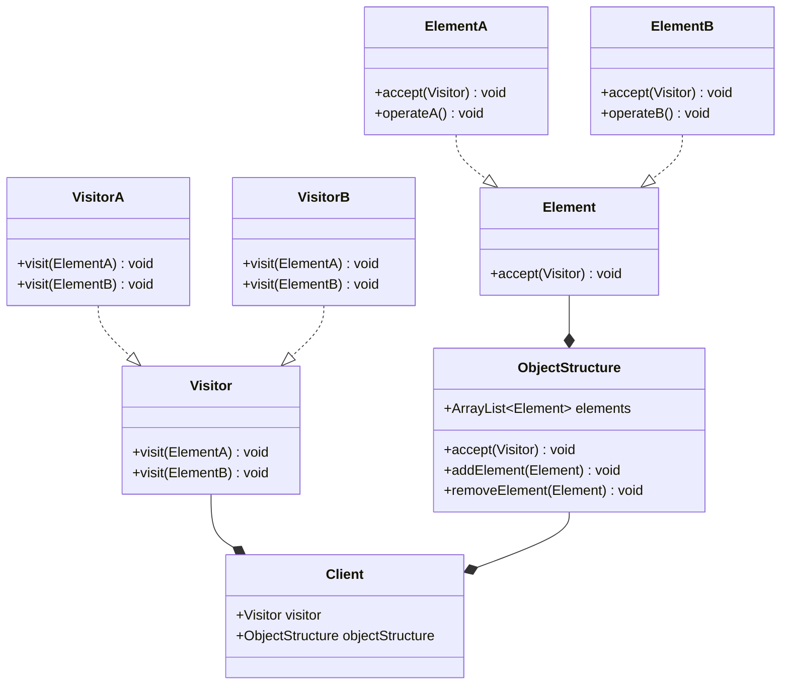

**阅读更多**

<!--more-->

# 1 Overview

Here are some of the commonly used design patterns in Java:

* **Creational Patterns:**
    1. **Singleton Pattern**: Ensures that only one instance of a class is created throughout the application.
    1. **Factory Pattern**: Provides an interface for creating objects, but allows subclasses to decide which class to instantiate.
    1. **Abstract Factory Pattern**: Provides an interface for creating families of related or dependent objects without specifying their concrete classes.
    1. **Builder Pattern**: Separates the construction of complex objects from their representation, allowing the same construction process to create different representations.
    1. **Prototype Pattern**: Creates objects by cloning existing ones, providing a way to create new instances without explicitly invoking a constructor.
* **Structural Patterns:**
    1. **Adapter Pattern**: Converts the interface of a class into another interface that clients expect, allowing classes to work together that couldn't otherwise because of incompatible interfaces.
    1. **Bridge Pattern**: Decouples an abstraction from its implementation, allowing both to vary independently.
    1. **Composite Pattern**: Composes objects into tree structures, representing part-whole hierarchies. It lets clients treat individual objects and compositions uniformly.
    1. **Decorator Pattern**: Dynamically adds behaviors or responsibilities to objects without modifying their structure.
    1. **Proxy Pattern**: Provides a surrogate or placeholder for another object to control access to it.
* **Behavioral Patterns:**
    1. **Observer Pattern**: Defines a one-to-many dependency between objects, so that when one object changes state, all its dependents are notified and updated automatically.
    1. **Strategy Pattern**: Defines a family of interchangeable algorithms, encapsulates each one, and makes them interchangeable within a context.
    1. **Template Method Pattern**: Defines the skeleton of an algorithm in a method, deferring some steps to subclasses.
    1. **Iterator Pattern**: Provides a way to access the elements of an aggregate object sequentially without exposing its underlying representation.
    1. **State Pattern**: Allows an object to alter its behavior when its internal state changes.
    1. **Chain of Responsibility Pattern**: Avoids coupling the sender of a request to its receiver by giving multiple objects a chance to handle the request.
    1. **Command Pattern**: Encapsulates a request as an object, thereby allowing users to parameterize clients with queues, requests, and operations.
    1. **Interpreter Pattern**: Defines a representation for a grammar or language and provides a way to interpret sentences in the language.
    1. **Mediator Pattern**: Defines an object that encapsulates how a set of objects interact, promoting loose coupling by keeping objects from referring to each other explicitly.
    1. **Visitor Pattern**: Defines a new operation to a class without changing the class itself.

# 2 Creational Patterns

## 2.1 Singleton Pattern

The Singleton Pattern is a creational design pattern that ensures a class has only one instance and provides a global point of access to that instance. This pattern is often used when there should be a single, shared instance of a class that needs to be accessed from various parts of the program.

**Examples:**

* case-1:
    ```java
    class Singleton{
        private static Singleton instance=new Singleton();
        
        private Singleton(){}
        
        public static Singleton getSingleton(){
            return instance;
        }
    }
    ```

* case-2
    ```java
    class Singleton{
        private static Singleton instance;

        private Singleton(){}

        public synchronized static Singleton getSingleton(){
            if(instance==null) {
                synchronized (Singleton.class) {
                    if (instance == null) {
                        instance = new Singleton();
                    }
                }
            }
            return instance;
        }
    }
    ```

* case-3
    ```java
    class Singleton{
        
        private static final class LazyInitialize{
            private static Singleton instance=new Singleton();
        }
        
        private Singleton(){}

        public static Singleton getSingleton(){
            return LazyInitialize.instance;
        }
    }
    ```

## 2.2 Factory Pattern

The Factory Pattern is a creational design pattern that provides an interface or base class for creating objects, but delegates the responsibility of determining the concrete type of object to the subclasses. It allows for the creation of objects without specifying their exact class, promoting loose coupling and flexibility in the code.

**Examples:**

```java
// Product interface
interface Vehicle {
    void drive();
}

// Concrete product classes
class Car implements Vehicle {
    @Override
    public void drive() {
        System.out.println("Driving a car.");
    }
}

class Motorcycle implements Vehicle {
    @Override
    public void drive() {
        System.out.println("Riding a motorcycle.");
    }
}

// Factory class
class VehicleFactory {
    public static Vehicle createVehicle(String type) {
        if (type.equalsIgnoreCase("car")) {
            return new Car();
        } else if (type.equalsIgnoreCase("motorcycle")) {
            return new Motorcycle();
        }
        return null; // Return null or throw an exception for unsupported types
    }
}

// Usage
public class Main {
    public static void main(String[] args) {
        Vehicle car = VehicleFactory.createVehicle("car");
        car.drive(); // Output: Driving a car.

        Vehicle motorcycle = VehicleFactory.createVehicle("motorcycle");
        motorcycle.drive(); // Output: Riding a motorcycle.
    }
}
```

In this example, we have an interface `Vehicle` that defines the common behavior of different types of vehicles. The `Car` and `Motorcycle` classes implement this interface and provide their own implementations of the `drive()` method.

The `VehicleFactory` class acts as the factory, providing a static method `createVehicle()` that takes a type parameter. Based on the type provided, it creates and returns the corresponding concrete `Vehicle` object. In this case, it creates either a `Car` or a `Motorcycle` object.

In the `Main` class, we can use the `VehicleFactory` to create instances of vehicles without directly instantiating concrete classes. This promotes flexibility because we can easily extend the factory to create new types of vehicles by adding new classes without modifying the client code.

By using the Factory Pattern, we decouple the client code from the concrete classes, allowing for easier maintenance, code extensibility, and testability.

## 2.3 Abstract Factory Pattern

The Abstract Factory Pattern is a creational design pattern that provides an interface or abstract class for creating families of related or dependent objects without specifying their concrete classes. It is an extension of the Factory Pattern, where multiple factories are grouped together under an abstract factory, allowing the creation of related objects as a family.

**Examples:**

```java
// Abstract product A
interface Window {
    void open();
}

// Concrete product A1
class WindowsWindow implements Window {
    @Override
    public void open() {
        System.out.println("Opening a Windows window.");
    }
}

// Concrete product A2
class MacWindow implements Window {
    @Override
    public void open() {
        System.out.println("Opening a Mac window.");
    }
}

// Abstract product B
interface Button {
    void click();
}

// Concrete product B1
class WindowsButton implements Button {
    @Override
    public void click() {
        System.out.println("Clicking a Windows button.");
    }
}

// Concrete product B2
class MacButton implements Button {
    @Override
    public void click() {
        System.out.println("Clicking a Mac button.");
    }
}

// Abstract factory
interface GUIFactory {
    Window createWindow();
    Button createButton();
}

// Concrete factory for Windows
class WindowsFactory implements GUIFactory {
    @Override
    public Window createWindow() {
        return new WindowsWindow();
    }

    @Override
    public Button createButton() {
        return new WindowsButton();
    }
}

// Concrete factory for Mac
class MacFactory implements GUIFactory {
    @Override
    public Window createWindow() {
        return new MacWindow();
    }

    @Override
    public Button createButton() {
        return new MacButton();
    }
}

// Client
public class Main {
    public static void main(String[] args) {
        // Create the factory for Windows
        GUIFactory windowsFactory = new WindowsFactory();
        // Use the factory to create Windows products
        Window windowsWindow = windowsFactory.createWindow();
        Button windowsButton = windowsFactory.createButton();

        windowsWindow.open();   // Output: Opening a Windows window.
        windowsButton.click();  // Output: Clicking a Windows button.

        // Create the factory for Mac
        GUIFactory macFactory = new MacFactory();
        // Use the factory to create Mac products
        Window macWindow = macFactory.createWindow();
        Button macButton = macFactory.createButton();

        macWindow.open();   // Output: Opening a Mac window.
        macButton.click();  // Output: Clicking a Mac button.
    }
}
```

In this example, we have two families of related products: `Window` and `Button`. Each family has multiple variations or implementations: `WindowsWindow` and `MacWindow` for the `Window` family, and `WindowsButton` and `MacButton` for the `Button` family.

The `GUIFactory` interface represents the abstract factory, declaring the methods `createWindow()` and `createButton()` for creating the respective products. The `WindowsFactory` and `MacFactory` classes are the concrete factories that implement the `GUIFactory` interface and provide the specific implementations of creating Windows or Mac products.

The client code uses the abstract factory (`GUIFactory`) to create the products without directly instantiating the concrete classes. The client code is decoupled from the specific product implementations and can work with any family of products created by the chosen factory.

The Abstract Factory Pattern promotes the creation of families of related objects in a unified and flexible manner. It allows for easy interchangeability of product families by simply switching the concrete factory, without affecting the client code that uses the products.

## 2.4 Builder Pattern

The Builder Pattern is a creational design pattern that provides a way to construct complex objects step by step. It separates the construction of an object from its representation, allowing the same construction process to create different representations of the object.

**Examples:**

```java
// Product class
class Car {
    private String make;
    private String model;
    private int year;
    private int doors;
    
    // Private constructor to enforce the use of the builder
    private Car() {
    }
    
    // Getters for the car properties
    
    public String getMake() {
        return make;
    }
    
    public String getModel() {
        return model;
    }
    
    public int getYear() {
        return year;
    }
    
    public int getDoors() {
        return doors;
    }
    
    // Builder class
    static class Builder {
        private String make;
        private String model;
        private int year;
        private int doors;
        
        // Setter methods for the car properties
        
        public Builder setMake(String make) {
            this.make = make;
            return this;
        }
        
        public Builder setModel(String model) {
            this.model = model;
            return this;
        }
        
        public Builder setYear(int year) {
            this.year = year;
            return this;
        }
        
        public Builder setDoors(int doors) {
            this.doors = doors;
            return this;
        }
        
        // Build method to create the Car object
        
        public Car build() {
            Car car = new Car();
            car.make = this.make;
            car.model = this.model;
            car.year = this.year;
            car.doors = this.doors;
            return car;
        }
    }
}

// Usage
public class Main {
    public static void main(String[] args) {
        Car car = new Car.Builder()
            .setMake("Toyota")
            .setModel("Camry")
            .setYear(2022)
            .setDoors(4)
            .build();
        
        System.out.println(car.getMake());   // Output: Toyota
        System.out.println(car.getModel());  // Output: Camry
        System.out.println(car.getYear());   // Output: 2022
        System.out.println(car.getDoors());  // Output: 4
    }
}
```

In this example, we have a `Car` class that represents a complex object to be constructed. The `Car` class has private properties for the make, model, year, and number of doors. It also has a private constructor to enforce the use of the builder for object creation.

The inner `Builder` class provides setter methods to set the different properties of the car. Each setter method returns the builder object itself (`this`) to support method chaining.

The `Builder` class also has a `build()` method that constructs and returns the final `Car` object. The `build()` method creates a new `Car` instance, sets the properties based on the values provided through the builder, and returns the constructed `Car` object.

In the `Main` class, we can use the builder to create a `Car` object by chaining the setter methods and finally calling the `build()` method. This allows us to construct a `Car` object step by step, setting only the desired properties.

The Builder Pattern provides a more readable and flexible way to create objects, especially when dealing with complex objects with many properties. It allows for the creation of different representations of the object by providing different builders or using optional setter methods in the builder.

## 2.5 Prototype Pattern

The Prototype Pattern is a creational design pattern that allows creating new objects by cloning or copying existing objects, known as prototypes. It provides a way to create objects without relying on traditional constructors, thus avoiding the need to explicitly instantiate classes.

**Examples:**

```java
// Prototype interface
interface Prototype {
    Prototype clone();
}

// Concrete prototypes
class ConcretePrototype1 implements Prototype {
    @Override
    public Prototype clone() {
        return new ConcretePrototype1();
    }
}

class ConcretePrototype2 implements Prototype {
    @Override
    public Prototype clone() {
        return new ConcretePrototype2();
    }
}

// Client
public class Main {
    public static void main(String[] args) {
        Prototype prototype1 = new ConcretePrototype1();
        Prototype clonedPrototype1 = prototype1.clone();
        
        Prototype prototype2 = new ConcretePrototype2();
        Prototype clonedPrototype2 = prototype2.clone();
        
        // Use the cloned prototypes as needed
    }
}
```

In this example, we have an interface `Prototype` that declares the `clone()` method, responsible for creating a copy of the prototype object. The concrete prototypes `ConcretePrototype1` and `ConcretePrototype2` implement this interface and provide their own implementations of the `clone()` method.

In the `Main` class, we create instances of the concrete prototypes `ConcretePrototype1` and `ConcretePrototype2`. To create a copy of a prototype, we simply call the `clone()` method on the prototype object, which returns a new instance of the same concrete prototype class.

By using the Prototype Pattern, we can create new objects by cloning existing objects, eliminating the need for complex instantiation logic. This pattern is particularly useful when creating objects that are costly to create or require initialization with a lot of data. It allows us to create new instances efficiently by copying the existing ones and then modifying them as needed.

It's worth noting that in Java, the `clone()` method is inherited from the `java.lang.Object` class. By implementing the `Cloneable` interface, you can use the built-in `clone()` method to create a shallow copy of an object. However, you may need to override the `clone()` method to perform a deep copy if the object contains mutable references.

# 3 Structural Patterns

## 3.1 Adapter Pattern

The Adapter Pattern is a structural design pattern that allows objects with incompatible interfaces to work together. It acts as a bridge between two incompatible interfaces, enabling them to collaborate and interact seamlessly.

**Examples:**

```java
// Target interface
interface MediaPlayer {
    void play(String audioType, String fileName);
}

// Adaptee class
class AdvancedMediaPlayer {
    void playVlc(String fileName) {
        System.out.println("Playing VLC file: " + fileName);
    }

    void playMp4(String fileName) {
        System.out.println("Playing MP4 file: " + fileName);
    }
}

// Adapter class
class MediaAdapter implements MediaPlayer {
    private AdvancedMediaPlayer advancedMediaPlayer;

    MediaAdapter(String audioType) {
        if (audioType.equalsIgnoreCase("vlc")) {
            advancedMediaPlayer = new AdvancedMediaPlayer();
        }
    }

    @Override
    public void play(String audioType, String fileName) {
        if (audioType.equalsIgnoreCase("vlc")) {
            advancedMediaPlayer.playVlc(fileName);
        }
    }
}

// Client
class AudioPlayer implements MediaPlayer {
    MediaAdapter mediaAdapter;

    @Override
    public void play(String audioType, String fileName) {
        if (audioType.equalsIgnoreCase("mp3")) {
            System.out.println("Playing MP3 file: " + fileName);
        } else if (audioType.equalsIgnoreCase("vlc")) {
            mediaAdapter = new MediaAdapter(audioType);
            mediaAdapter.play(audioType, fileName);
        } else {
            System.out.println("Invalid media type: " + audioType);
        }
    }
}

// Usage
public class Main {
    public static void main(String[] args) {
        AudioPlayer audioPlayer = new AudioPlayer();
        audioPlayer.play("mp3", "song.mp3");
        audioPlayer.play("vlc", "movie.vlc");
        audioPlayer.play("mp4", "video.mp4");
    }
}
```

In this example, we have a `MediaPlayer` interface that defines the target interface for playing audio files. The `AudioPlayer` class implements this interface and handles the playing of MP3 files directly.

The `AdvancedMediaPlayer` class is the existing class with its own interface for playing advanced audio formats like VLC and MP4.

The `MediaAdapter` class acts as an adapter, implementing the `MediaPlayer` interface while internally using the `AdvancedMediaPlayer` to handle the specific audio format.

The `AudioPlayer` class acts as the client and receives requests to play audio files. When it receives a request for an incompatible format (e.g., VLC), it creates an instance of the `MediaAdapter` specific to that format and delegates the play request to the adapter.

By using the Adapter Pattern, we can decouple the client (`AudioPlayer`) from the specific format of the audio being played (`AdvancedMediaPlayer`). The adapter allows the client to work with any audio format by adapting the requests to the appropriate methods of the `AdvancedMediaPlayer`.

In the example, when we play an MP3 file, the `AudioPlayer` handles it directly. When we play a VLC file, the `AudioPlayer` creates a `MediaAdapter` for VLC, which internally uses the `AdvancedMediaPlayer` to play the file.

The Adapter Pattern enables interaction between incompatible interfaces, making it easier to reuse existing classes and integrate them into new systems without modifying their original code.

## 3.2 Bridge Pattern

The Bridge Pattern is a structural design pattern that decouples an abstraction from its implementation, allowing both to vary independently. It provides a way to separate the interface (abstraction) and the implementation into separate class hierarchies, which can evolve independently of each other.

**Examples:**

```java
// Abstraction interface
interface Shape {
    void draw();
}

// Concrete implementation classes
class Circle implements Shape {
    private final String color;

    Circle(String color) {
        this.color = color;
    }

    @Override
    public void draw() {
        System.out.println("Drawing a " + color + " circle.");
    }
}

class Rectangle implements Shape {
    private final String color;

    Rectangle(String color) {
        this.color = color;
    }

    @Override
    public void draw() {
        System.out.println("Drawing a " + color + " rectangle.");
    }
}

// Implementor interface
interface Color {
    void applyColor();
}

// Concrete implementor classes
class RedColor implements Color {
    @Override
    public void applyColor() {
        System.out.println("Applying red color.");
    }
}

class BlueColor implements Color {
    @Override
    public void applyColor() {
        System.out.println("Applying blue color.");
    }
}

// Usage
public class Main {
    public static void main(String[] args) {
        Shape redCircle = new Circle("red");
        redCircle.draw();
        redCircle.applyColor();

        Shape blueRectangle = new Rectangle("blue");
        blueRectangle.draw();
        blueRectangle.applyColor();
    }
}
```

In this example, we have an abstraction hierarchy represented by the `Shape` interface. The `Circle` and `Rectangle` classes are concrete implementations of the `Shape` interface.

The `Color` interface represents the implementation hierarchy. The `RedColor` and `BlueColor` classes are concrete implementations of the `Color` interface.

The Bridge Pattern connects the abstraction and implementation hierarchies. The `Shape` interface has a reference to an instance of the `Color` interface. This way, the `Shape` can delegate the responsibility of applying the color to the specific `Color` implementation.

In the `Main` class, we create instances of concrete shapes (`Circle` and `Rectangle`) and associate them with specific colors (`RedColor` and `BlueColor`). We can call the `draw()` method on the shapes, which in turn calls the appropriate `draw()` method on the specific shape implementation. Similarly, the `applyColor()` method is called on the associated color implementation.

By using the Bridge Pattern, we separate the abstraction of shapes from their specific implementations and the application of colors from the specific color implementations. This allows for greater flexibility and extensibility, as we can easily add new shapes and colors independently without modifying existing classes.

The Bridge Pattern helps in achieving loose coupling between abstractions and implementations, enabling changes in one without affecting the other.

## 3.3 Composite Pattern

The Composite Pattern is a structural design pattern that allows you to compose objects into tree structures and represent part-whole hierarchies. It lets clients treat individual objects and compositions of objects uniformly.

**Examples:**

```java
// Component interface
interface Component {
    void render();
}

// Leaf class
class Leaf implements Component {
    private final String name;

    Leaf(String name) {
        this.name = name;
    }

    @Override
    public void render() {
        System.out.println("Rendering leaf: " + name);
    }
}

// Composite class
class Composite implements Component {
    private final List<Component> components = new ArrayList<>();

    void addComponent(Component component) {
        components.add(component);
    }

    void removeComponent(Component component) {
        components.remove(component);
    }

    @Override
    public void render() {
        System.out.println("Rendering composite:");
        for (Component component : components) {
            component.render();
        }
    }
}

// Usage
public class Main {
    public static void main(String[] args) {
        // Create leaf components
        Component leaf1 = new Leaf("Leaf 1");
        Component leaf2 = new Leaf("Leaf 2");

        // Create composite components
        Composite composite1 = new Composite();
        composite1.addComponent(leaf1);
        composite1.addComponent(leaf2);

        Component leaf3 = new Leaf("Leaf 3");
        Component leaf4 = new Leaf("Leaf 4");

        Composite composite2 = new Composite();
        composite2.addComponent(leaf3);
        composite2.addComponent(leaf4);

        // Create top-level composite
        Composite topLevelComposite = new Composite();
        topLevelComposite.addComponent(composite1);
        topLevelComposite.addComponent(composite2);

        // Render the top-level composite
        topLevelComposite.render();
    }
}
```

In this example, we have a `Component` interface that defines the common operations for both leaf objects (`Leaf`) and composite objects (`Composite`). The `Leaf` class represents the individual objects, while the `Composite` class represents the composite objects that can contain other components.

The `Composite` class contains a collection of `Component` objects and provides methods to add or remove components. The `render()` method in the `Composite` class recursively calls the `render()` method on each of its child components, resulting in a tree-like structure.

In the `Main` class, we create instances of leaf components (`Leaf`) and composite components (`Composite`). We add leaf components to composites and composites to other composites, forming a hierarchical structure.

When we call the `render()` method on the top-level composite, it internally calls the `render()` method on each component, resulting in the rendering of the entire component hierarchy.

The Composite Pattern allows clients to treat individual objects and compositions of objects uniformly. It simplifies the client's code as it doesn't need to distinguish between leaf objects and composite objects when operating on them. The pattern also enables the creation of complex structures by combining simple objects in a recursive manner.

The Composite Pattern is useful in scenarios where you need to represent part-whole hierarchies or tree-like structures, and you want to apply operations uniformly across individual objects and compositions.

## 3.4 Decorator Pattern

The Decorator Pattern is a structural design pattern that allows adding new behaviors or responsibilities to objects dynamically by wrapping them with decorator objects. It provides an alternative to subclassing for extending functionality.

**Examples:**

```java
// Component interface
interface Pizza {
    String getDescription();
    double getCost();
}

// Concrete component class
class Margherita implements Pizza {
    @Override
    public String getDescription() {
        return "Margherita Pizza";
    }

    @Override
    public double getCost() {
        return 5.99;
    }
}

// Decorator abstract class
abstract class PizzaDecorator implements Pizza {
    private final Pizza pizza;

    PizzaDecorator(Pizza pizza) {
        this.pizza = pizza;
    }

    @Override
    public String getDescription() {
        return pizza.getDescription();
    }

    @Override
    public double getCost() {
        return pizza.getCost();
    }
}

// Concrete decorator classes
class CheeseDecorator extends PizzaDecorator {
    CheeseDecorator(Pizza pizza) {
        super(pizza);
    }

    @Override
    public String getDescription() {
        return super.getDescription() + ", Extra Cheese";
    }

    @Override
    public double getCost() {
        return super.getCost() + 1.50;
    }
}

class MushroomDecorator extends PizzaDecorator {
    MushroomDecorator(Pizza pizza) {
        super(pizza);
    }

    @Override
    public String getDescription() {
        return super.getDescription() + ", Mushrooms";
    }

    @Override
    public double getCost() {
        return super.getCost() + 1.75;
    }
}

// Usage
public class Main {
    public static void main(String[] args) {
        // Create a Margherita pizza
        Pizza margherita = new Margherita();
        System.out.println(margherita.getDescription());  // Output: Margherita Pizza
        System.out.println(margherita.getCost());  // Output: 5.99

        // Add extra cheese to the Margherita pizza
        Pizza decoratedPizza = new CheeseDecorator(margherita);
        System.out.println(decoratedPizza.getDescription());  // Output: Margherita Pizza, Extra Cheese
        System.out.println(decoratedPizza.getCost());  // Output: 7.49

        // Add mushrooms to the decorated pizza
        decoratedPizza = new MushroomDecorator(decoratedPizza);
        System.out.println(decoratedPizza.getDescription());  // Output: Margherita Pizza, Extra Cheese, Mushrooms
        System.out.println(decoratedPizza.getCost());  // Output: 9.24
    }
}
```

In this example, we have a `Pizza` interface that defines the basic operations of a pizza, such as `getDescription()` and `getCost()`. The `Margherita` class is a concrete implementation of the `Pizza` interface.

The `PizzaDecorator` class is an abstract class that acts as the base decorator. It implements the same interface (`Pizza`) and holds a reference to a `Pizza` object. It delegates the calls to the wrapped pizza object, effectively adding functionality or modifying behavior.

The `CheeseDecorator` and `MushroomDecorator` classes are concrete decorators that extend the `PizzaDecorator` class. They add specific behaviors (extra cheese or mushrooms) to the decorated pizza by modifying the description and cost.

In the `Main` class, we create a `Margherita` pizza instance. We then wrap it with decorators (`CheeseDecorator` and `MushroomDecorator`) to add extra cheese and mushrooms to the pizza dynamically. The decorators modify the description and cost of the pizza, allowing for the dynamic addition of new features without modifying the original pizza class.

The Decorator Pattern provides a flexible and dynamic way to extend the functionality of objects without relying on subclassing. It promotes the principle of open-closed design, as new behaviors can be added by creating new decorator classes rather than modifying existing classes. It allows for the composition of objects with different behaviors at runtime.

## 3.5 Proxy Pattern

The Proxy Pattern is a structural design pattern that provides a surrogate or placeholder object, controlling access to another object. It allows for the creation of a representative object that can control the access, perform additional operations, or act as a protective layer for the underlying object.

**Examples:**

```java
// Subject interface
interface Image {
    void display();
}

// Real subject class
class RealImage implements Image {
    private final String filename;

    RealImage(String filename) {
        this.filename = filename;
        loadFromDisk();
    }

    private void loadFromDisk() {
        System.out.println("Loading image: " + filename);
    }

    @Override
    public void display() {
        System.out.println("Displaying image: " + filename);
    }
}

// Proxy class
class ImageProxy implements Image {
    private RealImage realImage;
    private final String filename;

    ImageProxy(String filename) {
        this.filename = filename;
    }

    @Override
    public void display() {
        if (realImage == null) {
            realImage = new RealImage(filename);
        }
        realImage.display();
    }
}

// Usage
public class Main {
    public static void main(String[] args) {
        Image image1 = new ImageProxy("image1.jpg");
        image1.display();  // Image is loaded and displayed

        Image image2 = new ImageProxy("image2.jpg");
        image2.display();  // Image is loaded and displayed

        // Image is not loaded until display() is called
        Image image3 = new ImageProxy("image3.jpg");
        // ...
        // Other operations
        // ...
        image3.display();  // Image is loaded and displayed
    }
}
```

In this example, we have an `Image` interface that represents the subject. The `RealImage` class is the real subject that performs the actual loading and displaying of an image.

The `ImageProxy` class acts as a proxy for the `RealImage`. It implements the `Image` interface and has a reference to a `RealImage` object. When the `display()` method is called on the proxy, it checks if the real image has been loaded. If not, it creates a `RealImage` instance and then calls the `display()` method on it.

In the `Main` class, we use the proxy to control access to the real image objects. When we call the `display()` method on the proxy, it dynamically creates the real image if necessary and delegates the display operation to it.

The Proxy Pattern is useful in various scenarios, such as lazy loading of resources, access control, caching, or adding additional functionality around an object. It allows for transparent access to the underlying object by providing a surrogate with the same interface.

In the example, the proxy delays the creation of the real image until it is actually needed, improving performance by loading images on demand. It acts as a protective layer, allowing the client to work with the proxy without directly interacting with the real image until necessary.

# 4 Behavioral Patterns

## 4.1 Observer Pattern

The Observer Pattern is a behavioral design pattern that establishes a one-to-many dependency between objects, so that when one object changes its state, all its dependents (observers) are automatically notified and updated.

**Examples:**

```java
import java.util.ArrayList;
import java.util.List;

// Subject interface
interface Subject {
    void registerObserver(Observer observer);
    void removeObserver(Observer observer);
    void notifyObservers();
}

// Concrete subject class
class WeatherStation implements Subject {
    private double temperature;
    private List<Observer> observers;

    WeatherStation() {
        observers = new ArrayList<>();
    }

    @Override
    public void registerObserver(Observer observer) {
        observers.add(observer);
    }

    @Override
    public void removeObserver(Observer observer) {
        observers.remove(observer);
    }

    @Override
    public void notifyObservers() {
        for (Observer observer : observers) {
            observer.update(temperature);
        }
    }

    void setTemperature(double temperature) {
        this.temperature = temperature;
        notifyObservers();
    }
}

// Observer interface
interface Observer {
    void update(double temperature);
}

// Concrete observer classes
class Display implements Observer {
    @Override
    public void update(double temperature) {
        System.out.println("Display: Temperature changed to " + temperature);
    }
}

class Log implements Observer {
    @Override
    public void update(double temperature) {
        System.out.println("Log: Temperature changed to " + temperature);
    }
}

// Usage
public class Main {
    public static void main(String[] args) {
        WeatherStation weatherStation = new WeatherStation();

        Observer display = new Display();
        Observer log = new Log();

        weatherStation.registerObserver(display);
        weatherStation.registerObserver(log);

        weatherStation.setTemperature(25.5);
        // Output:
        // Display: Temperature changed to 25.5
        // Log: Temperature changed to 25.5

        weatherStation.setTemperature(30.0);
        // Output:
        // Display: Temperature changed to 30.0
        // Log: Temperature changed to 30.0

        weatherStation.removeObserver(log);

        weatherStation.setTemperature(27.8);
        // Output:
        // Display: Temperature changed to 27.8
    }
}
```

In this example, we have a `Subject` interface that defines the methods to register, remove, and notify observers. The `WeatherStation` class is the concrete subject that maintains the temperature and manages the list of observers.

The `Observer` interface declares the `update()` method that is called by the subject to notify the observers. The `Display` and `Log` classes are concrete observers that implement the `Observer` interface and define their own behavior when the temperature changes.

In the `Main` class, we create a `WeatherStation` object and instances of the `Display` and `Log` classes as observers. We register the observers with the weather station. When the temperature changes, the weather station calls the `update()` method on each registered observer, passing the new temperature as a parameter.

By using the Observer Pattern, we achieve loose coupling between the subject and its observers. The subject doesn't need to know the specific details of its observers, allowing for flexibility in adding, removing, or modifying observers without affecting the subject or other observers.

In the example, the weather station notifies the display and log observers about temperature changes, and each observer can perform its specific actions based on the updated temperature.

The Observer Pattern is commonly used in scenarios where there is a one-to-many relationship between objects, and changes in one object should be propagated to multiple dependent objects. It promotes modularity, extensibility, and maintainability in the design of systems.

## 4.2 Strategy Pattern

The Strategy Pattern is a behavioral design pattern that enables selecting an algorithm or strategy dynamically at runtime. It allows encapsulating interchangeable behaviors and provides a way to vary the behavior of an object by encapsulating it within separate classes.

**Examples:**

```java
// Strategy interface
interface PaymentStrategy {
    void pay(double amount);
}

// Concrete strategy classes
class CreditCardStrategy implements PaymentStrategy {
    private final String cardNumber;
    private final String expirationDate;
    private final String cvv;

    CreditCardStrategy(String cardNumber, String expirationDate, String cvv) {
        this.cardNumber = cardNumber;
        this.expirationDate = expirationDate;
        this.cvv = cvv;
    }

    @Override
    public void pay(double amount) {
        System.out.println("Paying " + amount + " using Credit Card.");
        // Logic for processing credit card payment
    }
}

class PayPalStrategy implements PaymentStrategy {
    private final String email;
    private final String password;

    PayPalStrategy(String email, String password) {
        this.email = email;
        this.password = password;
    }

    @Override
    public void pay(double amount) {
        System.out.println("Paying " + amount + " using PayPal.");
        // Logic for processing PayPal payment
    }
}

// Context class
class ShoppingCart {
    private final PaymentStrategy paymentStrategy;

    ShoppingCart(PaymentStrategy paymentStrategy) {
        this.paymentStrategy = paymentStrategy;
    }

    void checkout(double amount) {
        // Perform checkout logic
        paymentStrategy.pay(amount);
    }
}

// Usage
public class Main {
    public static void main(String[] args) {
        // Create a shopping cart with a payment strategy
        ShoppingCart cart = new ShoppingCart(new CreditCardStrategy("1234567890123456", "12/2023", "123"));
        
        // Add items to the cart and calculate the total amount
        
        double totalAmount = 100.0;
        
        // Checkout using the selected payment strategy
        cart.checkout(totalAmount);
        // Output: Paying 100.0 using Credit Card.

        // Change the payment strategy dynamically
        cart = new ShoppingCart(new PayPalStrategy("john.doe@example.com", "password"));

        // Checkout using the new payment strategy
        cart.checkout(totalAmount);
        // Output: Paying 100.0 using PayPal.
    }
}
```

In this example, we have a `PaymentStrategy` interface that defines the contract for different payment strategies. The `CreditCardStrategy` and `PayPalStrategy` classes are concrete implementations of the payment strategy interface.

The `ShoppingCart` class acts as the context that utilizes the selected payment strategy. It has a reference to the payment strategy and uses it for the checkout process.

In the `Main` class, we create a shopping cart with a specific payment strategy, such as a credit card. We add items to the cart and calculate the total amount. Then, we call the `checkout()` method on the cart, which internally invokes the `pay()` method of the selected payment strategy.

By using the Strategy Pattern, we decouple the payment strategy from the shopping cart. The shopping cart only needs to know the `PaymentStrategy` interface and can switch between different strategies at runtime without modifying its code.

The Strategy Pattern provides flexibility in selecting and switching algorithms or behaviors dynamically. It allows for easy addition of new strategies and enhances code reuse, modularity, and maintainability.

In the example, we can easily add more payment strategies by implementing the `PaymentStrategy` interface and using them with the shopping cart without impacting existing code.

## 4.3 Template Method Pattern

The Template Method Pattern is a behavioral design pattern that defines the skeleton of an algorithm in a base class, allowing subclasses to provide specific implementations of certain steps of the algorithm. It promotes code reuse and provides a way to define the overall structure of an algorithm while allowing subclasses to customize certain steps.

**Examples:**

```java
// Abstract class with template method
abstract class Pizza {
    // Template method
    public final void makePizza() {
        prepareDough();
        addIngredients();
        bakePizza();
        if (shouldAddCheese()) {
            addCheese();
        }
        servePizza();
    }

    // Concrete steps
    private void prepareDough() {
        System.out.println("Preparing dough...");
    }

    protected abstract void addIngredients();

    private void bakePizza() {
        System.out.println("Baking pizza...");
    }

    protected boolean shouldAddCheese() {
        return true;
    }

    protected void addCheese() {
        System.out.println("Adding cheese...");
    }

    private void servePizza() {
        System.out.println("Serving pizza!");
    }
}

// Concrete subclass
class MargheritaPizza extends Pizza {
    @Override
    protected void addIngredients() {
        System.out.println("Adding tomato sauce, mozzarella cheese, and basil leaves.");
    }

    @Override
    protected boolean shouldAddCheese() {
        return false;
    }
}

// Concrete subclass
class PepperoniPizza extends Pizza {
    @Override
    protected void addIngredients() {
        System.out.println("Adding tomato sauce, mozzarella cheese, and pepperoni.");
    }
}

// Usage
public class Main {
    public static void main(String[] args) {
        Pizza margheritaPizza = new MargheritaPizza();
        margheritaPizza.makePizza();
        // Output:
        // Preparing dough...
        // Adding tomato sauce, mozzarella cheese, and basil leaves.
        // Baking pizza...
        // Serving pizza!

        System.out.println();

        Pizza pepperoniPizza = new PepperoniPizza();
        pepperoniPizza.makePizza();
        // Output:
        // Preparing dough...
        // Adding tomato sauce, mozzarella cheese, and pepperoni.
        // Baking pizza...
        // Adding cheese...
        // Serving pizza!
    }
}
```

In this example, we have an abstract class `Pizza` that represents the template for making a pizza. It defines the overall structure of the pizza-making process using a template method called `makePizza()`. The template method consists of several steps that are common to all pizzas.

The abstract class provides default implementations for some steps, such as preparing the dough, baking the pizza, and serving the pizza. It also defines abstract methods, such as `addIngredients()`, which must be implemented by concrete subclasses.

The concrete subclasses, `MargheritaPizza` and `PepperoniPizza`, extend the `Pizza` class and provide their specific implementations for adding ingredients. They can also override certain steps if needed, such as the decision to add cheese in the `shouldAddCheese()` method.

In the `Main` class, we create instances of the concrete pizza subclasses and call the `makePizza()` method on them. The template method (`makePizza()`) is responsible for executing the overall pizza-making process by invoking the defined steps and allowing subclasses to provide specific implementations where required.

The Template Method Pattern enables the creation of a common algorithm structure while allowing subclasses to customize certain steps. It promotes code reuse and provides a way to define the skeleton of an algorithm in a base class while delegating the implementation details to subclasses.

In the example, the `Pizza` class defines the common structure for making a pizza, and the concrete subclasses provide their specific ingredient additions. The template method ensures that the overall pizza-making process follows the defined steps, while allowing subclasses to have flexibility in ingredient selection and other customizations.

## 4.4 Iterator Pattern

The Iterator Pattern is a behavioral design pattern that provides a way to access the elements of an aggregate object sequentially without exposing its underlying representation. It separates the traversal logic from the underlying collection, making it easier to iterate over the elements of a collection in a consistent manner.

**Examples:**

```java
import java.util.ArrayList;
import java.util.List;

// Iterator interface
interface Iterator<T> {
    boolean hasNext();
    T next();
}

// Aggregate interface
interface Aggregate<T> {
    Iterator<T> createIterator();
}

// Concrete iterator class
class ListIterator<T> implements Iterator<T> {
    private final List<T> items;
    private int position;

    ListIterator(List<T> items) {
        this.items = items;
        this.position = 0;
    }

    @Override
    public boolean hasNext() {
        return position < items.size();
    }

    @Override
    public T next() {
        if (!hasNext()) {
            throw new IndexOutOfBoundsException("No more elements in the collection.");
        }
        T item = items.get(position);
        position++;
        return item;
    }
}

// Concrete aggregate class
class MyList<T> implements Aggregate<T> {
    private final List<T> items;

    MyList() {
        this.items = new ArrayList<>();
    }

    void add(T item) {
        items.add(item);
    }

    @Override
    public Iterator<T> createIterator() {
        return new ListIterator<>(items);
    }
}

// Usage
public class Main {
    public static void main(String[] args) {
        MyList<String> myList = new MyList<>();
        myList.add("Item 1");
        myList.add("Item 2");
        myList.add("Item 3");

        Iterator<String> iterator = myList.createIterator();
        while (iterator.hasNext()) {
            String item = iterator.next();
            System.out.println(item);
        }
        // Output:
        // Item 1
        // Item 2
        // Item 3
    }
}
```

In this example, we have an `Iterator` interface that defines the methods for iterating over a collection, including `hasNext()` to check if there are more elements and `next()` to retrieve the next element.

The `Aggregate` interface defines the method `createIterator()` to create an iterator for the collection.

The `ListIterator` class is a concrete iterator implementation that iterates over a list of items. It keeps track of the current position and provides the implementation for the iterator methods.

The `MyList` class is a concrete aggregate implementation that holds a list of items. It implements the `createIterator()` method, which creates a `ListIterator` and returns it as an `Iterator`.

In the `Main` class, we create an instance of `MyList` and add some items to it. We then obtain an iterator by calling `createIterator()` on the list. We can use the iterator to iterate over the elements using `hasNext()` and `next()` until all elements have been traversed.

The Iterator Pattern provides a standardized way to traverse the elements of a collection without exposing its internal structure. It decouples the collection from its iteration logic, making it easier to change the iteration algorithm or use different types of iterators.

In the example, the `MyList` class encapsulates the list of items, and the `ListIterator` provides a way to iterate over the items without exposing the list itself. This allows for a flexible and uniform way to iterate over different collections and provides a consistent interface for accessing elements regardless of the underlying data structure.

## 4.5 State Pattern

The State Pattern is a behavioral design pattern that allows an object to alter its behavior when its internal state changes. It encapsulates state-specific logic into separate state classes and enables an object to transition between different states at runtime.

**Examples:**

```java
// Context class
class Context {
    private State state;

    void setState(State state) {
        this.state = state;
    }

    void performOperation() {
        state.handleOperation(this);
    }
}

// State interface
interface State {
    void handleOperation(Context context);
}

// Concrete state classes
class ConcreteStateA implements State {
    @Override
    public void handleOperation(Context context) {
        System.out.println("Handling operation in State A.");
        // Change the state or perform operations based on the current state
        context.setState(new ConcreteStateB());
    }
}

class ConcreteStateB implements State {
    @Override
    public void handleOperation(Context context) {
        System.out.println("Handling operation in State B.");
        // Change the state or perform operations based on the current state
        context.setState(new ConcreteStateA());
    }
}

// Usage
public class Main {
    public static void main(String[] args) {
        Context context = new Context();

        // Set the initial state
        context.setState(new ConcreteStateA());

        // Perform operations on the context
        context.performOperation();
        // Output: Handling operation in State A.

        context.performOperation();
        // Output: Handling operation in State B.

        context.performOperation();
        // Output: Handling operation in State A.
    }
}
```

In this example, we have a `Context` class that represents the object whose behavior changes based on its internal state. It has a reference to the current state and delegates the handling of operations to the state object.

The `State` interface defines the methods that handle operations based on the current state. Each concrete state class implements the `State` interface and provides its own implementation of the `handleOperation()` method. The state classes can also modify the state of the context object as needed.

In the `Main` class, we create an instance of the `Context` class and set the initial state to `ConcreteStateA`. We then call the `performOperation()` method on the context object, which delegates the operation handling to the current state object.

By using the State Pattern, we can encapsulate the behavior associated with each state into separate state classes. This promotes better organization and maintainability of the code as each state can be treated as an independent object.

In the example, the context object can transition between `ConcreteStateA` and `ConcreteStateB` by calling the `handleOperation()` method. The state classes handle the operations differently based on the current state and can modify the state of the context as needed.

The State Pattern is useful when an object's behavior depends on its internal state and needs to change dynamically at runtime. It helps in eliminating conditional statements and promotes cleaner code by separating state-specific behavior into individual state classes.

## 4.6 Chain of Responsibility Pattern

The Chain of Responsibility Pattern is a behavioral design pattern that allows an object to pass a request along a chain of potential handlers until the request is handled or reaches the end of the chain. It decouples the sender of a request from its receivers and provides a way to handle the request dynamically.

**Examples:**

```java
// Handler interface
interface Handler {
    void setNextHandler(Handler nextHandler);
    void handleRequest(Request request);
}

// Concrete handler classes
class ConcreteHandlerA implements Handler {
    private Handler nextHandler;

    @Override
    public void setNextHandler(Handler nextHandler) {
        this.nextHandler = nextHandler;
    }

    @Override
    public void handleRequest(Request request) {
        if (request.getType().equals(RequestType.TYPE_A)) {
            System.out.println("Request handled by ConcreteHandlerA.");
        } else if (nextHandler != null) {
            nextHandler.handleRequest(request);
        } else {
            System.out.println("Request cannot be handled.");
        }
    }
}

class ConcreteHandlerB implements Handler {
    private Handler nextHandler;

    @Override
    public void setNextHandler(Handler nextHandler) {
        this.nextHandler = nextHandler;
    }

    @Override
    public void handleRequest(Request request) {
        if (request.getType().equals(RequestType.TYPE_B)) {
            System.out.println("Request handled by ConcreteHandlerB.");
        } else if (nextHandler != null) {
            nextHandler.handleRequest(request);
        } else {
            System.out.println("Request cannot be handled.");
        }
    }
}

// Request class
class Request {
    private final RequestType type;

    Request(RequestType type) {
        this.type = type;
    }

    RequestType getType() {
        return type;
    }
}

// Enumeration of request types
enum RequestType {
    TYPE_A,
    TYPE_B
}

// Usage
public class Main {
    public static void main(String[] args) {
        // Create the chain of responsibility
        Handler handlerA = new ConcreteHandlerA();
        Handler handlerB = new ConcreteHandlerB();
        handlerA.setNextHandler(handlerB);

        // Create requests
        Request request1 = new Request(RequestType.TYPE_A);
        Request request2 = new Request(RequestType.TYPE_B);
        Request request3 = new Request(RequestType.TYPE_A);

        // Process requests
        handlerA.handleRequest(request1);
        // Output: Request handled by ConcreteHandlerA.

        handlerA.handleRequest(request2);
        // Output: Request handled by ConcreteHandlerB.

        handlerA.handleRequest(request3);
        // Output: Request handled by ConcreteHandlerA.
    }
}
```

In this example, we have a `Handler` interface that defines the methods for setting the next handler in the chain and handling requests. The concrete handler classes, `ConcreteHandlerA` and `ConcreteHandlerB`, implement the `Handler` interface.

Each concrete handler class has a reference to the next handler in the chain, and they handle requests based on their specific criteria. If a request cannot be handled by a handler, it is passed to the next handler in the chain until it reaches the end of the chain.

The `Request` class represents a request with a specific type. The `RequestType` enumeration defines the types of requests.

In the `Main` class, we create a chain of responsibility by setting the next handler for each handler in the chain. We then create requests with different types and pass them to the first handler in the chain using the `handleRequest()` method.

By using the Chain of Responsibility Pattern, we can dynamically build a chain of handlers and pass a request through the chain until it is handled or reaches the end. It provides flexibility in handling requests and allows for easy extension or modification of the chain without impacting the client code.

In the example, the requests are handled by `ConcreteHandlerA` if the request type matches `RequestType.TYPE_A` and by `ConcreteHandlerB` if the request type matches `RequestType.TYPE_B`. If a request type does not match any handler's criteria or the chain ends, a message is displayed indicating that the request cannot be handled.

The Chain of Responsibility Pattern is useful in scenarios where there are multiple objects that can handle a request, and the handler needs to be determined dynamically at runtime. It promotes loose coupling between the sender of a request and its receivers, allowing for flexible and customizable handling of requests in a chain-like structure.

## 4.7 Command Pattern

The Command Pattern is a behavioral design pattern that encapsulates a request or operation as an object, allowing parameterization of clients with different requests, queueing or logging requests, and supporting undoable operations. It decouples the sender of a request from the object that performs the action, providing a way to issue requests without knowing the receiver's details.

**Examples:**

```java
// Command interface
interface Command {
    void execute();
}

// Receiver class
class Light {
    void turnOn() {
        System.out.println("Light is on.");
    }

    void turnOff() {
        System.out.println("Light is off.");
    }
}

// Concrete command classes
class TurnOnCommand implements Command {
    private final Light light;

    TurnOnCommand(Light light) {
        this.light = light;
    }

    @Override
    public void execute() {
        light.turnOn();
    }
}

class TurnOffCommand implements Command {
    private final Light light;

    TurnOffCommand(Light light) {
        this.light = light;
    }

    @Override
    public void execute() {
        light.turnOff();
    }
}

// Invoker class
class RemoteControl {
    private Command command;

    void setCommand(Command command) {
        this.command = command;
    }

    void pressButton() {
        command.execute();
    }
}

// Usage
public class Main {
    public static void main(String[] args) {
        RemoteControl remoteControl = new RemoteControl();
        Light light = new Light();

        // Create commands
        Command turnOnCommand = new TurnOnCommand(light);
        Command turnOffCommand = new TurnOffCommand(light);

        // Set commands to the remote control
        remoteControl.setCommand(turnOnCommand);
        remoteControl.pressButton();  // Output: Light is on.

        remoteControl.setCommand(turnOffCommand);
        remoteControl.pressButton();  // Output: Light is off.
    }
}
```

In this example, we have a `Command` interface that defines the `execute()` method, which encapsulates an operation. The `Light` class acts as the receiver and defines the actions that can be performed on the light, such as turning it on or off.

The concrete command classes, `TurnOnCommand` and `TurnOffCommand`, implement the `Command` interface and encapsulate the corresponding operations. They hold a reference to the receiver object (`Light`) and invoke the appropriate methods on it when the `execute()` method is called.

The `RemoteControl` class serves as the invoker. It has a `Command` field and provides methods to set the command and execute it by calling the `execute()` method on the command object.

In the `Main` class, we create an instance of the `RemoteControl` and the `Light` objects. We then create concrete commands (`TurnOnCommand` and `TurnOffCommand`) and associate them with the remote control using the `setCommand()` method. Finally, we press the button on the remote control, which triggers the execution of the associated command.

By using the Command Pattern, we decouple the sender (invoker) of a request from the receiver (command) that performs the action. This allows for the parameterization of clients with different requests, queueing or logging of requests, and support for undoable operations.

In the example, the remote control acts as the invoker, and the light object acts as the receiver. The commands encapsulate the operations (`turnOn()` and `turnOff()`) and can be executed by the remote control without knowing the details of the receiver.

The Command Pattern is useful in various scenarios, such as implementing menu systems, queuing requests, implementing undo/redo functionality, or supporting transactional operations. It provides flexibility, extensibility, and allows for better separation of concerns by encapsulating requests as objects.

## 4.8 Interpreter Pattern

The Interpreter Pattern is a behavioral design pattern that defines a language or grammar and provides a way to interpret and evaluate sentences or expressions in that language. It allows for the creation of a language interpreter by defining classes for different elements of the grammar and their behavior.

**Examples:**

```java
// Abstract expression interface
interface Expression {
    boolean interpret(String context);
}

// Terminal expression class
class TerminalExpression implements Expression {
    private final String data;

    TerminalExpression(String data) {
        this.data = data;
    }

    @Override
    public boolean interpret(String context) {
        return context.contains(data);
    }
}

// Non-terminal expression class
class AndExpression implements Expression {
    private final Expression expression1;
    private final Expression expression2;

    AndExpression(Expression expression1, Expression expression2) {
        this.expression1 = expression1;
        this.expression2 = expression2;
    }

    @Override
    public boolean interpret(String context) {
        return expression1.interpret(context) && expression2.interpret(context);
    }
}

// Non-terminal expression class
class OrExpression implements Expression {
    private final Expression expression1;
    private final Expression expression2;

    OrExpression(Expression expression1, Expression expression2) {
        this.expression1 = expression1;
        this.expression2 = expression2;
    }

    @Override
    public boolean interpret(String context) {
        return expression1.interpret(context) || expression2.interpret(context);
    }
}

// Usage
public class Main {
    public static void main(String[] args) {
        Expression john = new TerminalExpression("John");
        Expression married = new TerminalExpression("married");
        Expression marriedJohn = new AndExpression(john, married);

        Expression jane = new TerminalExpression("Jane");
        Expression single = new TerminalExpression("single");
        Expression singleJane = new AndExpression(jane, single);

        Expression orExpression = new OrExpression(marriedJohn, singleJane);

        // Interpretation
        System.out.println(orExpression.interpret("John is married"));  // Output: true
        System.out.println(orExpression.interpret("Jane is single"));   // Output: true
        System.out.println(orExpression.interpret("John is single"));   // Output: false
        System.out.println(orExpression.interpret("Jane is married"));  // Output: false
    }
}
```

In this example, we have an `Expression` interface that represents the abstract expression. The `TerminalExpression` class is a concrete implementation of the terminal expression, which evaluates a specific part of the grammar. The `AndExpression` and `OrExpression` classes are concrete implementations of non-terminal expressions that combine multiple expressions.

The expressions can interpret a given context (sentence or expression) and evaluate to true or false based on the interpretation. The `AndExpression` class evaluates to true only if both expressions it contains evaluate to true, while the `OrExpression` class evaluates to true if either of its expressions evaluates to true.

In the `Main` class, we create expressions for various conditions, such as "John is married" and "Jane is single," using the terminal expressions and combine them using non-terminal expressions. We can then interpret these expressions using different contexts to evaluate whether the expressions hold true or false.

The Interpreter Pattern is useful when there is a need to interpret and evaluate sentences or expressions in a specific language or grammar. It enables the creation of a language interpreter by defining classes for different elements of the grammar and their behavior.

In the example, the expressions represent conditions or rules that can be interpreted and evaluated based on the given context. By combining different expressions using non-terminal expressions, complex conditions can be built and interpreted to determine their truth value.

## 4.9 Mediator Pattern

The Mediator Pattern is a behavioral design pattern that promotes loose coupling between components by encapsulating their interaction within a mediator object. It centralizes communication and coordination between objects, reducing their direct dependencies and simplifying their interactions.

**Examples:**

```java
// Mediator interface
interface Mediator {
    void sendMessage(String message, Colleague colleague);
}

// Concrete mediator class
class ConcreteMediator implements Mediator {
    private Colleague colleague1;
    private Colleague colleague2;

    void setColleague1(Colleague colleague) {
        this.colleague1 = colleague;
    }

    void setColleague2(Colleague colleague) {
        this.colleague2 = colleague;
    }

    @Override
    public void sendMessage(String message, Colleague colleague) {
        if (colleague == colleague1) {
            colleague2.receiveMessage(message);
        } else if (colleague == colleague2) {
            colleague1.receiveMessage(message);
        }
    }
}

// Colleague interface
interface Colleague {
    void sendMessage(String message);
    void receiveMessage(String message);
}

// Concrete colleague class
class ConcreteColleague implements Colleague {
    private final Mediator mediator;

    ConcreteColleague(Mediator mediator) {
        this.mediator = mediator;
    }

    @Override
    public void sendMessage(String message) {
        mediator.sendMessage(message, this);
    }

    @Override
    public void receiveMessage(String message) {
        System.out.println("Received message: " + message);
    }
}

// Usage
public class Main {
    public static void main(String[] args) {
        ConcreteMediator mediator = new ConcreteMediator();

        ConcreteColleague colleague1 = new ConcreteColleague(mediator);
        ConcreteColleague colleague2 = new ConcreteColleague(mediator);

        mediator.setColleague1(colleague1);
        mediator.setColleague2(colleague2);

        colleague1.sendMessage("Hello from colleague1!");
        // Output: Received message: Hello from colleague1!

        colleague2.sendMessage("Hi from colleague2!");
        // Output: Received message: Hi from colleague2!
    }
}
```

In this example, we have a `Mediator` interface that defines the communication protocol between colleagues. The `ConcreteMediator` class is a concrete implementation of the mediator that manages the communication between colleagues.

The `Colleague` interface represents the individual components that interact with each other through the mediator. The `ConcreteColleague` class is a concrete implementation of a colleague that sends and receives messages.

In the `Main` class, we create a mediator object (`ConcreteMediator`) and two colleague objects (`ConcreteColleague`). We set the colleagues in the mediator using the mediator's setter methods. When a colleague sends a message, it calls the mediator's `sendMessage()` method, passing the message and itself as the sender. The mediator then relays the message to the other colleague.

By using the Mediator Pattern, the communication between colleagues is encapsulated within the mediator object. Colleagues are decoupled from each other and have no direct knowledge of other colleagues. They interact solely through the mediator, which reduces dependencies and simplifies their interactions.

In the example, the `ConcreteMediator` acts as the central communication hub, relaying messages between the colleagues (`ConcreteColleague`). The colleagues can send messages to each other by calling the `sendMessage()` method on themselves, and the mediator ensures that the messages reach the intended recipients.

The Mediator Pattern is beneficial in scenarios where a set of objects need to communicate with each other in a loosely coupled manner. It promotes modularity, simplifies interactions, and allows for easy addition or removal of components without affecting others.

## 4.10 Visitor Pattern

The Visitor Pattern is a behavioral design pattern that allows adding new operations or behaviors to a set of related classes without modifying their code. It achieves this by separating the implementation of the operations into separate visitor classes. The visitor classes can visit and operate on the elements of the object structure, enabling new behaviors to be added without modifying the classes themselves.

**Examples:**

```java
// Element interface
interface Element {
    void accept(Visitor visitor);
}

// Concrete element classes
class ConcreteElementA implements Element {
    @Override
    public void accept(Visitor visitor) {
        visitor.visit(this);
    }

    void operationA() {
        System.out.println("Operation A on ConcreteElementA.");
    }
}

class ConcreteElementB implements Element {
    @Override
    public void accept(Visitor visitor) {
        visitor.visit(this);
    }

    void operationB() {
        System.out.println("Operation B on ConcreteElementB.");
    }
}

// Visitor interface
interface Visitor {
    void visit(ConcreteElementA elementA);
    void visit(ConcreteElementB elementB);
}

// Concrete visitor classes
class ConcreteVisitor implements Visitor {
    @Override
    public void visit(ConcreteElementA elementA) {
        System.out.println("Visitor visits and operates on ConcreteElementA.");
        elementA.operationA();
    }

    @Override
    public void visit(ConcreteElementB elementB) {
        System.out.println("Visitor visits and operates on ConcreteElementB.");
        elementB.operationB();
    }
}

// Object structure class
class ObjectStructure {
    private final List<Element> elements = new ArrayList<>();

    void addElement(Element element) {
        elements.add(element);
    }

    void accept(Visitor visitor) {
        for (Element element : elements) {
            element.accept(visitor);
        }
    }
}

// Usage
public class Main {
    public static void main(String[] args) {
        ObjectStructure objectStructure = new ObjectStructure();
        objectStructure.addElement(new ConcreteElementA());
        objectStructure.addElement(new ConcreteElementB());

        Visitor visitor = new ConcreteVisitor();
        objectStructure.accept(visitor);
    }
}
```

In this example, we have an `Element` interface that represents the elements of an object structure. The concrete element classes (`ConcreteElementA` and `ConcreteElementB`) implement the `Element` interface and provide their specific implementation of the `accept()` method.

The `Visitor` interface defines the visitor's contract and declares the visit methods for each concrete element class. The concrete visitor class (`ConcreteVisitor`) implements the `Visitor` interface and provides the implementation for each visit method.

The `ObjectStructure` class represents the object structure that contains the elements. It provides methods to add elements to the structure and accepts a visitor by iterating over the elements and calling their `accept()` method.

In the `Main` class, we create an instance of the `ObjectStructure` and add some concrete elements to it. We also create an instance of the `ConcreteVisitor`. Finally, we call the `accept()` method on the object structure, passing the visitor as an argument. This triggers the visiting and operation on each element.

By using the Visitor Pattern, we can add new operations or behaviors to the elements without modifying their code. The elements accept a visitor, which visits and operates on them based on the specific visit method implementation in the visitor class.

In the example, the `ConcreteVisitor` visits and operates on each concrete element class. The visitor can perform additional operations or logic on the elements while maintaining separation between the elements and their specific behaviors.

The Visitor Pattern is useful when there is a need to add new behaviors or operations to a set of related classes without modifying their code. It enables a flexible and extensible way to operate on elements in an object structure while keeping the code modular and maintainable.

### 4.10.1 More



**访问者模式包含如下角色：**

* `Visitor`：接口或者抽象类，定义了对每个`Element`访问的行为，它的参数就是被访问的元素。**方法个数理论上与元素的种类是一样的**。因此，访问者模式要求元素的类型要稳定，如果经常添加、移除元素类，必然会导致频繁地修改`Visitor`接口，如果出现这种情况，则说明不适合使用访问者模式
    * 方法可以是同名的，比如`visit(ElementA)`、`visit(ElementB)`等等；也可以是不同名的，比如`visitElementA(ElementA)`、`visitElementB(ElementB)`等等
* `ConcreteVisitor`：具体的访问者，它需要给出对每一个元素类访问时所产生的具体行为
* `Element`：元素接口或者抽象类，它定义了一个接受访问者的方法（`accept`），其意义是指每一个元素都要可以被访问者访问
* `ConcreteElement`：具体的元素类，它提供接受访问的具体实现。**而这个具体的实现，通常情况下是使用访问者提供的访问该元素类的方法**
* `ObjectStructure`：定义当中所提到的对象结构，对象结构是一个抽象表述，它内部管理了元素集合，并且可以迭代这些元素提供访问者访问

**优势：**

* 符合单一职责原则
* 优秀的扩展性
* 灵活性

**劣势：**

* 具体元素对访问者公布细节，违反了[迪米特原则](https://en.wikipedia.org/wiki/Law_of_Demeter)
* 具体元素变更比较困难
* 违反了依赖倒置原则，依赖了具体类，没有依赖抽象

**动态双分派：**

* 第一次分派：`element.accept(visitor)`，动态分派，根据`element`的实际类型调用对应的`accept`方法
* 第二次分派：`ConcreteElement::accept`的方法中会调用`visitor.visit(this)`，静态分派，由于`this`的类型是`ConcreteElement`，在一系列的`visit`重载方法中，调用匹配的那一个
