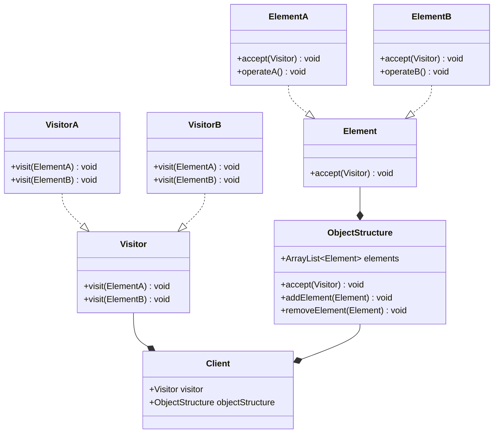

**阅读更多**

<!--more-->

# 1 定义

**访问者模式包含如下角色：**

* `Visitor`：接口或者抽象类，定义了对每个`Element`访问的行为，它的参数就是被访问的元素。**方法个数理论上与元素的种类是一样的**。因此，访问者模式要求元素的类型要稳定，如果经常添加、移除元素类，必然会导致频繁地修改`Visitor`接口，如果出现这种情况，则说明不适合使用访问者模式
    * 方法可以是同名的，比如`visit(ElementA)`、`visit(ElementB)`等等；也可以是不同名的，比如`visitElementA(ElementA)`、`visitElementB(ElementB)`等等
* `ConcreteVisitor`：具体的访问者，它需要给出对每一个元素类访问时所产生的具体行为
* `Element`：元素接口或者抽象类，它定义了一个接受访问者的方法（`accept`），其意义是指每一个元素都要可以被访问者访问
* `ConcreteElement`：具体的元素类，它提供接受访问的具体实现。**而这个具体的实现，通常情况下是使用访问者提供的访问该元素类的方法**
* `ObjectStructure`：定义当中所提到的对象结构，对象结构是一个抽象表述，它内部管理了元素集合，并且可以迭代这些元素提供访问者访问

**优势：**

* 符合单一职责原则
* 优秀的扩展性
* 灵活性

**劣势：**

* 具体元素对访问者公布细节，违反了[迪米特原则](https://en.wikipedia.org/wiki/Law_of_Demeter)
* 具体元素变更比较困难
* 违反了依赖倒置原则，依赖了具体类，没有依赖抽象

**动态双分派：**

* 第一次分派：`element.accept(visitor)`，动态分派，根据`element`的实际类型调用对应的`accept`方法
* 第二次分派：`ConcreteElement::accept`的方法中会调用`visitor.visit(this)`，静态分派，由于`this`的类型是`ConcreteElement`，在一系列的`visit`重载方法中，调用匹配的那一个
