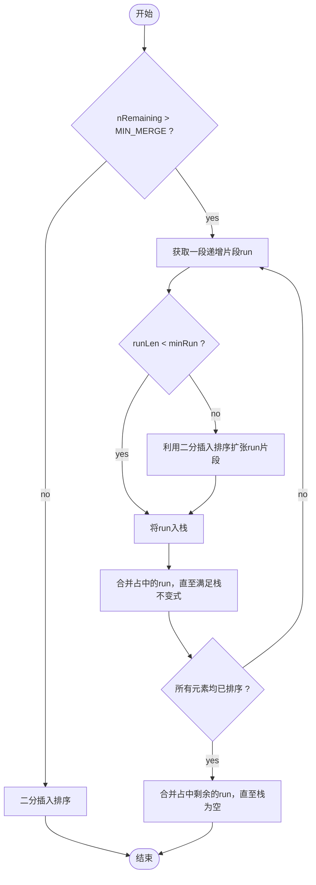

**阅读更多**

<!--more-->

# 1 前言

Timsort是结合了合并排序（merge sort）和插入排序（insertion sort）而得出的排序算法，它在现实中有很好的效率。Tim Peters在2002年设计了该算法并在Python中使用（TimSort是python中list.sort的默认实现）。该算法找到数据中已经排好序的块-分区，每一个分区叫一个run，然后按规则合并这些run。Pyhton自从2.3版以来一直采用Timsort算法排序，现在Java SE7和Android也采用Timsort算法对数组排序

JDK 1.8的实现中，Arrays.sort根据数组元素的类型会采用两种不同的排序算法。**对于基本类型(byte,short,int,long,float,double)**，采用的是一种优化过的快速排序（本篇博客不做介绍），虽然快速排序是不稳定的排序，但是对于基本类型而言，稳定与否没有任何区别。**对于类类型（reference）**，采用的是就是本篇博客将要讨论的TimSort，TimSort是一种优化过的归并排序，具有稳定性

ComparableTimSort与TimSort是一样的，TimSort利用的是Comparator来进行对象的比较，而ComparableTimSort直接利用的是实现了Comparable接口的对象来进行比较操作

# 2 常量

```java
    /**
     * This is the minimum sized sequence that will be merged.  Shorter
     * sequences will be lengthened by calling binarySort.  If the entire
     * array is less than this length, no merges will be performed.
     *
     * This constant should be a power of two.  It was 64 in Tim Peter's C
     * implementation, but 32 was empirically determined to work better in
     * this implementation.  In the unlikely event that you set this constant
     * to be a number that's not a power of two, you'll need to change the
     * {@link #minRunLength} computation.
     *
     * If you decrease this constant, you must change the stackLen
     * computation in the TimSort constructor, or you risk an
     * ArrayOutOfBounds exception.  See listsort.txt for a discussion
     * of the minimum stack length required as a function of the length
     * of the array being sorted and the minimum merge sequence length.
     */
    private static final int MIN_MERGE = 32;

    /**
     * When we get into galloping mode, we stay there until both runs win less
     * often than MIN_GALLOP consecutive times.
     */
    private static final int  MIN_GALLOP = 7;

    /**
     * Maximum initial size of tmp array, which is used for merging.  The array
     * can grow to accommodate demand.
     *
     * Unlike Tim's original C version, we do not allocate this much storage
     * when sorting smaller arrays.  This change was required for performance.
     */
    private static final int INITIAL_TMP_STORAGE_LENGTH = 256;
```

* **`MIN_MERGE`**：进行归并算法的最小长度，小于这个长度的序列将会采用二分插入排序算法
* **`MIN_GALLOP`**：在进行merge操作时，会利用这个数值进行一些优化措施，具体请参考mergeLo方法的分析
* **`INITIAL_TMP_STORAGE_LENGTH`**：tem临时数组的初始大小，tem的具体大小会根据情况进行调整

# 3 字段

```java
    /**
     * The array being sorted.
     */
    private final Object[] a;

        /**
     * Temp storage for merges. A workspace array may optionally be
     * provided in constructor, and if so will be used as long as it
     * is big enough.
     */
    private Object[] tmp;
    private int tmpBase; //base of tmp array slice
    private int tmpLen;  //length of tmp array slice

    /**
     * A stack of pending runs yet to be merged.  Run i starts at
     * address base[i] and extends for len[i] elements.  It's always
     * true (so long as the indices are in bounds) that:
     *
     *     runBase[i] + runLen[i] == runBase[i + 1]
     *
     * so we could cut the storage for this, but it's a minor amount,
     * and keeping all the info explicit simplifies the code.
     */
    private int stackSize = 0;  //Number of pending runs on stack
    private final int[] runBase;
    private final int[] runLen;
```

* **a**：待排序的数组
* **tmp**：临时数组
* **tmpBase**：临时数组起始下标
* **tmpLen**：临时数组长度
* **stackSize**：栈大小
* **runBase**：run的起始下标数组
* **runLen**：run的长度数组

> run是数组中一段已排序的片段。片段的起始地址存在runBase数组中，片段的长度存在runLen中

# 4 方法

## 4.1 Arrays.sort

`Arrays.sort()`是排序的接口方法

```java
    public static void sort(Object[] a) {
        //如果需要使用旧版的Merge sort
        if (LegacyMergeSort.userRequested)
            //使用旧版的MergeSort进行排序操作
            legacyMergeSort(a);
        else
            //使用TimSort
            ComparableTimSort.sort(a, 0, a.length, null, 0, 0);
    }
```

## 4.2 sort

`ComparableTimSort.sort()`包含了TimSort的主要逻辑

1. 若范围内的元素少于2，那么直接返回，因为一定是有序的
1. 若范围内的元素少于MIN_MERGE，采用二分插入排序算法
1. 依次分离出一系列有序片段(run)

```java
    /**
     * Sorts the given range, using the given workspace array slice
     * for temp storage when possible. This method is designed to be
     * invoked from public methods (in class Arrays) after performing
     * any necessary array bounds checks and expanding parameters into
     * the required forms.
     *
     * @param a the array to be sorted
     * @param lo the index of the first element, inclusive, to be sorted
     * @param hi the index of the last element, exclusive, to be sorted
     * @param work a workspace array (slice)
     * @param workBase origin of usable space in work array
     * @param workLen usable size of work array
     * @since 1.8
     */
    static void sort(Object[] a, int lo, int hi, Object[] work, int workBase, int workLen) {
        assert a != null && lo >= 0 && lo <= hi && hi <= a.length;
        
        //待排序元素数量
        int nRemaining  = hi - lo;
        if (nRemaining < 2)
            return;  //Arrays of size 0 and 1 are always sorted

        //If array is small, do a "mini-TimSort" with no merges
        //如果待排序元素数量小于MIN_MERGE就使用"mini-TimSort"即二分插入排序算法
        if (nRemaining < MIN_MERGE) {
            //返回包含头元素的最长递增序列的长度
            int initRunLen = countRunAndMakeAscending(a, lo, hi);
            //进行二分插入排序算法
            binarySort(a, lo, hi, lo + initRunLen);
            return;
        }

        /**
         * March over the array once, left to right, finding natural runs,
         * extending short natural runs to minRun elements, and merging runs
         * to maintain stack invariant.
         */
        ComparableTimSort ts = new ComparableTimSort(a, work, workBase, workLen);

        //根据元素数量计算出run的最小大小
        int minRun = minRunLength(nRemaining);
        do {
            //Identify next run
            //计算出下一个run的大小
            int runLen = countRunAndMakeAscending(a, lo, hi);

            //If run is short, extend to min(minRun, nRemaining)
            //如果run的大小小于minRun，那么将run的大小提升到min(minRun, nRemaining)，并且采用二分插入排序来排序这段run
            if (runLen < minRun) {
                int force = nRemaining <= minRun ? nRemaining : minRun;
                binarySort(a, lo, lo + force, lo + runLen);
                runLen = force;
            }

            //Push run onto pending-run stack, and maybe merge
            //将当前run入栈
            ts.pushRun(lo, runLen);
            //
            ts.mergeCollapse();

            //Advance to find next run
            lo += runLen;
            nRemaining -= runLen;
        } while (nRemaining != 0);

        //Merge all remaining runs to complete sort
        assert lo == hi;
        ts.mergeForceCollapse();
        assert ts.stackSize == 1;
    }
```

## 4.3 countRunAndMakeAscending

```java
    /**
     * Returns the length of the run beginning at the specified position in
     * the specified array and reverses the run if it is descending (ensuring
     * that the run will always be ascending when the method returns).
     *
     * A run is the longest ascending sequence with:
     *
     *    a[lo] <= a[lo + 1] <= a[lo + 2] <= ...
     *
     * or the longest descending sequence with:
     *
     *    a[lo] >  a[lo + 1] >  a[lo + 2] >  ...
     *
     * For its intended use in a stable mergesort, the strictness of the
     * definition of "descending" is needed so that the call can safely
     * reverse a descending sequence without violating stability.
     *
     * @param a the array in which a run is to be counted and possibly reversed
     * @param lo index of the first element in the run
     * @param hi index after the last element that may be contained in the run.
              It is required that {@code lo < hi}.
     * @return  the length of the run beginning at the specified position in
     *          the specified array
     */
    @SuppressWarnings({"unchecked", "rawtypes"})
    private static int countRunAndMakeAscending(Object[] a, int lo, int hi) {
        assert lo < hi;
        int runHi = lo + 1;
        //如果当前run中只有一个元素，那么一定是有序的，返回即可。如果从sort方法中调用该方法，那么必然保证runLen>1，因此以下if一定返回false
        if (runHi == hi)
            return 1;

        //Find end of run, and reverse range if descending
        //如果run中第二个元素严格小于第一个元素，即严格递减
        if (((Comparable) a[runHi++]).compareTo(a[lo]) < 0) { //Descending
            //找到严格递减的最长序列
            while (runHi < hi && ((Comparable) a[runHi]).compareTo(a[runHi - 1]) < 0)
                runHi++;
            //将递减序列进行反转，因为TimSort必须保证稳定性，所以前面才必须是严格递减的，否则如果交换两个相等的元素则会导致稳定性被破坏
            reverseRange(a, lo, runHi);
        } else {                              //Ascending
            //找到递增(可以非严格递增)的最长序列
            while (runHi < hi && ((Comparable) a[runHi]).compareTo(a[runHi - 1]) >= 0)
                runHi++;
        }

        //返回递增序列的长度
        return runHi - lo;
    }
```

## 4.4 reverseRange

反转指定片段，这是一种最简洁的写法了，不用考虑奇数偶数之类的，只要`lo<hi`就交换

```java
    /**
     * Reverse the specified range of the specified array.
     *
     * @param a the array in which a range is to be reversed
     * @param lo the index of the first element in the range to be reversed
     * @param hi the index after the last element in the range to be reversed
     */
    private static void reverseRange(Object[] a, int lo, int hi) {
        hi--;
        while (lo < hi) {
            Object t = a[lo];
            a[lo++] = a[hi];
            a[hi--] = t;
        }
    }
```

## 4.5 binarySort

二分插入排序，对于一个较小的数组来说，二分插入排序是最优的一种算法

二分插入排序算法相比于插入排序算法而言进行了一些优化：**对于开头已排序的部分，二分插入排序算法能够充分利用已排序这一点来减少的次数，提升交换的速度(System.arraycopy)**

参数说明

1. a：待排序的数组
1. lo：序列范围的起始下标
1. hi：序列范围的末尾下标，包含
1. start：未排序部分的起始下标

```java

    /**
     * Sorts the specified portion of the specified array using a binary
     * insertion sort.  This is the best method for sorting small numbers
     * of elements.  It requires O(n log n) compares, but O(n^2) data
     * movement (worst case).
     *
     * If the initial part of the specified range is already sorted,
     * this method can take advantage of it: the method assumes that the
     * elements from index {@code lo}, inclusive, to {@code start},
     * exclusive are already sorted.
     *
     * @param a the array in which a range is to be sorted
     * @param lo the index of the first element in the range to be sorted
     * @param hi the index after the last element in the range to be sorted
     * @param start the index of the first element in the range that is
     *        not already known to be sorted ({@code lo <= start <= hi})
     */
    @SuppressWarnings({"fallthrough", "rawtypes", "unchecked"})
    private static void binarySort(Object[] a, int lo, int hi, int start) {
        assert lo <= start && start <= hi;
        //如果start与lo相同，那么将start递增1，因为第一个元素一定是有序的，因此未排序的部分从第二个元素开始
        if (start == lo)
            start++;
        for ( ; start < hi; start++) {
            Comparable pivot = (Comparable) a[start];

            //因为[lo,start-1]范围内的元素是已排序的，那么将一个元素插入到这个范围内可以采用二分法，而不用从后面依次向前比较
            //Set left (and right) to the index where a[start] (pivot) belongs
            int left = lo;
            int right = start;
            assert left <= right;
            /*
             * Invariants:
             *   pivot >= all in [lo, left).
             *   pivot <  all in [right, start).
             */
            while (left < right) {
                int mid = (left + right) >>> 1;
                if (pivot.compareTo(a[mid]) < 0)
                    right = mid;
                else
                    left = mid + 1;
            }
            assert left == right;

            /*
             * The invariants still hold: pivot >= all in [lo, left) and
             * pivot < all in [left, start), so pivot belongs at left.  Note
             * that if there are elements equal to pivot, left points to the
             * first slot after them -- that's why this sort is stable.
             * Slide elements over to make room for pivot.
             */
            //n表示需要移动的元素数量
            int n = start - left;  //The number of elements to move
            //Switch is just an optimization for arraycopy in default case
            //元素的移动分为两类情况，第一类是只需要移动一个或者两个元素，那么直接手动移动即可；第二类是需要移动比较多的元素，那么使用System.arraycopy来进行内存拷贝，提高效率
            switch (n) {
                case 2:  a[left + 2] = a[left + 1];
                case 1:  a[left + 1] = a[left];
                         break;
                default: System.arraycopy(a, left, a, left + 1, n);
            }
            a[left] = pivot;
        }
    }
```

## 4.6 pushRun

将一个run入栈，保存的信息有两个，一个是run的起始下标，另一个是run的长度。栈顶元素位于数组的末尾

```java
    /**
     * Pushes the specified run onto the pending-run stack.
     *
     * @param runBase index of the first element in the run
     * @param runLen  the number of elements in the run
     */
    private void pushRun(int runBase, int runLen) {
        this.runBase[stackSize] = runBase;
        this.runLen[stackSize] = runLen;
        stackSize++;
    }
```

## 4.7 mergeCollapse

mergeCollapse会在**不满足**堆栈不变式的情况下进行合并操作，**堆栈不变式**是指

1. `runLen[i - 3] > runLen[i - 2] + runLen[i - 1]`
1. `runLen[i - 2] > runLen[i - 1]`

```java
    /**
     * Examines the stack of runs waiting to be merged and merges adjacent runs
     * until the stack invariants are reestablished:
     *
     *     1. runLen[i - 3] > runLen[i - 2] + runLen[i - 1]
     *     2. runLen[i - 2] > runLen[i - 1]
     *
     * This method is called each time a new run is pushed onto the stack,
     * so the invariants are guaranteed to hold for i < stackSize upon
     * entry to the method.
     */
    private void mergeCollapse() {
        while (stackSize > 1) {
            int n = stackSize - 2;

            if (n > 0 && runLen[n-1] <= runLen[n] + runLen[n+1]) {
                if (runLen[n - 1] < runLen[n + 1])
                    n--;
                mergeAt(n);
            } else if (runLen[n] <= runLen[n + 1]) {
                mergeAt(n);
            } else {
                break; //Invariant is established
            }
        }
    }
```

## 4.8 mergeAt

mergeAt方法合并栈中第i个run和第i+1个run，i必须是栈中倒数第2或者倒数第3个run，即i必须为`stackSize-2`或者`stackSize-3`

> 注意，在以下叙述中，第0个run代表栈底，第stackSize-1个run代表栈顶

合并分为三个部分

1. 找出run2的首元素在run1中的位置，记为index1，满足`run1[index1+1] > run2[first]`
1. 找出run1的尾元素在run2中的位置，记为index2，满足`run1[last] > run2[index2-1]`
1. 于是`run1[base] ~ run1[index1]`部分是已排序的，`run2[index2] ~ run2[last]`是已排序的，因此只需要合并`run1[index1+1] ~ run1[last]`以及`run2[first] ~ run2[index2-1]`即可

```java
    /**
     * Merges the two runs at stack indices i and i+1.  Run i must be
     * the penultimate or antepenultimate run on the stack.  In other words,
     * i must be equal to stackSize-2 or stackSize-3.
     *
     * @param i stack index of the first of the two runs to merge
     */
    @SuppressWarnings("unchecked")
    private void mergeAt(int i) {
        assert stackSize >= 2;
        assert i >= 0;
        assert i == stackSize - 2 || i == stackSize - 3;

        int base1 = runBase[i];
        int len1 = runLen[i];
        int base2 = runBase[i + 1];
        int len2 = runLen[i + 1];
        assert len1 > 0 && len2 > 0;
        assert base1 + len1 == base2;

        /*
         * Record the length of the combined runs; if i is the 3rd-last
         * run now, also slide over the last run (which isn't involved
         * in this merge).  The current run (i+1) goes away in any case.
         */
        //更改栈中第i个run的长度为merge后的长度
        runLen[i] = len1 + len2;
        //如果i是栈中倒数第3个run，那么将栈顶的run移动一下
        if (i == stackSize - 3) {
            runBase[i + 1] = runBase[i + 2];
            runLen[i + 1] = runLen[i + 2];
        }
        stackSize--;

        /*
         * Find where the first element of run2 goes in run1. Prior elements
         * in run1 can be ignored (because they're already in place).
         */
        int k = gallopRight((Comparable<Object>) a[base2], a, base1, len1, 0);
        assert k >= 0;
        base1 += k;
        len1 -= k;
        //也就是run1的所有元素均小于run2的起始元素，因此已经有序了
        if (len1 == 0)
            return;

        /*
         * Find where the last element of run1 goes in run2. Subsequent elements
         * in run2 can be ignored (because they're already in place).
         */
        len2 = gallopLeft((Comparable<Object>) a[base1 + len1 - 1], a,
                base2, len2, len2 - 1);
        assert len2 >= 0;
        //也就是run2的所有元素均大于run1的最后一个元素，因此已经有序了
        if (len2 == 0)
            return;

        //对run1和run2中相交的部分进行merge
        //Merge remaining runs, using tmp array with min(len1, len2) elements
        if (len1 <= len2)
            mergeLo(base1, len1, base2, len2);
        else
            mergeHi(base1, len1, base2, len2);
    }
```

## 4.9 gallopLeft

首先解释一下参数

1. key：待插入的元素
1. a：序列
1. base：序列范围的第一个元素
1. len：序列范围的长度
1. hint：开始查找的位置

该方法大致意思就是在一个序列范围中查找某个元素的插入位置，如果存在相等的元素，则返回的是最左边的一个

```java
    /**
     * Locates the position at which to insert the specified key into the
     * specified sorted range; if the range contains an element equal to key,
     * returns the index of the leftmost equal element.
     *
     * @param key the key whose insertion point to search for
     * @param a the array in which to search
     * @param base the index of the first element in the range
     * @param len the length of the range; must be > 0
     * @param hint the index at which to begin the search, 0 <= hint < n.
     *     The closer hint is to the result, the faster this method will run.
     * @return the int k,  0 <= k <= n such that a[b + k - 1] < key <= a[b + k],
     *    pretending that a[b - 1] is minus infinity and a[b + n] is infinity.
     *    In other words, key belongs at index b + k; or in other words,
     *    the first k elements of a should precede key, and the last n - k
     *    should follow it.
     */
    private static int gallopLeft(Comparable<Object> key, Object[] a,
            int base, int len, int hint) {
        assert len > 0 && hint >= 0 && hint < len;

        int lastOfs = 0;//较小的偏移量，可取的值为0,1,3,...(ofs+1)/2
        int ofs = 1;//较大的偏移量，可取的值为1,3,5...maxOfx
        if (key.compareTo(a[base + hint]) > 0) {
            //此时key > a[base + hint]，因此向右查找，直至满足a[base+hint+lastOfs] < key <= a[base+hint+ofs]
            //Gallop right until a[base+hint+lastOfs] < key <= a[base+hint+ofs]
            //maxOfs代表最大偏移量
            int maxOfs = len - hint;
            //当key>a[base + hint + ofs]
            while (ofs < maxOfs && key.compareTo(a[base + hint + ofs]) > 0) {
                //更新lastOfs
                lastOfs = ofs;
                //更新ofs，更新为原来的两倍再加1
                ofs = (ofs << 1) + 1;
                //当越界时，直接赋值为maxOfs，然后便可以退出while循环了
                if (ofs <= 0)   //int overflow
                    ofs = maxOfs;
            }

            //调整ofs
            if (ofs > maxOfs)
                ofs = maxOfs;

            //由于ofs与lastOfs为相对hint的偏移量，现在调整为相对base的偏移量
            //Make offsets relative to base
            lastOfs += hint;
            ofs += hint;
            //此时满足a[base+lastOfs] < key <= a[base+ofs]
        } else { //key <= a[base + hint]
            //此时key <= a[base + hint]，因此向左查找，直至满足a[base+hint-ofs] < key <= a[base+hint-lastOfs]
            //Gallop left until a[base+hint-ofs] < key <= a[base+hint-lastOfs]
            //最大偏移量，即base+hint-maxOfs>=base
            final int maxOfs = hint + 1;
            while (ofs < maxOfs && key.compareTo(a[base + hint - ofs]) <= 0) {
                lastOfs = ofs;
                ofs = (ofs << 1) + 1;
                if (ofs <= 0)   //int overflow
                    ofs = maxOfs;
            }

            //调整ofs
            if (ofs > maxOfs)
                ofs = maxOfs;

            //由于ofs与lastOfs为相对于hint的负偏移量，现在调整为相对base的偏移量，这里需要调整一下，使得结果与上一种情况统一
            //Make offsets relative to base
            int tmp = lastOfs;
            lastOfs = hint - ofs;
            ofs = hint - tmp;
            //此时满足a[base+lastOfs] < key <= a[base+ofs]
        }
        assert -1 <= lastOfs && lastOfs < ofs && ofs <= len;

        /*
         * Now a[base+lastOfs] < key <= a[base+ofs], so key belongs somewhere
         * to the right of lastOfs but no farther right than ofs.  Do a binary
         * search, with invariant a[base + lastOfs - 1] < key <= a[base + ofs].
         */
        //现在a[base+lastOfs] < key <= a[base+ofs]，因此用二分法查找
        lastOfs++;
        while (lastOfs < ofs) {
            int m = lastOfs + ((ofs - lastOfs) >>> 1);

            if (key.compareTo(a[base + m]) > 0)
                lastOfs = m + 1;  //a[base + m] < key
            else
                ofs = m;          //key <= a[base + m]
        }
        assert lastOfs == ofs;    //so a[base + ofs - 1] < key <= a[base + ofs]
        return ofs;
    }
```

为什么不直接用二分法？这样效率更高么？

## 4.10 gallopRight

首先解释一下参数

1. key：待插入的元素
1. a：序列
1. base：序列范围的第一个元素
1. len：序列范围的长度
1. hint：开始查找的位置

该方法大致意思就是在一个序列范围中查找某个元素的插入位置，如果存在相等的元素，则返回的是最右边的一个

```java
    /**
     * Like gallopLeft, except that if the range contains an element equal to
     * key, gallopRight returns the index after the rightmost equal element.
     *
     * @param key the key whose insertion point to search for
     * @param a the array in which to search
     * @param base the index of the first element in the range
     * @param len the length of the range; must be > 0
     * @param hint the index at which to begin the search, 0 <= hint < n.
     *     The closer hint is to the result, the faster this method will run.
     * @return the int k,  0 <= k <= n such that a[b + k - 1] <= key < a[b + k]
     */
    private static int gallopRight(Comparable<Object> key, Object[] a,
            int base, int len, int hint) {
        assert len > 0 && hint >= 0 && hint < len;

        int ofs = 1;//较大的偏移量，可取的值为1,3,5...maxOfx
        int lastOfs = 0;//较小的偏移量，可取的值为0,1,3,...(ofs+1)/2
        if (key.compareTo(a[base + hint]) < 0) {
            //此时key < a[base + hint]，因此向左查找，直至满足a[b+hint - ofs] <= key < a[b+hint - lastOfs]
            //Gallop left until a[b+hint - ofs] <= key < a[b+hint - lastOfs]
            int maxOfs = hint + 1;
            while (ofs < maxOfs && key.compareTo(a[base + hint - ofs]) < 0) {
                lastOfs = ofs;
                ofs = (ofs << 1) + 1;
                if (ofs <= 0)   //int overflow
                    ofs = maxOfs;
            }

            //调整ofs
            if (ofs > maxOfs)
                ofs = maxOfs;

            //由于ofs与lastOfs为相对于hint的负偏移量，现在调整为相对base的偏移量，这里需要调整一下，使得结果与下一种情况统一
            //Make offsets relative to b
            int tmp = lastOfs;
            lastOfs = hint - ofs;
            ofs = hint - tmp;

            //此时满足a[b + lastOfs] <= key < a[b + ofs]
        } else { //a[b + hint] <= key
            //此时a[b + hint] <= key，因此向右查找，直至满足a[b+hint + lastOfs] <= key < a[b+hint + ofs]
            //Gallop right until a[b+hint + lastOfs] <= key < a[b+hint + ofs]
            int maxOfs = len - hint;
            while (ofs < maxOfs && key.compareTo(a[base + hint + ofs]) >= 0) {
                lastOfs = ofs;
                ofs = (ofs << 1) + 1;
                if (ofs <= 0)   //int overflow
                    ofs = maxOfs;
            }

            //调整ofs
            if (ofs > maxOfs)
                ofs = maxOfs;

            //由于ofs与lastOfs为相对hint的偏移量，现在调整为相对base的偏移量
            //Make offsets relative to b
            lastOfs += hint;
            ofs += hint;
            //此时满足a[b + lastOfs] <= key < a[b + ofs]
        }
        assert -1 <= lastOfs && lastOfs < ofs && ofs <= len;

        /*
         * Now a[b + lastOfs] <= key < a[b + ofs], so key belongs somewhere to
         * the right of lastOfs but no farther right than ofs.  Do a binary
         * search, with invariant a[b + lastOfs - 1] <= key < a[b + ofs].
         */
        lastOfs++;
        while (lastOfs < ofs) {
            int m = lastOfs + ((ofs - lastOfs) >>> 1);

            if (key.compareTo(a[base + m]) < 0)
                ofs = m;          //key < a[b + m]
            else
                lastOfs = m + 1;  //a[b + m] <= key
        }
        assert lastOfs == ofs;    //so a[b + ofs - 1] <= key < a[b + ofs]
        return ofs;
    }
```

## 4.11 mergeLo

合并两个run，必须满足下列条件

1. `runLen1 <= runLen2`
1. `run1[first] > run2[first]`
1. `run1[last] > run2[last]`

由于merge需要利用额外空间，为了最小化这个额外的空间，每次只将较小的一个run复制到这个额外的空间上

该merge操作的优化点在于：当一个run连续出现多个数值都比另一个run的某个数值要小时，可以进行优化，通过二分法来查找临界位置，并且通过System.arraycopy来进行拷贝。这样说可能比较难理解，举个例子来说明一下

> 假设`run1[i1] < run2[i2]`,`run1[i1+1] < run2[i2]`,`run1[i1+2] < run2[i2]`,...,`run1[i1+k] < run2[i2]`。如果`k > minGallop`，那么此时可以进行一些优化，即假设这种趋势将会延续下去，即还会有连续多个run1的值小于`run2[i2]`。因此我们用二分法来查找`run2[i2]`这个值位于run1中的具体位置，找到位置后，那么run1前面这部分元素将会比`run2[i2]`要小，因此可以用System.arraycopy来进行拷贝

```java
    /**
     * Merges two adjacent runs in place, in a stable fashion.  The first
     * element of the first run must be greater than the first element of the
     * second run (a[base1] > a[base2]), and the last element of the first run
     * (a[base1 + len1-1]) must be greater than all elements of the second run.
     *
     * For performance, this method should be called only when len1 <= len2;
     * its twin, mergeHi should be called if len1 >= len2.  (Either method
     * may be called if len1 == len2.)
     *
     * @param base1 index of first element in first run to be merged
     * @param len1  length of first run to be merged (must be > 0)
     * @param base2 index of first element in second run to be merged
     *        (must be aBase + aLen)
     * @param len2  length of second run to be merged (must be > 0)
     */
    @SuppressWarnings({"unchecked", "rawtypes"})
    private void mergeLo(int base1, int len1, int base2, int len2) {
        assert len1 > 0 && len2 > 0 && base1 + len1 == base2;

        //Copy first run into temp array
        Object[] a = this.a; //For performance
        //根据len1的大小，分配一个2的幂次大小的数组
        Object[] tmp = ensureCapacity(len1);

        int cursor1 = tmpBase; //Indexes into tmp array
        int cursor2 = base2;   //Indexes int a
        int dest = base1;      //Indexes int a
        //将run中的元素拷贝到temp中去
        System.arraycopy(a, base1, tmp, cursor1, len1);

        //Move first element of second run and deal with degenerate cases
        //由于run1[first] > run2[first]，因此第一个元素一定是run2[first]
        a[dest++] = a[cursor2++];

        //处理两个非常规的情况
        //run2没有元素剩余了，因此将tem中的元素拷贝回来，然后返回
        if (--len2 == 0) {
            System.arraycopy(tmp, cursor1, a, dest, len1);
            return;
        }
        //run1只有一个元素，且run1[last] > run2[last]，因此run1中的所有元素都比run2中的所有元素要大
        if (len1 == 1) {
            //先移动run2中的元素
            System.arraycopy(a, cursor2, a, dest, len2);
            //再移动run1的唯一元素即可
            a[dest + len2] = tmp[cursor1]; //Last elt of run 1 to end of merge
            return;
        }

        int minGallop = this.minGallop;  //Use local variable for performance
    outer:
        while (true) {
            //这两个值用于记录一些信息，在同一时刻，必定有一个为0。根据这个值可以进行某些优化
            //当count1 > 0，意味着run2中的某个元素会比连续多个run1中的元素要大，即run1 won
            //当count2 > 0，意味着run1中的某个元素会比连续多个run2中的元素要大，即run2 won
            int count1 = 0; //Number of times in a row that first run won
            int count2 = 0; //Number of times in a row that second run won

            /*
             * Do the straightforward thing until (if ever) one run starts
             * winning consistently.
             */
            //进行合并操作，即比较a[cursor2]与tmp[cursor1]的大小，取较小的一个放到a[dest]中去。当出现连续多个(minGallop个)数值都从某一个run中取得时(全部从run1中取或者全部从run2中取)，那么可以假设这种趋势将会延续下去，因此可以做一些优化
            do {
                assert len1 > 1 && len2 > 0;
                
                if (((Comparable) a[cursor2]).compareTo(tmp[cursor1]) < 0) {
                    //run2 won
                    a[dest++] = a[cursor2++];
                    count2++;
                    count1 = 0;
                    if (--len2 == 0)
                        break outer;
                } else {
                    //run1 won
                    a[dest++] = tmp[cursor1++];
                    count1++;
                    count2 = 0;
                    if (--len1 == 1)
                        break outer;
                }
            } while ((count1 | count2) < minGallop);
            //这个判断相当于 count1 < minGallop && count2 <minGallop，因为count1和count2总有一个为0
             
            /*
             * One run is winning so consistently that galloping may be a
             * huge win. So try that, and continue galloping until (if ever)
             * neither run appears to be winning consistently anymore.
             */
            //执行到这里的话，某个run中的元素将比另一个run中的连续多个元素都要大，那么这种连续性可能持续的更长。那么我们就按照这个逻辑试一试。直到这种连续性被打破。根据找到的长度，直接连续的copy就可以了，这样可以提高copy的效率
            //可以采用二分查找这种连续性的边界。另外，单个赋值操作要比System.arraycopy操作要慢，使用System.arraycopy也能产生增益
            do {
                assert len1 > 1 && len2 > 0;
                //直接利用gallopRight(二分查找)找到a[cursor2]在run1中的最右边的位置，那么意味着run1中的前count1个元素都要比a[cursor2]小，因此直接用System.arraycopy来拷贝这部分数据
                count1 = gallopRight((Comparable) a[cursor2], tmp, cursor1, len1, 0);
                if (count1 != 0) {
                    System.arraycopy(tmp, cursor1, a, dest, count1);
                    dest += count1;
                    cursor1 += count1;
                    len1 -= count1;
                    if (len1 <= 1)  //len1 == 1 || len1 == 0
                        break outer;
                }

                //run1前count1个元素都已经移动到dest中去了，现在移动a[cursor2]这个元素
                a[dest++] = a[cursor2++];
                if (--len2 == 0)
                    break outer;

                //直接利用gallopLeft(二分查找)找到tmp[cursor1]在run2中最左边的位置，那么意味着run2中的前count2个元素都要比tmp[cursor1]小，因此直接使用System.arraycopy来拷贝这部分数据
                count2 = gallopLeft((Comparable) tmp[cursor1], a, cursor2, len2, 0);
                if (count2 != 0) {
                    System.arraycopy(a, cursor2, a, dest, count2);
                    dest += count2;
                    cursor2 += count2;
                    len2 -= count2;
                    if (len2 == 0)
                        break outer;
                }

                //run2前count2个元素都已经移动到dest中去了，现在就是tmp[curosr1]这个元素
                a[dest++] = tmp[cursor1++];
                if (--len1 == 1)
                    break outer;
                minGallop--;
            } while (count1 >= MIN_GALLOP | count2 >= MIN_GALLOP);
            //当这种连续多个较大的趋势仍然成立时

            if (minGallop < 0)
                minGallop = 0;
            minGallop += 2;  //Penalize for leaving gallop mode
        }  //End of "outer" loop
        this.minGallop = minGallop < 1 ? 1 : minGallop;  //Write back to field

        if (len1 == 1) {
            assert len2 > 0;
            System.arraycopy(a, cursor2, a, dest, len2);
            a[dest + len2] = tmp[cursor1]; //Last elt of run 1 to end of merge
        } else if (len1 == 0) {
            throw new IllegalArgumentException(
                "Comparison method violates its general contract!");
        } else {
            assert len2 == 0;
            assert len1 > 1;
            System.arraycopy(tmp, cursor1, a, dest, len1);
        }
    }
```

## 4.12 mergeHi

该方法与mergeLo方法对称，不再分析

```java
    /**
     * Like mergeLo, except that this method should be called only if
     * len1 >= len2; mergeLo should be called if len1 <= len2.  (Either method
     * may be called if len1 == len2.)
     *
     * @param base1 index of first element in first run to be merged
     * @param len1  length of first run to be merged (must be > 0)
     * @param base2 index of first element in second run to be merged
     *        (must be aBase + aLen)
     * @param len2  length of second run to be merged (must be > 0)
     */
    @SuppressWarnings({"unchecked", "rawtypes"})
    private void mergeHi(int base1, int len1, int base2, int len2) {
        assert len1 > 0 && len2 > 0 && base1 + len1 == base2;

        //Copy second run into temp array
        Object[] a = this.a; //For performance
        Object[] tmp = ensureCapacity(len2);
        int tmpBase = this.tmpBase;
        System.arraycopy(a, base2, tmp, tmpBase, len2);

        int cursor1 = base1 + len1 - 1;  //Indexes into a
        int cursor2 = tmpBase + len2 - 1; //Indexes into tmp array
        int dest = base2 + len2 - 1;     //Indexes into a

        //Move last element of first run and deal with degenerate cases
        a[dest--] = a[cursor1--];
        if (--len1 == 0) {
            System.arraycopy(tmp, tmpBase, a, dest - (len2 - 1), len2);
            return;
        }
        if (len2 == 1) {
            dest -= len1;
            cursor1 -= len1;
            System.arraycopy(a, cursor1 + 1, a, dest + 1, len1);
            a[dest] = tmp[cursor2];
            return;
        }

        int minGallop = this.minGallop;  //Use local variable for performance
    outer:
        while (true) {
            int count1 = 0; //Number of times in a row that first run won
            int count2 = 0; //Number of times in a row that second run won

            /*
             * Do the straightforward thing until (if ever) one run
             * appears to win consistently.
             */
            do {
                assert len1 > 0 && len2 > 1;
                if (((Comparable) tmp[cursor2]).compareTo(a[cursor1]) < 0) {
                    a[dest--] = a[cursor1--];
                    count1++;
                    count2 = 0;
                    if (--len1 == 0)
                        break outer;
                } else {
                    a[dest--] = tmp[cursor2--];
                    count2++;
                    count1 = 0;
                    if (--len2 == 1)
                        break outer;
                }
            } while ((count1 | count2) < minGallop);

            /*
             * One run is winning so consistently that galloping may be a
             * huge win. So try that, and continue galloping until (if ever)
             * neither run appears to be winning consistently anymore.
             */
            do {
                assert len1 > 0 && len2 > 1;
                count1 = len1 - gallopRight((Comparable) tmp[cursor2], a, base1, len1, len1 - 1);
                if (count1 != 0) {
                    dest -= count1;
                    cursor1 -= count1;
                    len1 -= count1;
                    System.arraycopy(a, cursor1 + 1, a, dest + 1, count1);
                    if (len1 == 0)
                        break outer;
                }
                a[dest--] = tmp[cursor2--];
                if (--len2 == 1)
                    break outer;

                count2 = len2 - gallopLeft((Comparable) a[cursor1], tmp, tmpBase, len2, len2 - 1);
                if (count2 != 0) {
                    dest -= count2;
                    cursor2 -= count2;
                    len2 -= count2;
                    System.arraycopy(tmp, cursor2 + 1, a, dest + 1, count2);
                    if (len2 <= 1)
                        break outer; //len2 == 1 || len2 == 0
                }
                a[dest--] = a[cursor1--];
                if (--len1 == 0)
                    break outer;
                minGallop--;
            } while (count1 >= MIN_GALLOP | count2 >= MIN_GALLOP);
            if (minGallop < 0)
                minGallop = 0;
            minGallop += 2;  //Penalize for leaving gallop mode
        }  //End of "outer" loop
        this.minGallop = minGallop < 1 ? 1 : minGallop;  //Write back to field

        if (len2 == 1) {
            assert len1 > 0;
            dest -= len1;
            cursor1 -= len1;
            System.arraycopy(a, cursor1 + 1, a, dest + 1, len1);
            a[dest] = tmp[cursor2];  //Move first elt of run2 to front of merge
        } else if (len2 == 0) {
            throw new IllegalArgumentException(
                "Comparison method violates its general contract!");
        } else {
            assert len1 == 0;
            assert len2 > 0;
            System.arraycopy(tmp, tmpBase, a, dest - (len2 - 1), len2);
        }
    }
```

# 5 流程



# 6 参考

* [读 Java TimSort算法 源码 笔记](http://www.jianshu.com/p/10aa41b780f2)
