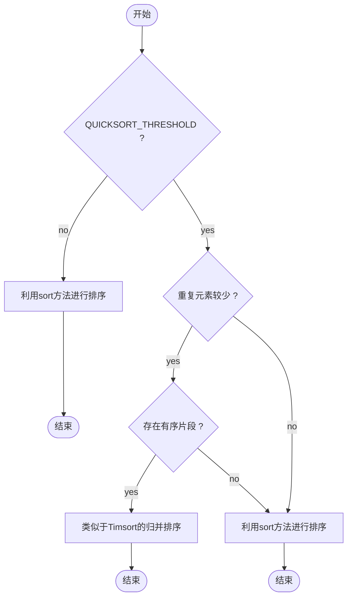
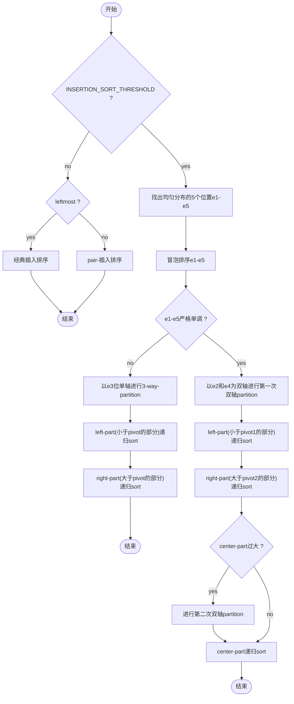

**阅读更多**

<!--more-->

# 1 前言

Java中Arrays.sort排序方法对于基本类型的排序采用的是双轴快速排序。本篇博客主要分析JDK源码

# 2 常量

```java
    /**
     * The maximum number of runs in merge sort.
     */
    private static final int MAX_RUN_COUNT = 67;

    /**
     * The maximum length of run in merge sort.
     */
    private static final int MAX_RUN_LENGTH = 33;

    /**
     * If the length of an array to be sorted is less than this
     * constant, Quicksort is used in preference to merge sort.
     */
    private static final int QUICKSORT_THRESHOLD = 286;

    /**
     * If the length of an array to be sorted is less than this
     * constant, insertion sort is used in preference to Quicksort.
     */
    private static final int INSERTION_SORT_THRESHOLD = 47;

    /**
     * If the length of a byte array to be sorted is greater than this
     * constant, counting sort is used in preference to insertion sort.
     */
    private static final int COUNTING_SORT_THRESHOLD_FOR_BYTE = 29;

    /**
     * If the length of a short or char array to be sorted is greater
     * than this constant, counting sort is used in preference to Quicksort.
     */
    private static final int COUNTING_SORT_THRESHOLD_FOR_SHORT_OR_CHAR = 3200;
```

* **`MAX_RUN_COUNT`**：run数量的最大值，如果超过这个值，那么便认为数组不是特别的有序
* **`MAX_RUN_LENGTH`**：run长度的最大值
* **`QUICKSORT_THRESHOLD`**：如果数组长度小于这个值，那么快排的效率会比归并排序的效率要高
* **`INSERTION_SORT_THRESHOLD`**：如果数组长度小于这个值，那么插入排序的效率会比快排的效率要高
* **`COUNTING_SORT_THRESHOLD_FOR_BYTE`**：对于字节数组而言，如果长度大于这个数值，那么用计数排序效率比较高，因为额外的内存空间是确定的，256
* **`COUNTING_SORT_THRESHOLD_FOR_SHORT_OR_CHAR`**：对于char或者short而言，如果数组长度大于这个数值，那么计数排序效率会比较高

> 从这几个常量就能清晰地看出，DualPivotQuickSort对于不同的基本类型的排序方式是不同的，对于short、char以及byte等16bit或者8bit的基本类型而言，计数排序不会造成特别大的空间开销。而对于其他基本类型，比如int，long，float，double等。则会根据数组的长度来选择相应的排序算法，包括插入排序、快速排序和归并排序

# 3 方法

## 3.1 sort

参数说明

* a：待排序的数组
* left：左边界，闭区间
* right：右边界，闭区间
* work：
* workBase：
* workLen

```java
    /**
     * Sorts the specified range of the array using the given
     * workspace array slice if possible for merging
     *
     * @param a the array to be sorted
     * @param left the index of the first element, inclusive, to be sorted
     * @param right the index of the last element, inclusive, to be sorted
     * @param work a workspace array (slice)
     * @param workBase origin of usable space in work array
     * @param workLen usable size of work array
     */
    static void sort(int[] a, int left, int right,
                     int[] work, int workBase, int workLen) {
        //Use Quicksort on small arrays
        //待排序序列长度小于QUICKSORT_THRESHOLD，则采用快速排序
        if (right - left < QUICKSORT_THRESHOLD) {
            sort(a, left, right, true);
            return;
        }

        /*
         * Index run[i] is the start of i-th run
         * (ascending or descending sequence).
         */
        //run用于保存所有run的起始下标
        int[] run = new int[MAX_RUN_COUNT + 1];
        int count = 0; run[0] = left;

        //Check if the array is nearly sorted
        for (int k = left; k < right; run[count] = k) {
            if (a[k] < a[k + 1]) { //ascending
                //找到整个递增序列
                while (++k <= right && a[k - 1] <= a[k]);
            } else if (a[k] > a[k + 1]) { //descending
                //找到整个递减序列
                while (++k <= right && a[k - 1] >= a[k]);
                //反转这个递减序列，使其变为递增
                for (int lo = run[count] - 1, hi = k; ++lo < --hi; ) {
                    int t = a[lo]; a[lo] = a[hi]; a[hi] = t;
                }
            } else { //equal
                for (int m = MAX_RUN_LENGTH; ++k <= right && a[k - 1] == a[k]; ) {
                    //当发现相等的元素超过MAX_RUN_LENGTH时，采用快速排序？可是为什么要这样做呢？
                    if (--m == 0) {
                        sort(a, left, right, true);
                        return;
                    }
                }
            }

            /*
             * The array is not highly structured,
             * use Quicksort instead of merge sort.
             */
            //当发现run非常多，意味着这些run都是一些很短的片段，大致上可以判定为无规律，即无序状态。这个时候采用快速排序
            if (++count == MAX_RUN_COUNT) {
                sort(a, left, right, true);
                return;
            }
        }

        //Check special cases
        //Implementation note: variable "right" is increased by 1.
        //注意，这里会使得right增加1
        if (run[count] == right++) { //The last run contains one element
            run[++count] = right;
        } else if (count == 1) { //The array is already sorted
            //说明整个数组就是有序的，直接返回就行了
            return;
        }

        //下面开始归并排序

        //Determine alternation base for merge
        byte odd = 0;
        for (int n = 1; (n <<= 1) < count; odd ^= 1);

        //Use or create temporary array b for merging
        int[] b;                 //temp array; alternates with a
        int ao, bo;              //array offsets from 'left'
        int blen = right - left; //space needed for b
        if (work == null || workLen < blen || workBase + blen > work.length) {
            work = new int[blen];
            workBase = 0;
        }
        if (odd == 0) {
            System.arraycopy(a, left, work, workBase, blen);
            b = a;
            bo = 0;
            a = work;
            ao = workBase - left;
        } else {
            b = work;
            ao = 0;
            bo = workBase - left;
        }

        //Merging
        //进行数轮合并操作，直至run的数量为1
        for (int last; count > 1; count = last) {
            //每一轮两两进行合并，每一轮合并后的run数量就是last
            for (int k = (last = 0) + 2; k <= count; k += 2) {
                int hi = run[k], mi = run[k - 1];
                for (int i = run[k - 2], p = i, q = mi; i < hi; ++i) {
                    if (q >= hi || p < mi && a[p + ao] <= a[q + ao]) {
                        b[i + bo] = a[p++ + ao];
                    } else {
                        b[i + bo] = a[q++ + ao];
                    }
                }
                //将合并后的序列挪到前面的位置，因此last在进行完一轮合并后指向的就是最后一个run
                run[++last] = hi;
            }
            if ((count & 1) != 0) {
                for (int i = right, lo = run[count - 1]; --i >= lo;
                    b[i + bo] = a[i + ao]
                );
                run[++last] = right;
            }
            int[] t = a; a = b; b = t;
            int o = ao; ao = bo; bo = o;
        }
    }
```

下面给一个流程图



## 3.2 sort

双轴快速排序

参数说明

* a：待排序数组
* left：待排序序列范围的左边界
* right：待排序序列范围的右边界
* leftmost：指定范围是否在数组最左边

```java
    /**
     * Sorts the specified range of the array by Dual-Pivot Quicksort.
     *
     * @param a the array to be sorted
     * @param left the index of the first element, inclusive, to be sorted
     * @param right the index of the last element, inclusive, to be sorted
     * @param leftmost indicates if this part is the leftmost in the range
     */
    private static void sort(int[] a, int left, int right, boolean leftmost) {
        int length = right - left + 1;

        //Use insertion sort on tiny arrays
        //此时需要采取插入排序算法
        if (length < INSERTION_SORT_THRESHOLD) {
            if (leftmost) {
                /*
                 * Traditional (without sentinel) insertion sort,
                 * optimized for server VM, is used in case of
                 * the leftmost part.
                 */
                //经典的插入排序算法
                for (int i = left, j = i; i < right; j = ++i) {
                    int ai = a[i + 1];
                    while (ai < a[j]) {
                        a[j + 1] = a[j];
                        if (j-- == left) {
                            break;
                        }
                    }
                    a[j + 1] = ai;
                }
            } else {
                /*
                 * Skip the longest ascending sequence.
                 */
                //首先跳过前面的升序部分
                do {
                    if (left >= right) {
                        return;
                    }
                } while (a[++left] >= a[left - 1]);

                /*
                 * Every element from adjoining part plays the role
                 * of sentinel, therefore this allows us to avoid the
                 * left range check on each iteration. Moreover, we use
                 * the more optimized algorithm, so called pair insertion
                 * sort, which is faster (in the context of Quicksort)
                 * than traditional implementation of insertion sort.
                 */

                 /*
                 * 这里用到了成对插入排序方法，它比简单的插入排序算法效率要高一些
                 * 因为这个分支执行的条件是左边是有元素的
                 * 所以可以直接从left开始往前查找
                 */

                //left=k+1，且left每次迭代会递增2，一次在自增部分递增，另一次在条件部分递增
                for (int k = left; ++left <= right; k = ++left) {
                    int a1 = a[k], a2 = a[left];

                    //保证a1>=a2
                    if (a1 < a2) {
                        a2 = a1; a1 = a[left];
                    }

                    //先把两个数字中较大的那个移动到合适的位置
                    //pair-插入排序的优化点之一：比a1大的元素只需要挪动一次即可
                    while (a1 < a[--k]) {
                        a[k + 2] = a[k];//这里每次需要向左移动两个元素
                    }
                    a[++k + 1] = a1;

                    //再把两个数字中较小的那个移动到合适的位置
                    while (a2 < a[--k]) {
                        a[k + 1] = a[k];//这里每次需要向左移动一个元素
                    }
                    a[k + 1] = a2;
                }

                //由于上面循环条件的缘故，最后一个元素是没有被插入的，因为left每次递增2
                int last = a[right];

                //对最后一个元素进行一次简单的插入排序
                while (last < a[--right]) {
                    a[right + 1] = a[right];
                }
                a[right + 1] = last;
            }
            return;
        }

        //Inexpensive approximation of length / 7
        //length / 7 的一种低复杂度的实现, 近似值(length * 9 / 64 + 1)
        int seventh = (length >> 3) + (length >> 6) + 1;

        /*
         * Sort five evenly spaced elements around (and including) the
         * center element in the range. These elements will be used for
         * pivot selection as described below. The choice for spacing
         * these elements was empirically determined to work well on
         * a wide variety of inputs.
         */
        //对5段靠近中间位置的数列排序，这些元素最终会被用来做轴(下面会讲)
        //他们的选定是根据大量数据积累经验确定的
        int e3 = (left + right) >>> 1; //The midpoint
        int e2 = e3 - seventh;
        int e1 = e2 - seventh;
        int e4 = e3 + seventh;
        int e5 = e4 + seventh;

        //Sort these elements using insertion sort
        //以下就是将e1~e5这5个元素进行排序，利用的是冒泡排序
        if (a[e2] < a[e1]) { int t = a[e2]; a[e2] = a[e1]; a[e1] = t; }

        if (a[e3] < a[e2]) { int t = a[e3]; a[e3] = a[e2]; a[e2] = t;
            if (t < a[e1]) { a[e2] = a[e1]; a[e1] = t; }
        }
        if (a[e4] < a[e3]) { int t = a[e4]; a[e4] = a[e3]; a[e3] = t;
            if (t < a[e2]) { a[e3] = a[e2]; a[e2] = t;
                if (t < a[e1]) { a[e2] = a[e1]; a[e1] = t; }
            }
        }
        if (a[e5] < a[e4]) { int t = a[e5]; a[e5] = a[e4]; a[e4] = t;
            if (t < a[e3]) { a[e4] = a[e3]; a[e3] = t;
                if (t < a[e2]) { a[e3] = a[e2]; a[e2] = t;
                    if (t < a[e1]) { a[e2] = a[e1]; a[e1] = t; }
                }
            }
        }

        //Pointers
        //中间区间的首元素下标
        int less  = left;  //The index of the first element of center part
        //右边区间的首元素下标
        int great = right; //The index before the first element of right part

        if (a[e1] != a[e2] && a[e2] != a[e3] && a[e3] != a[e4] && a[e4] != a[e5]) {
            /*
             * Use the second and fourth of the five sorted elements as pivots.
             * These values are inexpensive approximations of the first and
             * second terciles of the array. Note that pivot1 <= pivot2.
             */
            //利用第2与第4个元素作为双轴，注意到pivot1 <= pivot2
            int pivot1 = a[e2];
            int pivot2 = a[e4];

            /*
             * The first and the last elements to be sorted are moved to the
             * locations formerly occupied by the pivots. When partitioning
             * is complete, the pivots are swapped back into their final
             * positions, and excluded from subsequent sorting.
             */
            //下面这两个循环会直接跳过left与right这两个位置的元素，因此需要将left于right放到中间的某两个位置上，而e2和e4位置上的元素已经被保存为pivot1和pivot2了，因此可以将left和right的元素放在这两个位置
            //因此排序的部分就是a[left...right]中除了pivot1和pivot2的所有元素
            //最终pivot1和pivot2将会被置于一个正确的位置
            a[e2] = a[left];
            a[e4] = a[right];

            /*
             * Skip elements, which are less or greater than pivot values.
             */
            //跳过一些队首的小于pivot1的值，跳过队尾的大于pivot2的值，即找到center part部分
            while (a[++less] < pivot1);
            while (a[--great] > pivot2);

            /*
             * Partitioning:
             *
             *   left part           center part                   right part
             * +--------------------------------------------------------------+
             * |  < pivot1  |  pivot1 <= && <= pivot2  |    ?    |  > pivot2  |
             * +--------------------------------------------------------------+
             *               ^                          ^       ^
             *               |                          |       |
             *              less                        k     great
             *
             * Invariants:
             *
             *              all in (left, less)   < pivot1
             *    pivot1 <= all in [less, k)     <= pivot2
             *              all in (great, right) > pivot2
             *
             * Pointer k is the first index of ?-part.
             */
            outer:
            for (int k = less - 1; ++k <= great; ) {
                int ak = a[k];
                if (ak < pivot1) { //Move a[k] to left part
                    //ak比pivot1小，因此放入left part中
                    a[k] = a[less];
                    /*
                     * Here and below we use "a[i] = b; i++;" instead
                     * of "a[i++] = b;" due to performance issue.
                     */
                    //"a[i] = b; i++;"的效率比"a[i++] = b;"的效率高
                    a[less] = ak;
                    ++less;
                } else if (ak > pivot2) { //Move a[k] to right part
                    //ak比pivot2大，因此放入right part中
                    //按理来说，ad应该放入greate-1这个位置，即位置k与位置greate-1交换，但是greate-1的元素处于"?-part"，因此不妨在这个时候从右往左找到第一个<=pivot2的元素
                    while (a[great] > pivot2) {
                        if (great-- == k) {
                            break outer;
                        }
                    }
                    //此时a[great] <= pivot2

                    //如果这个时候a[great] < pivot1，那么应该放入left part中去
                    if (a[great] < pivot1) { //a[great] <= pivot2
                        a[k] = a[less];
                        a[less] = a[great];
                        ++less;
                    } else { //pivot1 <= a[great] <= pivot2
                        a[k] = a[great];
                    }
                    /*
                     * Here and below we use "a[i] = b; i--;" instead
                     * of "a[i--] = b;" due to performance issue.
                     */
                    //"a[i] = b; i--;"的效率比"a[i--] = b;"的效率高
                    a[great] = ak;
                    --great;
                }
            }

            //Swap pivots into their final positions
            //由于排序的部分是a[left+1...right-1]，而原范围确是a[left...right]，而那两个被扣掉的元素就是pivot1和pivot2，因此，经过一些交换，将pivot1和pivot2插入到a[left...right]范围中去，并维持left-part、center-part、right-part三个部分
            a[left]  = a[less  - 1]; a[less  - 1] = pivot1;
            a[right] = a[great + 1]; a[great + 1] = pivot2;

            //Sort left and right parts recursively, excluding known pivots
            //递归调用sort方法排序left-part和right-part
            sort(a, left, less - 2, leftmost);
            sort(a, great + 2, right, false);

            /*
             * If center part is too large (comprises > 4/7 of the array),
             * swap internal pivot values to ends.
             */
            
            /* 
             * 如果center part包含的元素过多，超过数组长度的 4/7，那么需要进行一些优化处理
             * 预处理的方法是把等于pivot1的元素统一放到左边，等于pivot2的元素统一
             * 放到右边,最终产生一个不包含pivot1和pivot2的数列，再拿去参与快排中的递归
             */
            if (less < e1 && e5 < great) {
                /*
                 * Skip elements, which are equal to pivot values.
                 */
                //跳过那些与pivot1相同的元素
                while (a[less] == pivot1) {
                    ++less;
                }

                //跳过那些与pivot2相同的元素
                while (a[great] == pivot2) {
                    --great;
                }

                /*
                 * Partitioning:
                 *
                 *   left part         center part                  right part
                 * +----------------------------------------------------------+
                 * | == pivot1 |  pivot1 < && < pivot2  |    ?    | == pivot2 |
                 * +----------------------------------------------------------+
                 *              ^                        ^       ^
                 *              |                        |       |
                 *             less                      k     great
                 *
                 * Invariants:
                 *
                 *              all in (*,  less) == pivot1
                 *     pivot1 < all in [less,  k)  < pivot2
                 *              all in (great, *) == pivot2
                 *
                 * Pointer k is the first index of ?-part.
                 */
                outer:
                for (int k = less - 1; ++k <= great; ) {
                    int ak = a[k];
                    if (ak == pivot1) { //Move a[k] to left part
                        //挪到left part中去
                        a[k] = a[less];
                        a[less] = ak;
                        ++less;
                    } else if (ak == pivot2) { //Move a[k] to right part
                        //挪到right part中去

                        //由于great位置上的元素处于?-part，因此不妨在这里就进行处理，即决定它是否位于right-part中。下面的循环向左找到第一个不等于pivot2的元素
                        while (a[great] == pivot2) {
                            if (great-- == k) {
                                break outer;
                            }
                        }
                        if (a[great] == pivot1) { //a[great] < pivot2
                            //首先将center-part的第一个元素挪到k位置，for循环递增后，k也属于center-part
                            a[k] = a[less];
                            /*
                             * Even though a[great] equals to pivot1, the
                             * assignment a[less] = pivot1 may be incorrect,
                             * if a[great] and pivot1 are floating-point zeros
                             * of different signs. Therefore in float and
                             * double sorting methods we have to use more
                             * accurate assignment a[less] = a[great].
                             */
                            //然后center-part的第一个元素放置pivot1，在递增less，那么这个位置就属于left-part了
                            a[less] = pivot1;
                            ++less;
                        } else { //pivot1 < a[great] < pivot2
                            //将a[great]放置到k位置上，在k递增后，这个位置就变为center-part的最后一个元素
                            a[k] = a[great];
                        }
                        a[great] = ak;
                        --great;
                    }
                }
            }

            //Sort center part recursively
            //递归调用sort排序中间部分即可
            sort(a, less, great, false);

        } else { //Partitioning with one pivot
            //用单轴3-way进行partition，因为e1-e5至少存在一对相等的元素，因此判定这个数组中重复的元素居多
            /*
             * Use the third of the five sorted elements as pivot.
             * This value is inexpensive approximation of the median.
             */
            int pivot = a[e3];

            /*
             * Partitioning degenerates to the traditional 3-way
             * (or "Dutch National Flag") schema:
             *
             *   left part    center part              right part
             * +-------------------------------------------------+
             * |  < pivot  |   == pivot   |     ?    |  > pivot  |
             * +-------------------------------------------------+
             *              ^              ^        ^
             *              |              |        |
             *             less            k      great
             *
             * Invariants:
             *
             *   all in (left, less)   < pivot
             *   all in [less, k)     == pivot
             *   all in (great, right) > pivot
             *
             * Pointer k is the first index of ?-part.
             */
            for (int k = less; k <= great; ++k) {
                if (a[k] == pivot) {
                    continue;
                }
                int ak = a[k];
                if (ak < pivot) { //Move a[k] to left part
                    //放到left-part中，并修改边界
                    a[k] = a[less];
                    a[less] = ak;
                    ++less;
                } else { //a[k] > pivot - Move a[k] to right part
                    //放到right-part中

                    //由于great位置上的元素位于?-part，因此不妨在这里进行处理，即决定它位于right-part、left-part还是center-part
                    while (a[great] > pivot) {
                        --great;
                    }

                    //如果位于left-part
                    if (a[great] < pivot) { //a[great] <= pivot
                        a[k] = a[less];
                        a[less] = a[great];
                        ++less;
                    } else { //a[great] == pivot
                        //如果位于center-part
                        /*
                         * Even though a[great] equals to pivot, the
                         * assignment a[k] = pivot may be incorrect,
                         * if a[great] and pivot are floating-point
                         * zeros of different signs. Therefore in float
                         * and double sorting methods we have to use
                         * more accurate assignment a[k] = a[great].
                         */
                        a[k] = pivot;
                    }
                    a[great] = ak;
                    --great;
                }
            }

            /*
             * Sort left and right parts recursively.
             * All elements from center part are equal
             * and, therefore, already sorted.
             */
            //递归调用sort进行排序即可
            sort(a, left, less - 1, leftmost);
            sort(a, great + 1, right, false);
        }
    }
```

下面给一个流程图



# 4 参考

* [DualPivotQuickSort 双轴快速排序 源码 笔记](http://www.jianshu.com/p/6d26d525bb96)
* [QUICKSORTING - 3-WAY AND DUAL PIVOT](http://rerun.me/2013/06/13/quicksorting-3-way-and-dual-pivot/)
