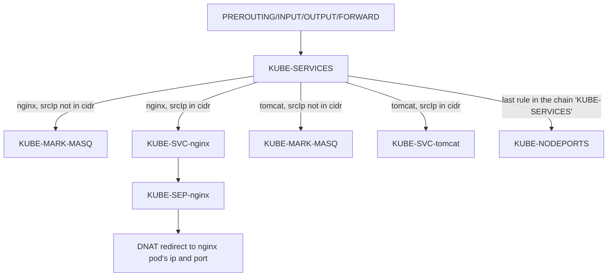
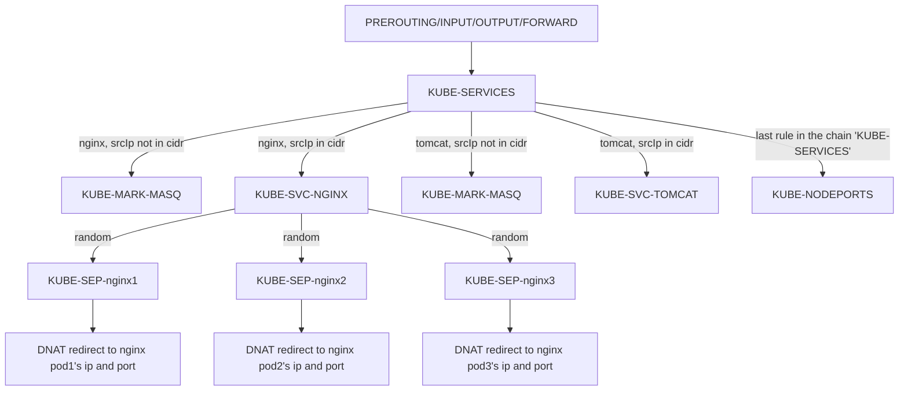

**阅读更多**

<!--more-->

# 1 综述


**pod的网络类型可以是容器网络也可以是主机网络，这里仅讨论容器网络这一类型的pod**

* **同主机pod互访**：`A->B`
* **pod访问外网**：`A->C->E`
* **跨主机pod互访**：`A->D->F->J->H`

# 2 kube-proxy

## 2.1 工作模式

### 2.1.1 Proxy-mode: userspace

1. **该模式最主要的特征是：流量重定向工作是由`kube-proxy`完成的，也就是在用户空间完成的**
1. `kube-proxy`会监听`Service`的创建和删除，当发现新的`Service`创建出来后，`kube-proxy`会在`localhost`网络开启一个随机端口（记为`loPort`）进行监听，同时向`iptable`写入路由规则（`Cluster IP:Port`->`localhost:loPort`），即将流向`Service`的流量转发到本地监听的端口上来
1. `kube-proxy`会监听`Endpoint`的变更，并将`Service`及其对应的`Pod`列表保存起来


在`Pod`中访问`Service`的时序图如下

```plantuml
skinparam backgroundColor #EEEBDC
skinparam handwritten true

skinparam sequence {
	ArrowColor DeepSkyBlue
	ActorBorderColor DeepSkyBlue
	LifeLineBorderColor blue
	LifeLineBackgroundColor #A9DCDF
	
	ParticipantBorderColor DeepSkyBlue
	ParticipantBackgroundColor DodgerBlue
	ParticipantFontName Impact
	ParticipantFontSize 17
	ParticipantFontColor #A9DCDF
	
	ActorBackgroundColor aqua
	ActorFontColor DeepSkyBlue
	ActorFontSize 17
	ActorFontName Aapex
}
participant Pod
participant coreDNS
participant iptables
participant kube_proxy as "kube proxy"
participant endpoint

Pod->coreDNS: 查询serviceName对应的Cluster IP
coreDNS-->Pod: return
Pod->iptables: traffic to Cluster IP
iptables->iptables: 规则匹配
iptables->kube_proxy: traffic to kube_proxy
kube_proxy->kube_proxy: 查询代理端口号和Service的映射关系，以及Service和Endpoint的映射关系
kube_proxy->endpoint: traffic to endpoint
```

### 2.1.2 Proxy-mode: iptables

1. **该模式最主要的特征是：流量重定向的工作是由`iptable`完成的，也就是在内核空间完成的**
1. `kube-proxy`会监听`Service`、`Endpoint`的变化，并且更新`iptable`的路由表
1. 更高效、安全，但是灵活性较差（当某个`Pod`没有应答时，不会尝试其他`Pod`）


在`Pod`中访问`Service`的时序图如下

```plantuml
skinparam backgroundColor #EEEBDC
skinparam handwritten true

skinparam sequence {
	ArrowColor DeepSkyBlue
	ActorBorderColor DeepSkyBlue
	LifeLineBorderColor blue
	LifeLineBackgroundColor #A9DCDF
	
	ParticipantBorderColor DeepSkyBlue
	ParticipantBackgroundColor DodgerBlue
	ParticipantFontName Impact
	ParticipantFontSize 17
	ParticipantFontColor #A9DCDF
	
	ActorBackgroundColor aqua
	ActorFontColor DeepSkyBlue
	ActorFontSize 17
	ActorFontName Aapex
}
participant Pod
participant coreDNS
participant iptables
participant endpoint

Pod->coreDNS: 查询serviceName对应的Cluster IP
coreDNS-->Pod: return
Pod->iptables: traffic to Cluster IP
iptables->iptables: 规则匹配
iptables->endpoint: traffic to remotePod
```

### 2.1.3 Proxy-mode: ipvs

与`iptable`模式类似，`ipvs`也是利用`netfilter`的`hook function`来实现的，但是`ipvs`利用的是哈希表，且工作在内核空间，因此效率非常高，同时`ipvs`还支持多种负载均衡算法

1. `rr`: round-rogin
1. `lc`: least connection
1. `dh`: destination hashing
1. `sh`: source hashing
1. `sed`: shortest expected delay
1. `nq`: never queue


在以上任何一种模式中，来自`Cluster IP:Port`的流量都会被重定向到其中一个后端`Pod`中，且用户不感知这些过程

## 2.2 自定义chain介绍


定义可以参考源码[proxier.go ](https://github.com/kubernetes/kubernetes/blob/master/pkg/proxy/iptables/proxier.go)

```golang
const (
	// the services chain
	kubeServicesChain utiliptables.Chain = "KUBE-SERVICES"

	// the external services chain
	kubeExternalServicesChain utiliptables.Chain = "KUBE-EXTERNAL-SERVICES"

	// the nodeports chain
	kubeNodePortsChain utiliptables.Chain = "KUBE-NODEPORTS"

	// the kubernetes postrouting chain
	kubePostroutingChain utiliptables.Chain = "KUBE-POSTROUTING"

	// KubeMarkMasqChain is the mark-for-masquerade chain
	KubeMarkMasqChain utiliptables.Chain = "KUBE-MARK-MASQ"

	// KubeMarkDropChain is the mark-for-drop chain
	KubeMarkDropChain utiliptables.Chain = "KUBE-MARK-DROP"

	// the kubernetes forward chain
	kubeForwardChain utiliptables.Chain = "KUBE-FORWARD"

	// kube proxy canary chain is used for monitoring rule reload
	kubeProxyCanaryChain utiliptables.Chain = "KUBE-PROXY-CANARY"
)
```

**KUBE-SERVICES**：所有的`service`（无论是`ClusterIP`、`NodePort`、`LoadBalance`，因为它们都有`ClusterIP`）都会存在一条或多条（每个端口映射对应一条规则）指向`KUBE-SVC-xxx`链的规则。而每个`KUBE-SVC-xxx`链的规则，依据副本数量的不同，会存在一个或多个指向`KUBE-SEP-xxx`链的规则（通过随机变量实现负载均衡）

**KUBE-NODEPORTS**：`NodePort`类型的`service`会存在一条或多条（每个端口映射对应一条规则）指向`KUBE-SVC-xxx`链的规则。而每个`KUBE-SVC-xxx`链的规则，依据副本数量的不同，会存在一个或多个指向`KUBE-SEP-xxx`链的规则（通过随机变量实现负载均衡）

**KUBE-MARK-MASQ**：用于给流量打上标签，配合`KUBE-POSTROUTING`链一起作用

**KUBE-POSTROUTING**：一般用于`SNAT`配置。对于通过`ClusterIP`访问某个服务的流量而言（`NodePort`同理，不再赘述），存在如下几种情况

* `sourceIp`不属于`podCidr`，会设置`SNAT`，这样服务看到的流量来源就是`cni0`（这样做的目的是？）
* `sourceIp`属于`podCidr`，但是与`ClusterIP`背后的`pod`的`IP`不同，不设置`SNAT`
* `sourceIp`属于`podCidr`，且与`ClusterIP`背后的`pod`的`IP`不同（自己访问自己），会设置`SNAT`，这样服务看到的流量来源就是`cni0`（这样做的目的是？）
* **即便不做SNAT，也是没有问题的，只不过服务看到的流量来源没有被隐藏（通过`iptables -t nat -I KUBE-POSTROUTING -j RETURN`可以禁用后续的规则）**

## 2.3 iptables规则链-示例讲解

### 2.3.1 nodeport-单副本

**deployment（hello-world-deployment.yml）**

```yaml
apiVersion: apps/v1
kind: Deployment
metadata:
  name: hello-world-deployment
  labels:
    mylabel: label_hello_world_deployment
spec:
  replicas: 1
  selector:
    matchLabels:
      mylabel: label_hello_world
  template:
    metadata:
      labels:
        mylabel: label_hello_world
    spec:
      containers:
      - name: hello-world
        image: registry.cn-hangzhou.aliyuncs.com/liuyehcf_default/liuye_repo:v1
        imagePullPolicy: IfNotPresent
        command: ["java", "-jar", "lib/spring-boot-1.0-SNAPSHOT.jar"]
        ports:
        - containerPort: 8080
```

**service（hello-world-service.yml）**

```yaml
apiVersion: v1
kind: Service
metadata:
  name: hello-world-service
spec:
  ports:
    - protocol: TCP
      port: 4000
      targetPort: 8080
      nodePort: 30001
  selector:
    mylabel: label_hello_world
  type: NodePort
```

创建`deployment`以及`service`

```sh
[root@k8s-master ~]$ kubectl apply -f hello-world-service.yml
#-------------------------↓↓↓↓↓↓-------------------------
service/hello-world-service created
#-------------------------↑↑↑↑↑↑-------------------------

[root@k8s-master ~]$ kubectl apply -f hello-world-deployment.yml
#-------------------------↓↓↓↓↓↓-------------------------
deployment.apps/hello-world-deployment created
#-------------------------↑↑↑↑↑↑-------------------------
```

查找一下该`pod`部署在哪个`node`上

```sh
[root@k8s-master ~]$ kubectl get pods -o wide
#-------------------------↓↓↓↓↓↓-------------------------
NAME                                     READY   STATUS    RESTARTS   AGE   IP           NODE      NOMINATED NODE   READINESS GATES
hello-world-deployment-cbdf4db7b-j6fpq   1/1     Running   0          56s   10.244.1.5   k8s-n-1   <none>           <none>
#-------------------------↑↑↑↑↑↑-------------------------
```

发现，应用部署在`k8s-n-1`上，查看`k8s-n-1`节点上的`iptables`规则，用`30001`作为条件过滤

```sh
[root@k8s-n-1 ~]$ iptables-save | grep '30001'
#-------------------------↓↓↓↓↓↓-------------------------
-A KUBE-NODEPORTS -p tcp -m comment --comment "default/hello-world-service:" -m tcp --dport 30001 -j KUBE-MARK-MASQ
-A KUBE-NODEPORTS -p tcp -m comment --comment "default/hello-world-service:" -m tcp --dport 30001 -j KUBE-SVC-5MRENC7Q6ZQR6GKR
#-------------------------↑↑↑↑↑↑-------------------------
```

我们找到了名为`KUBE-NODEPORTS`的`Chain`的两条规则，继续用`KUBE-NODEPORTS`寻找上游`Chain`

```sh
[root@k8s-n-1 ~]$ iptables-save | grep 'KUBE-NODEPORTS'
#-------------------------↓↓↓↓↓↓-------------------------
:KUBE-NODEPORTS - [0:0]
-A KUBE-NODEPORTS -p tcp -m comment --comment "default/hello-world-service:" -m tcp --dport 30001 -j KUBE-MARK-MASQ
-A KUBE-NODEPORTS -p tcp -m comment --comment "default/hello-world-service:" -m tcp --dport 30001 -j KUBE-SVC-5MRENC7Q6ZQR6GKR
-A KUBE-SERVICES -m comment --comment "kubernetes service nodeports; NOTE: this must be the last rule in this chain" -m addrtype --dst-type LOCAL -j KUBE-NODEPORTS
#-------------------------↑↑↑↑↑↑-------------------------
```

我们找到了名为`KUBE-SERVICES`的`Chain`的一条规则，继续用`KUBE-SERVICES`寻找上游`Chain`

```sh
[root@k8s-n-1 ~]$ iptables-save | grep 'KUBE-SERVICES'
#-------------------------↓↓↓↓↓↓-------------------------
:KUBE-SERVICES - [0:0]
-A INPUT -m conntrack --ctstate NEW -m comment --comment "kubernetes service portals" -j KUBE-SERVICES
-A FORWARD -m conntrack --ctstate NEW -m comment --comment "kubernetes service portals" -j KUBE-SERVICES
-A OUTPUT -m conntrack --ctstate NEW -m comment --comment "kubernetes service portals" -j KUBE-SERVICES
:KUBE-SERVICES - [0:0]
-A PREROUTING -m comment --comment "kubernetes service portals" -j KUBE-SERVICES
-A OUTPUT -m comment --comment "kubernetes service portals" -j KUBE-SERVICES
-A KUBE-SERVICES ! -s 10.244.0.0/16 -d 10.96.103.220/32 -p tcp -m comment --comment "default/hello-world-service: cluster IP" -m tcp --dport 4000 -j KUBE-MARK-MASQ
-A KUBE-SERVICES -d 10.96.103.220/32 -p tcp -m comment --comment "default/hello-world-service: cluster IP" -m tcp --dport 4000 -j KUBE-SVC-5MRENC7Q6ZQR6GKR
-A KUBE-SERVICES ! -s 10.244.0.0/16 -d 10.96.0.1/32 -p tcp -m comment --comment "default/kubernetes:https cluster IP" -m tcp --dport 443 -j KUBE-MARK-MASQ
-A KUBE-SERVICES -d 10.96.0.1/32 -p tcp -m comment --comment "default/kubernetes:https cluster IP" -m tcp --dport 443 -j KUBE-SVC-NPX46M4PTMTKRN6Y
-A KUBE-SERVICES ! -s 10.244.0.0/16 -d 10.96.0.10/32 -p udp -m comment --comment "kube-system/kube-dns:dns cluster IP" -m udp --dport 53 -j KUBE-MARK-MASQ
-A KUBE-SERVICES -d 10.96.0.10/32 -p udp -m comment --comment "kube-system/kube-dns:dns cluster IP" -m udp --dport 53 -j KUBE-SVC-TCOU7JCQXEZGVUNU
-A KUBE-SERVICES ! -s 10.244.0.0/16 -d 10.96.0.10/32 -p tcp -m comment --comment "kube-system/kube-dns:dns-tcp cluster IP" -m tcp --dport 53 -j KUBE-MARK-MASQ
-A KUBE-SERVICES -d 10.96.0.10/32 -p tcp -m comment --comment "kube-system/kube-dns:dns-tcp cluster IP" -m tcp --dport 53 -j KUBE-SVC-ERIFXISQEP7F7OF4
-A KUBE-SERVICES ! -s 10.244.0.0/16 -d 10.96.0.10/32 -p tcp -m comment --comment "kube-system/kube-dns:metrics cluster IP" -m tcp --dport 9153 -j KUBE-MARK-MASQ
-A KUBE-SERVICES -d 10.96.0.10/32 -p tcp -m comment --comment "kube-system/kube-dns:metrics cluster IP" -m tcp --dport 9153 -j KUBE-SVC-JD5MR3NA4I4DYORP
-A KUBE-SERVICES -m comment --comment "kubernetes service nodeports; NOTE: this must be the last rule in this chain" -m addrtype --dst-type LOCAL -j KUBE-NODEPORTS
#-------------------------↑↑↑↑↑↑-------------------------
```

我们发现，`PREROUTING`、`INPUT`、`FORWARD`、`OUTPUT`为`KUBE-SERVICES`的上游`Chain`

接着我们回到`Chain KUBE-NODEPORTS`的规则，继续往下游分析，查看`Chain KUBE-SVC-5MRENC7Q6ZQR6GKR`

```sh
[root@k8s-n-1 ~]$ iptables-save | grep 'KUBE-SVC-5MRENC7Q6ZQR6GKR'
#-------------------------↓↓↓↓↓↓-------------------------
:KUBE-SVC-5MRENC7Q6ZQR6GKR - [0:0]
-A KUBE-NODEPORTS -p tcp -m comment --comment "default/hello-world-service:" -m tcp --dport 30001 -j KUBE-SVC-5MRENC7Q6ZQR6GKR
-A KUBE-SERVICES -d 10.96.103.220/32 -p tcp -m comment --comment "default/hello-world-service: cluster IP" -m tcp --dport 4000 -j KUBE-SVC-5MRENC7Q6ZQR6GKR
-A KUBE-SVC-5MRENC7Q6ZQR6GKR -j KUBE-SEP-2KIVNDBOTOCNVG2U
#-------------------------↑↑↑↑↑↑-------------------------
```

找到了一条规则，该规则指向了另一个`Chain KUBE-SEP-2KIVNDBOTOCNVG2U`，继续往下查看

```sh
[root@k8s-n-1 ~]$ iptables-save | grep 'KUBE-SEP-2KIVNDBOTOCNVG2U'
#-------------------------↓↓↓↓↓↓-------------------------
:KUBE-SEP-2KIVNDBOTOCNVG2U - [0:0]
-A KUBE-SEP-2KIVNDBOTOCNVG2U -s 10.244.1.5/32 -j KUBE-MARK-MASQ
-A KUBE-SEP-2KIVNDBOTOCNVG2U -p tcp -m tcp -j DNAT --to-destination 10.244.1.5:8080
-A KUBE-SVC-5MRENC7Q6ZQR6GKR -j KUBE-SEP-2KIVNDBOTOCNVG2U
#-------------------------↑↑↑↑↑↑-------------------------
```

找到了一条DNAT规则，该规则将数据包的目的ip以及端口改写为`10.244.1.5`以及`8080`，然后继续查找路由表

```sh
[root@k8s-n-1 ~]$ ip r | grep '10.244.1.0/24'
#-------------------------↓↓↓↓↓↓-------------------------
10.244.1.0/24 dev cni0 proto kernel scope link src 10.244.1.1
#-------------------------↑↑↑↑↑↑-------------------------
```

我们发现，路由表指向的是`cni0`，每个pod都对应了一个`veth pair`，一端连接在网桥上，另一端在容器的网络命名空间中，我们可以通过`brctl`来查看网桥`cni0`的相关信息

```sh
[root@k8s-n-1 ~]$ brctl show cni0
#-------------------------↓↓↓↓↓↓-------------------------
bridge name	bridge id		STP enabled	interfaces
cni0		8000.2a11eb4c8527	no		veth8469bbce
#-------------------------↑↑↑↑↑↑-------------------------

[root@k8s-n-1 ~]$ brctl showmacs cni0
#-------------------------↓↓↓↓↓↓-------------------------
port no	mac addr		is local?	ageing timer
  2	a6:92:e2:fd:6c:9c	yes		   0.00
  2	a6:92:e2:fd:6c:9c	yes		   0.00
  2	ca:97:47:ed:dd:01	no		   3.75
#-------------------------↑↑↑↑↑↑-------------------------
```

可以看到，目前网桥`cni0`上只有一张网卡，该网卡类型是`veth`，veth是一对网卡，其中一张网卡在默认的网络命名空间中，另外一张网卡在pod的网络命名空间中。`brctl showmacs cni0`输出的三条数据中，其`port`都是2，代表这些对应着同一个网卡，即`veth`网卡，`is local`字段为`true`表示位于默认网络命名空间中，`is local`字段为`false`表示位于另一个网络命名空间中，接下来找到该docker的命名空间，然后进入该命名空间查看一下网卡的mac地址是否为`ca:97:47:ed:dd:01`，同时看一下该网卡的ip是否为`10.244.1.5`

* 注意，`brctl showmacs cni0`的输出中，`is local`为`false`的这条数据，`ageing timer`不是`0.00`，大约在300s后，这条数据将会消失。可以通过重新访问该`veth`网卡来激活（`ping`一下对应的`pod ip`）

```sh
# 其中 e464807dae4f 是容器id
[root@k8s-n-1 ~]$ pid=$(docker inspect -f '{{.State.Pid}}' e464807dae4f)
[root@k8s-n-1 ~]$ nsenter -t ${pid} -n ifconfig
#-------------------------↓↓↓↓↓↓-------------------------
eth0: flags=4163<UP,BROADCAST,RUNNING,MULTICAST>  mtu 1450
        inet 10.244.1.5  netmask 255.255.255.0  broadcast 0.0.0.0
        inet6 fe80::c897:47ff:feed:dd01  prefixlen 64  scopeid 0x20<link>
        ether ca:97:47:ed:dd:01  txqueuelen 0  (Ethernet)
        RX packets 64  bytes 6286 (6.1 KiB)
        RX errors 0  dropped 0  overruns 0  frame 0
        TX packets 49  bytes 5643 (5.5 KiB)
        TX errors 0  dropped 0 overruns 0  carrier 0  collisions 0

lo: flags=73<UP,LOOPBACK,RUNNING>  mtu 65536
        inet 127.0.0.1  netmask 255.0.0.0
        inet6 ::1  prefixlen 128  scopeid 0x10<host>
        loop  txqueuelen 1000  (Local Loopback)
        RX packets 0  bytes 0 (0.0 B)
        RX errors 0  dropped 0  overruns 0  frame 0
        TX packets 0  bytes 0 (0.0 B)
        TX errors 0  dropped 0 overruns 0  carrier 0  collisions 0
#-------------------------↑↑↑↑↑↑-------------------------
```

接着，我们看下在`k8s-n-2`节点上，路由规则是怎样的

```sh
[root@k8s-n-2 ~]$ ip r | grep '10.244.1.0/24'
#-------------------------↓↓↓↓↓↓-------------------------
10.244.1.0/24 via 10.244.1.0 dev flannel.1 onlink
#-------------------------↑↑↑↑↑↑-------------------------
```

可以看到，在`k8s-n-1`节点上，直接路由到了`flannel.1`这样网卡，然后通过`flannel`的网络（主机网络或覆盖网络）到达`k8s-n-1`上

**iptables规则链**



### 2.3.2 nodeport-多副本

**deployment（hello-world-deployment.yml）**

```yaml
apiVersion: apps/v1
kind: Deployment
metadata:
  name: hello-world-deployment
  labels:
    mylabel: label_hello_world_deployment
spec:
  replicas: 3 # 这里改成3副本
  selector:
    matchLabels:
      mylabel: label_hello_world
  template:
    metadata:
      labels:
        mylabel: label_hello_world
    spec:
      containers:
      - name: hello-world
        image: registry.cn-hangzhou.aliyuncs.com/liuyehcf_default/liuye_repo:v1
        imagePullPolicy: IfNotPresent
        command: ["java", "-jar", "lib/spring-boot-1.0-SNAPSHOT.jar"]
        ports:
        - containerPort: 8080
```

**service（hello-world-service.yml）**

```yaml
apiVersion: v1
kind: Service
metadata:
  name: hello-world-service
spec:
  ports:
    - protocol: TCP
      port: 4000
      targetPort: 8080
      nodePort: 30001
  selector:
    mylabel: label_hello_world
  type: NodePort
```

创建`deployment`以及`service`

```sh
[root@k8s-master ~]$ kubectl apply -f hello-world-service.yml
#-------------------------↓↓↓↓↓↓-------------------------
service/hello-world-service created
#-------------------------↑↑↑↑↑↑-------------------------

[root@k8s-master ~]$ kubectl apply -f hello-world-deployment.yml
#-------------------------↓↓↓↓↓↓-------------------------
deployment.apps/hello-world-deployment created
#-------------------------↑↑↑↑↑↑-------------------------
```

查看一下`pod`的部署情况

```sh
[root@k8s-master ~]$ kubectl get pods -o wide
#-------------------------↓↓↓↓↓↓-------------------------
NAME                                     READY   STATUS    RESTARTS   AGE     IP           NODE      NOMINATED NODE   READINESS GATES
hello-world-deployment-cbdf4db7b-5qflq   1/1     Running   0          5m      10.244.2.2   k8s-n-2   <none>           <none>
hello-world-deployment-cbdf4db7b-j6fpq   1/1     Running   1          5h35m   10.244.1.6   k8s-n-1   <none>           <none>
hello-world-deployment-cbdf4db7b-qc624   1/1     Running   0          5m      10.244.1.7   k8s-n-1   <none>           <none>
#-------------------------↑↑↑↑↑↑-------------------------
```

我们以`k8s-n-1`为例，首先以`NodePort`为关键字进行搜索

```sh
[root@k8s-n-1 ~]$ iptables-save | grep 30001
#-------------------------↓↓↓↓↓↓-------------------------
-A KUBE-NODEPORTS -p tcp -m comment --comment "default/hello-world-service:" -m tcp --dport 30001 -j KUBE-MARK-MASQ
-A KUBE-NODEPORTS -p tcp -m comment --comment "default/hello-world-service:" -m tcp --dport 30001 -j KUBE-SVC-5MRENC7Q6ZQR6GKR
#-------------------------↑↑↑↑↑↑-------------------------
```

上游`Chain`与单副本完全一致，不再赘述，继续沿着下游`Chain`进行分析，搜索`KUBE-SVC-5MRENC7Q6ZQR6GKR`关键词

```sh
[root@k8s-n-1 ~]$ iptables-save | grep KUBE-SVC-5MRENC7Q6ZQR6GKR
#-------------------------↓↓↓↓↓↓-------------------------
:KUBE-SVC-5MRENC7Q6ZQR6GKR - [0:0]
-A KUBE-NODEPORTS -p tcp -m comment --comment "default/hello-world-service:" -m tcp --dport 30001 -j KUBE-SVC-5MRENC7Q6ZQR6GKR
-A KUBE-SERVICES -d 10.96.103.220/32 -p tcp -m comment --comment "default/hello-world-service: cluster IP" -m tcp --dport 4000 -j KUBE-SVC-5MRENC7Q6ZQR6GKR
-A KUBE-SVC-5MRENC7Q6ZQR6GKR -m statistic --mode random --probability 0.33333333349 -j KUBE-SEP-NQUZNNDG4S4UQTZI
-A KUBE-SVC-5MRENC7Q6ZQR6GKR -m statistic --mode random --probability 0.50000000000 -j KUBE-SEP-XYEBSHB6XMTA6LVQ
-A KUBE-SVC-5MRENC7Q6ZQR6GKR -j KUBE-SEP-AFBU56PEPWZ4VPIJ
#-------------------------↑↑↑↑↑↑-------------------------
```

这里，我们就能发现单副本与多副本之间的差异了，在单副本的例子中，只有一条规则，而多副本的例子中，有多条规则（规则数量与副本数保持一致），并且使用了`statistic`模块，引入了随机因子，用于实现负载均衡的功能（`iptables -m statistic -h`查看该模块的参数），然后，分别查看三个下游`Chain`

```sh
[root@k8s-n-1 ~]$ iptables-save | grep KUBE-SEP-NQUZNNDG4S4UQTZI
#-------------------------↓↓↓↓↓↓-------------------------
:KUBE-SEP-NQUZNNDG4S4UQTZI - [0:0]
-A KUBE-SEP-NQUZNNDG4S4UQTZI -s 10.244.1.6/32 -j KUBE-MARK-MASQ
-A KUBE-SEP-NQUZNNDG4S4UQTZI -p tcp -m tcp -j DNAT --to-destination 10.244.1.6:8080
-A KUBE-SVC-5MRENC7Q6ZQR6GKR -m statistic --mode random --probability 0.33333333349 -j KUBE-SEP-NQUZNNDG4S4UQTZI
#-------------------------↑↑↑↑↑↑-------------------------

[root@k8s-n-1 ~]$ iptables-save | grep KUBE-SEP-XYEBSHB6XMTA6LVQ
#-------------------------↓↓↓↓↓↓-------------------------
:KUBE-SEP-XYEBSHB6XMTA6LVQ - [0:0]
-A KUBE-SEP-XYEBSHB6XMTA6LVQ -s 10.244.1.7/32 -j KUBE-MARK-MASQ
-A KUBE-SEP-XYEBSHB6XMTA6LVQ -p tcp -m tcp -j DNAT --to-destination 10.244.1.7:8080
-A KUBE-SVC-5MRENC7Q6ZQR6GKR -m statistic --mode random --probability 0.50000000000 -j KUBE-SEP-XYEBSHB6XMTA6LVQ
#-------------------------↑↑↑↑↑↑-------------------------

[root@k8s-n-1 ~]$ iptables-save | grep KUBE-SEP-AFBU56PEPWZ4VPIJ
#-------------------------↓↓↓↓↓↓-------------------------
:KUBE-SEP-AFBU56PEPWZ4VPIJ - [0:0]
-A KUBE-SEP-AFBU56PEPWZ4VPIJ -s 10.244.2.2/32 -j KUBE-MARK-MASQ
-A KUBE-SEP-AFBU56PEPWZ4VPIJ -p tcp -m tcp -j DNAT --to-destination 10.244.2.2:8080
-A KUBE-SVC-5MRENC7Q6ZQR6GKR -j KUBE-SEP-AFBU56PEPWZ4VPIJ
#-------------------------↑↑↑↑↑↑-------------------------
```

这里，可以看到，三个`Chain`，每个`Chain`分别配置了一个DNAT，指向某一个`pod`。后续的链路，如果在`pod`在本机，则走`cni0`网桥，否则就走`flannel`

**iptables规则链**



## 2.4 总结

1. 每个`node`上的`pod`，其子网都相同
1. 同个`node`之间`pod`相互访问，最终会走到`cni`网桥，该网桥等价于一个二层交换机，接着一对`veth`网卡，其中一段在默认的网络命名空间，另一端在`pod`的网络命名空间
1. 不同`node`之间的`pod`相互访问，最终会走到`flannel`

# 3 coreDNS

`coreDNS`是每个`Kubernetes`集群都会安装的系统组件，用于`Service`的解析，将服务名称解析成`ClusterIP`

一般来说，`coredns`以`deployment`运行在集群中（也可能是`daemonset`）

```sh
[root@k8s-master ~]$ kubectl get deployment -n kube-system
#-------------------------↓↓↓↓↓↓-------------------------
NAME            READY   UP-TO-DATE   AVAILABLE   AGE
coredns         2/2     2            2           149d
#-------------------------↑↑↑↑↑↑-------------------------
```

**下面，我们用一个pod来验证一下`dnsutils.yaml`，yaml文件内容如下，`dnsutils`这个镜像中包含了`dig`、`nslookup`等命令，换成其他任何包含这个两个命令的镜像都行**

```yaml
apiVersion: v1
kind: Pod
metadata:
  name: dnsutils
  namespace: default
spec:
  containers:
  - name: dnsutils
    image: gcr.io/kubernetes-e2e-test-images/dnsutils:1.3
    command:
      - sleep
      - "3600"
    imagePullPolicy: IfNotPresent
```

```sh
# 创建pod
[root@k8s-master ~]$ kubectl apply -f dnsutils.yaml
#-------------------------↓↓↓↓↓↓-------------------------
pod/dnsutils created
#-------------------------↑↑↑↑↑↑-------------------------

# 查看一下pod是否启动成功
[root@k8s-master ~]$ kubectl get pods
#-------------------------↓↓↓↓↓↓-------------------------
NAME                                      READY   STATUS    RESTARTS   AGE
dnsutils                                  1/1     Running   0          33s
#-------------------------↑↑↑↑↑↑-------------------------

# 看下default以及kube-system命名空间下各有什么service
[root@k8s-master ~]$ kubectl get svc
#-------------------------↓↓↓↓↓↓-------------------------
NAME                  TYPE        CLUSTER-IP       EXTERNAL-IP   PORT(S)          AGE
kubernetes            ClusterIP   10.96.0.1        <none>        443/TCP          28d
#-------------------------↑↑↑↑↑↑-------------------------
[root@k8s-master ~]$ kubectl get svc -n kube-system
#-------------------------↓↓↓↓↓↓-------------------------
NAME            TYPE        CLUSTER-IP       EXTERNAL-IP   PORT(S)                  AGE
kube-dns        ClusterIP   10.96.0.10       <none>        53/UDP,53/TCP,9153/TCP   149d
tiller-deploy   ClusterIP   10.108.160.127   <none>        44134/TCP                118d
#-------------------------↑↑↑↑↑↑-------------------------

# 查看/etc/resolv.conf，我们发现，指定的nameserver就是coredns的ClusterIP
[root@k8s-master ~]$ kubectl exec -it dnsutils -- cat /etc/resolv.conf
#-------------------------↓↓↓↓↓↓-------------------------
nameserver 10.96.0.10
search default.svc.cluster.local svc.cluster.local cluster.local hz.ali.com
options ndots:5
#-------------------------↑↑↑↑↑↑-------------------------

# 用nslookup查找位于相同命名空间下的服务 kubernetes
[root@k8s-master ~]$ kubectl exec -it dnsutils -- nslookup kubernetes
#-------------------------↓↓↓↓↓↓-------------------------
Server:		10.96.0.10
Address:	10.96.0.10#53

Name:	kubernetes.default.svc.cluster.local
Address: 10.96.0.1
#-------------------------↑↑↑↑↑↑-------------------------

# 用nslookup查找位于不同命名空间下的服务 tiller-deploy
[root@k8s-master ~]$ kubectl exec -it dnsutils -- nslookup tiller-deploy.kube-system
#-------------------------↓↓↓↓↓↓-------------------------
Server:		10.96.0.10
Address:	10.96.0.10#53

Non-authoritative answer:
Name:	tiller-deploy.kube-system.svc.cluster.local
Address: 10.108.160.127
#-------------------------↑↑↑↑↑↑-------------------------

# 清理资源
[root@k8s-master ~]$ kubectl delete -f dnsutils.yaml
#-------------------------↓↓↓↓↓↓-------------------------
pod "dnsutils" deleted
#-------------------------↑↑↑↑↑↑-------------------------
```

**接下来，将修改`dnsutils.yaml`，设置成`hostnetwork`，同时不指定`dnsPolicy`**

```yaml
apiVersion: v1
kind: Pod
metadata:
  name: dnsutils
  namespace: default
spec:
  hostNetwork: true
  containers:
  - name: dnsutils
    image: gcr.io/kubernetes-e2e-test-images/dnsutils:1.3
    command:
      - sleep
      - "3600"
    imagePullPolicy: IfNotPresent
```

```sh
# 创建pod
[root@k8s-master ~]$ kubectl apply -f dnsutils.yaml
#-------------------------↓↓↓↓↓↓-------------------------
pod/dnsutils created
#-------------------------↑↑↑↑↑↑-------------------------

# 查看一下pod是否启动成功
[root@k8s-master ~]$ kubectl get pods
#-------------------------↓↓↓↓↓↓-------------------------
NAME                                      READY   STATUS    RESTARTS   AGE
dnsutils                                  1/1     Running   0          29s
#-------------------------↑↑↑↑↑↑-------------------------

# 看下default以及kube-system命名空间下各有什么service
[root@k8s-master ~]$ kubectl get svc
#-------------------------↓↓↓↓↓↓-------------------------
NAME                  TYPE        CLUSTER-IP       EXTERNAL-IP   PORT(S)          AGE
kubernetes            ClusterIP   10.96.0.1        <none>        443/TCP          28d
#-------------------------↑↑↑↑↑↑-------------------------
[root@k8s-master ~]$ kubectl get svc -n kube-system
#-------------------------↓↓↓↓↓↓-------------------------
NAME            TYPE        CLUSTER-IP       EXTERNAL-IP   PORT(S)                  AGE
kube-dns        ClusterIP   10.96.0.10       <none>        53/UDP,53/TCP,9153/TCP   149d
tiller-deploy   ClusterIP   10.108.160.127   <none>        44134/TCP                118d
#-------------------------↑↑↑↑↑↑-------------------------

# 查看/etc/resolv.conf，我们发现，这个配置就是主机的配置
[root@k8s-master ~]$ kubectl exec -it dnsutils -- cat /etc/resolv.conf
#-------------------------↓↓↓↓↓↓-------------------------
nameserver 30.14.129.245
nameserver 30.14.128.82
nameserver 10.65.0.201
search hz.ali.com
#-------------------------↑↑↑↑↑↑-------------------------

# 用nslookup查找位于相同命名空间下的服务 kubernetes，查找不到
[root@k8s-master ~]$ kubectl exec -it dnsutils -- nslookup kubernetes
#-------------------------↓↓↓↓↓↓-------------------------
;; Got SERVFAIL reply from 30.14.129.245, trying next server
;; Got SERVFAIL reply from 30.14.128.82, trying next server
Server:		10.65.0.201
Address:	10.65.0.201#53

server cant find kubernetes: SERVFAIL

command terminated with exit code 1
#-------------------------↑↑↑↑↑↑-------------------------

# 清理资源
[root@k8s-master ~]$ kubectl delete -f dnsutils.yaml
#-------------------------↓↓↓↓↓↓-------------------------
pod "dnsutils" deleted
#-------------------------↑↑↑↑↑↑-------------------------
```

**我们继续修改`dnsutils.yaml`，设置成`hostnetwork`，同时将`dnsPolicy`设置为`ClusterFirstWithHostNet`**

```yaml
apiVersion: v1
kind: Pod
metadata:
  name: dnsutils
  namespace: default
spec:
  hostNetwork: true
  dnsPolicy: ClusterFirstWithHostNet
  containers:
  - name: dnsutils
    image: gcr.io/kubernetes-e2e-test-images/dnsutils:1.3
    command:
      - sleep
      - "3600"
    imagePullPolicy: IfNotPresent
```

```sh
# 创建pod
[root@k8s-master ~]$ kubectl apply -f dnsutils.yaml
#-------------------------↓↓↓↓↓↓-------------------------
pod/dnsutils created
#-------------------------↑↑↑↑↑↑-------------------------

# 查看一下pod是否启动成功
[root@k8s-master ~]$ kubectl get pods
#-------------------------↓↓↓↓↓↓-------------------------
NAME                                      READY   STATUS    RESTARTS   AGE
dnsutils                                  1/1     Running   0          42
#-------------------------↑↑↑↑↑↑-------------------------

# 看下default以及kube-system命名空间下各有什么service
[root@k8s-master ~]$ kubectl get svc
#-------------------------↓↓↓↓↓↓-------------------------
NAME                  TYPE        CLUSTER-IP       EXTERNAL-IP   PORT(S)          AGE
kubernetes            ClusterIP   10.96.0.1        <none>        443/TCP          28d
#-------------------------↑↑↑↑↑↑-------------------------
[root@k8s-master ~]$ kubectl get svc -n kube-system
#-------------------------↓↓↓↓↓↓-------------------------
NAME            TYPE        CLUSTER-IP       EXTERNAL-IP   PORT(S)                  AGE
kube-dns        ClusterIP   10.96.0.10       <none>        53/UDP,53/TCP,9153/TCP   149d
tiller-deploy   ClusterIP   10.108.160.127   <none>        44134/TCP                118d
#-------------------------↑↑↑↑↑↑-------------------------

# 查看/etc/resolv.conf，我们发现，指定的nameserver就是coredns的ClusterIP
[root@k8s-master ~]$ kubectl exec -it dnsutils -- cat /etc/resolv.conf
#-------------------------↓↓↓↓↓↓-------------------------
nameserver 10.96.0.10
search default.svc.cluster.local svc.cluster.local cluster.local hz.ali.com
options ndots:5
#-------------------------↑↑↑↑↑↑-------------------------

# 用nslookup查找位于相同命名空间下的服务 kubernetes
[root@k8s-master ~]$ kubectl exec -it dnsutils -- nslookup kubernetes
#-------------------------↓↓↓↓↓↓-------------------------
Server:		10.96.0.10
Address:	10.96.0.10#53

Name:	kubernetes.default.svc.cluster.local
Address: 10.96.0.1
#-------------------------↑↑↑↑↑↑-------------------------

# 用nslookup查找位于不同命名空间下的服务 tiller-deploy
[root@k8s-master ~]$ kubectl exec -it dnsutils -- nslookup tiller-deploy.kube-system
#-------------------------↓↓↓↓↓↓-------------------------
Server:		10.96.0.10
Address:	10.96.0.10#53

Non-authoritative answer:
Name:	tiller-deploy.kube-system.svc.cluster.local
Address: 10.108.160.127
#-------------------------↑↑↑↑↑↑-------------------------

# 清理资源
[root@k8s-master ~]$ kubectl delete -f dnsutils.yaml
#-------------------------↓↓↓↓↓↓-------------------------
pod "dnsutils" deleted
#-------------------------↑↑↑↑↑↑-------------------------
```

# 4 HostNetwork

使用主机网络后，`PodIP`就是主机`IP`，`ContainerPort`就是主机`Port`

如果一个设置了主机网络的`Pod`，想要通过`serviceName:servicePort`来访问其他服务的时候，需要将`dnsPolicy`配置成`ClusterFirstWithHostNet`

此外，如果配置了一个`Service`，以`NodePort`方式将设置了主机网络的`Pod`对外露出，可能会导致这样的问题：假设主机A上部署了一个主机网络的`Pod`，并且以`NodePort`对外露出，`NodePort=30001`，此时访问主机B的30001端口，请求有可能无法触达A，原因如下：

* `kube-proxy`设置的`iptables`规则可能会与用户设置的`iptables`规则冲突，因此`k8s`事先约定了一个NodePort范围，`30000-32767`，且在初始化集群时，需要指定一个网段用于分配`PodIP`，在这样的限制条件下，`kube-proxy`设置的`iptables`规则才能与用户原有的`iptables`规则互不影响
* 当服务以`NodePort`形式露出时，且`Pod`为容器网络时，`kube-proxy`会配置如下两条规则
    * 一条`DNAT`规则，改写目的端口为`NodePort`的IP数据包头，将其改为`PodIP`
    * 一条`FORWARD`规则，对应的网段就是`PodIP`的网段
* 当服务以`NodePort`形式露出，且`Pod`为主机网络时，只设置了一条`DNAT`规则，而一般来说，`FORWARD`的默认策略是`DROP`。因此
    * 当`Pod`的IP就是当前主机的IP时，直接走`INPUT`，进入本地网络协议栈，可以正常访问服务
    * 当`Pod`的IP是其他主机的IP时，经过`FORWARD`，由于没有配置对应的规则，流量被直接`DROP`，无法正常访问服务
* 解决方式：`iptables -P FORWARD ACCEPT`，将默认的`FORWARD`策略改为`ACCEPT`

# 5 问题排查

## 5.1 排查一般思路

### 5.1.1 步骤1：确认系统网络参数是否配置正确

**以下两个配置项，需要设置成1，否则iptables规则无法应用于二层转发（同主机的pod之间的网络通信走的是二层转发）**

1. net.bridge.bridge-nf-call-ip6tables
1. net.bridge.bridge-nf-call-iptables

**以下三个配置项，需要设置成1，否则流量从网卡`cni0`出来之后，无法forward到主机的外网网卡上，意味着，容器里面是无法访问公网的，具体表现就是在容器网络的容器中无法ping通外网ip**

1. net.ipv4.ip_forward
1. net.ipv4.conf.all.forwarding
1. net.ipv6.conf.all.forwarding

**如何修改配置**

```sh
# 临时修改
echo 1 > /proc/sys/net/bridge/bridge-nf-call-ip6tables
echo 1 > /proc/sys/net/bridge/bridge-nf-call-iptables
echo 1 > /proc/sys/net/ipv4/ip_forward
echo 1 > /proc/sys/net/ipv4/conf/all/forwarding
echo 1 > /proc/sys/net/ipv6/conf/all/forwarding

# 永久修改
cat >> /etc/sysctl.conf << 'EOF'
net.bridge.bridge-nf-call-ip6tables=1
net.bridge.bridge-nf-call-iptables=1
net.ipv4.ip_forward=1
net.ipv4.conf.all.forwarding=1
net.ipv6.conf.all.forwarding=1
EOF
sysctl -p /etc/sysctl.conf
```

### 5.1.2 步骤2：检查防火墙是否已关闭

systemctl status firewalld

### 5.1.3 步骤3：校验iptables中的DNAT规则的目的ip是否可访问

一般来说，DNAT的目的ip的流转方式有3类

1. 如果`目的ip`是当前主机的某个`podIp`，那么流量会转发到`cni0`，一般来说，这种情况都是没啥问题的
1. 如果`目的ip`是另一台主机的某个`podIp`，那么流量会转发到`flannel.1`，然后通过`overlay`转发到`podIp`所在的主机上
    * 可能的网络限制：由于overlay是通过udp转发的，需要检查下主机是否有针对udp的过滤配置
1. 如果`目的ip`是某个`机器的ip`，那么直接走外网网卡或者`lo`
    * 机器的ip如果变化了，那么iptables中记录的DNAT目的ip可能还是一个旧的主机ip，因此这个时候需要重启下pod，更新下iptables规则

### 5.1.4 步骤4：检查容器中/etc/resolv.conf配置是否有效

1. 对于`coredns`来说，容器内的`/etc/resolv.conf`文件是在容器创建的时候，从宿主机上拷贝的。如果主机恰好用的dhcp的方式获取ip，那么获取的dns地址很有可能是dhcp的地址，这个地址是可能会失效的
1. 对于普通的容器网络的容器来说，容器内的`/etc/resolv.conf`配置的是coredns的clusterIp，因此不需要改动
1. 对于主机网络，且dnsPolicy为`ClusterFirst`的容器来说，容器内的`/etc/resolv.conf`文件是在容器创建的时候，从宿主机上拷贝的。如果主机恰好用的dhcp的方式获取ip，那么获取的dns地址很有可能是dhcp的地址，这个地址是可能会失效的

## 5.2 排查手段

1. tcpdump抓包
1. iptables配置一些打印日志的规则

```sh
iptables -I INPUT -p icmp -j LOG --log-prefix "liuye-input: "
iptables -I FORWARD -p icmp -j LOG --log-prefix "liuye-forward: "
iptables -I OUTPUT -p icmp -j LOG --log-prefix "liuye-output: "
iptables -t nat -I PREROUTING -p icmp -j LOG --log-prefix "liuye-prerouting: "
iptables -t nat -I POSTROUTING -p icmp -j LOG --log-prefix "liuye-postrouting: "
```

## 5.3 容器网络不通

现象：在容器中，pingk8s域名失败，ping外网域名失败

kube-proxy包含如下日志：

```
W1009 12:41:47.192659       6 proxier.go:320] missing br-netfilter module or unset sysctl br-nf-call-iptables; proxy may not work as intended
```

原因就是没有开启`bridge-nf-call-iptables`，当`bridge-nf-call-iptables`开启时，在二层网桥转发的数据也会被iptables链进制规则限制，而同主机的pod直接的数据转发是直接通过网桥进行转发的，而网桥在二层网络进行数据处理，所以`bridge-nf-call-iptables`没有开启时，pod无法通过clusterIP访问同主机的pod

**如何开启**

1. `echo '1' > /proc/sys/net/bridge/bridge-nf-call-iptables`：立即生效，重启后还原为默认配置
1. `echo 'net.bridge.bridge-nf-call-iptables=1' >> /etc/sysctl.conf && sysctl -p /etc/sysctl.conf`：修改默认配置，重启后也能生效

# 6 参考

* [kubernetes入门之kube-proxy实现原理](https://xuxinkun.github.io/2016/07/22/kubernetes-proxy/)
* [kubernetes 简介：service 和 kube-proxy 原理](https://cizixs.com/2017/03/30/kubernetes-introduction-service-and-kube-proxy/)
* [kube-proxy工作原理](https://cloud.tencent.com/developer/article/1097449)
* [如何找到VEth设备的对端接口VEth peer](https://juejin.im/post/5caccf256fb9a06851504647)
* [技术干货|深入理解flannel](https://zhuanlan.zhihu.com/p/34749675)
* [Debugging DNS Resolution](https://kubernetes.io/docs/tasks/administer-cluster/dns-debugging-resolution/)
* [记一次pod无法通过clusterIP访问同主机其它pod的排障过程](https://yuyicai.com/posts/k8s-pod-can-not-conne-to-pod-with-clusterip/)
* [理解kubernetes环境的iptables](https://www.cnblogs.com/charlieroro/p/9588019.html)
* [Kubernetes Networking Demystified: A Brief Guide](https://www.stackrox.com/post/2020/01/kubernetes-networking-demystified/)
* [Kube Proxy 工作模式对比分析](https://blog.csdn.net/shida_csdn/article/details/104626839/)
* [IPVS从入门到精通kube-proxy实现原理](https://zhuanlan.zhihu.com/p/94418251)