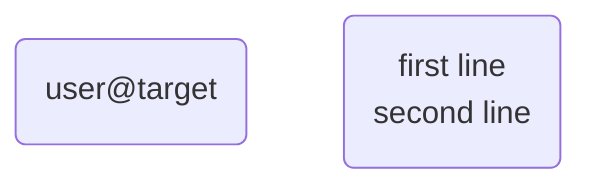
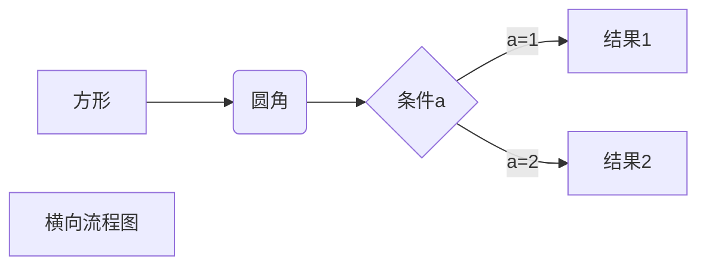
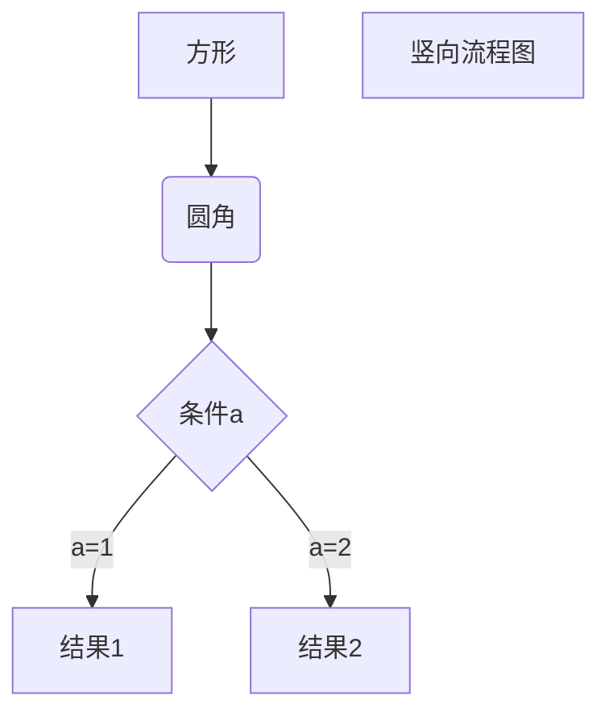
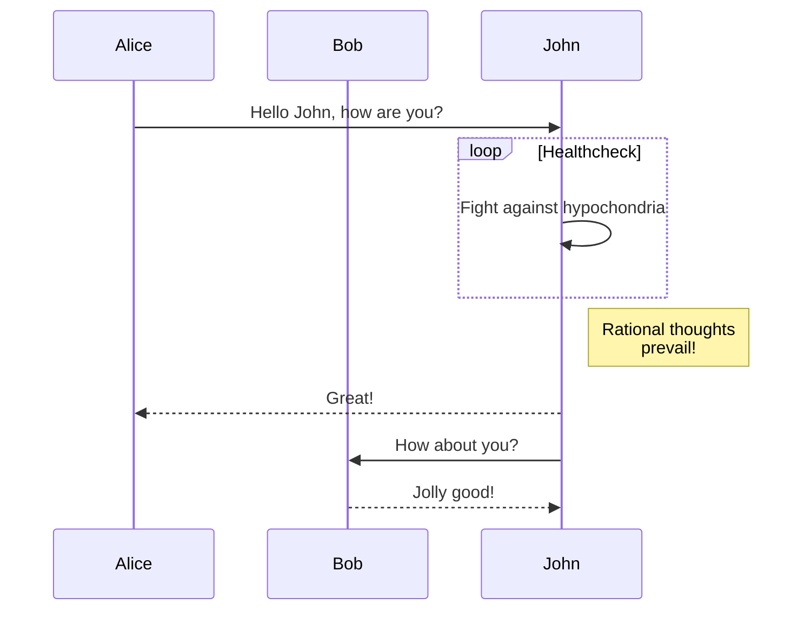
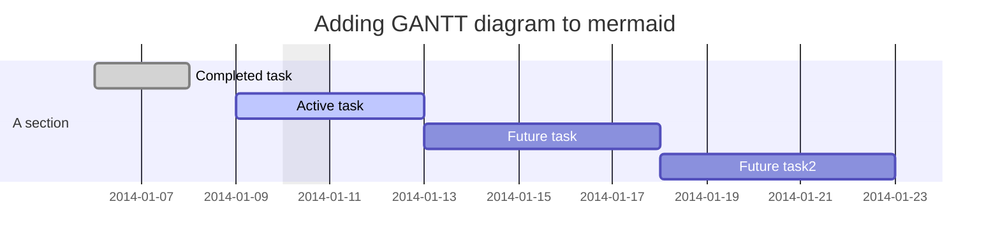
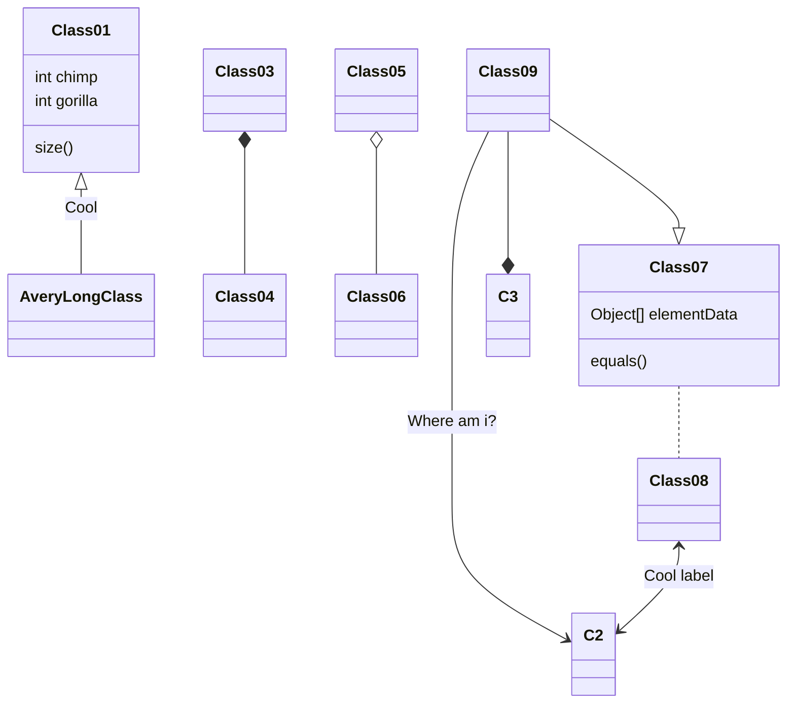

**阅读更多**

<!--more-->

# 1 基础语法

## 1.1 行内代码

```
`代码`
```

如果行内代码仅包含一个反引号，应该怎么写？如下

```
`` ` ``
`` `something` ``
```

效果：`` ` ``、`` `something` ``

## 1.2 代码diff

```diff
- before
+ after
```

## 1.3 标题跳转

**语法**

* `[跳转](#标题名)`
* 其中，如果标题名中间有空格，那么将空格替换为`-`

## 1.4 表格进阶

```
<table>
  <tr>
    <th rowspan="2" width="80px">锁状态</th>
    <th colspan="2" width="160px">25bit</th>
    <th rowspan="2" width="160px">4bit</th>
    <th width="80px">1bit</th>
    <th width="80px">2bit</th>
  </tr>
  <tr>
    <th>23bit</th>
    <th>2bit</th>
    <th>是否偏向锁</th>
    <th>锁标志位</th>
  </tr>
  <tr>
    <td>轻量级锁</td>
    <td colspan="4">指向栈中锁记录的指针</td>
    <td>00</td>
  </tr>
  <tr>
    <td>重量级锁</td>
    <td colspan="4">指向互斥量(重量级锁)的指针</td>
    <td>10</td>
  </tr>
  <tr>
    <td>GC标记</td>
    <td colspan="4">空</td>
    <td>11</td>
  </tr>
  <tr>
    <td>偏向锁</td>
    <td>线程ID</td>
    <td>Epoch</td>
    <td>对象分代年龄</td>
    <td>1</td>
    <td>01</td>
  </tr>
</table>
```

# 2 mermaid

* [mermaid-github](https://github.com/mermaid-js/mermaid)
* [mermaid-doc](https://mermaid.js.org/intro/)

## 2.1 Tips

1. 如何包含特殊符号？用引号，例如`item1("user@target")`
1. 如何换行？用`<br>`，例如`item2("first line<br>second line")`



## 2.2 流程图

Possible FlowChart orientations are:

* `TB` - Top to bottom
* `TD` - Top-down/ same as top to bottom
* `BT` - Bottom to top
* `RL` - Right to left
* `LR` - Left to right

### 2.2.1 横向

```
flowchart LR
    A[方形] -->B(圆角)
    B --> C{条件a}
    C -->|a=1| D[结果1]
    C -->|a=2| E[结果2]
    F[横向流程图]
```



### 2.2.2 纵向

```
flowchart TB
    A[方形] --> B(圆角)
    B --> C{条件a}
    C --> |a=1| D[结果1]
    C --> |a=2| E[结果2]
    F[竖向流程图]
```



## 2.3 时序图

```
sequenceDiagram
    participant Alice
    participant Bob
    Alice->>John: Hello John, how are you?
    loop Healthcheck
        John->>John: Fight against hypochondria
    end
    Note right of John: Rational thoughts <br/>prevail!
    John-->>Alice: Great!
    John->>Bob: How about you?
    Bob-->>John: Jolly good!
```



## 2.4 甘地图

```
gantt
    dateFormat  YYYY-MM-DD
    title Adding GANTT diagram to mermaid
    excludes weekdays 2014-01-10

    section A section
    Completed task            :done,    des1, 2014-01-06,2014-01-08
    Active task               :active,  des2, 2014-01-09, 3d
    Future task               :         des3, after des2, 5d
    Future task2               :         des4, after des3, 5d
```



## 2.5 类图

```
classDiagram
    Class01 <|-- AveryLongClass : Cool
    Class03 *-- Class04
    Class05 o-- Class06
    Class07 .. Class08
    Class09 --> C2 : Where am i?
    Class09 --* C3
    Class09 --|> Class07
    Class07 : equals()
    Class07 : Object[] elementData
    Class01 : size()
    Class01 : int chimp
    Class01 : int gorilla
    Class08 <--> C2: Cool label
```



# 3 plantuml

## 3.1 示例

**源码：**

```
skinparam backgroundColor #EEEBDC
skinparam handwritten true

skinparam sequence {
	ArrowColor DeepSkyBlue
	ActorBorderColor DeepSkyBlue
	LifeLineBorderColor blue
	LifeLineBackgroundColor #A9DCDF
	
	ParticipantBorderColor DeepSkyBlue
	ParticipantBackgroundColor DodgerBlue
	ParticipantFontName Impact
	ParticipantFontSize 17
	ParticipantFontColor #A9DCDF
	
	ActorBackgroundColor aqua
	ActorFontColor DeepSkyBlue
	ActorFontSize 17
	ActorFontName Aapex
}

actor User
box "foo1"
participant "First Class" as A
end box
box "foo2"
participant "Second Class" as B
end box
box "foo3"
participant "Last Class" as C
end box

User -> A: DoWork
activate A

A -> B: Create Request
activate B

B -> C: DoWork
activate C
C --> B: WorkDone
destroy C

B --> A: Request Created
deactivate B

A --> User: Done
deactivate A
```

**效果图：**

```plantuml
skinparam backgroundColor #EEEBDC
skinparam handwritten true

skinparam sequence {
	ArrowColor DeepSkyBlue
	ActorBorderColor DeepSkyBlue
	LifeLineBorderColor blue
	LifeLineBackgroundColor #A9DCDF
	
	ParticipantBorderColor DeepSkyBlue
	ParticipantBackgroundColor DodgerBlue
	ParticipantFontName Impact
	ParticipantFontSize 17
	ParticipantFontColor #A9DCDF
	
	ActorBackgroundColor aqua
	ActorFontColor DeepSkyBlue
	ActorFontSize 17
	ActorFontName Aapex
}

actor User
box "foo1"
participant "First Class" as A
end box
box "foo2"
participant "Second Class" as B
end box
box "foo3"
participant "Last Class" as C
end box

User -> A: DoWork
activate A

A -> B: Create Request
activate B

B -> C: DoWork
activate C
C --> B: WorkDone
destroy C

B --> A: Request Created
deactivate B

A --> User: Done
deactivate A
```

## 3.2 查看所有可用的参数

**源码：**

```
help skinparams
```

**示例：**

```plantuml
help skinparams
```

## 3.3 参考

* [Ashley's PlantUML Doc](https://plantuml-documentation.readthedocs.io/en/latest/formatting/all-skin-params.html)
* [PlantUML Doc](https://plantuml.com/zh/sequence-diagram)
* [Skinparam](http://plantuml.com/zh/skinparam)
* [Markdown 高级技巧](https://www.runoob.com/markdown/md-advance.html)
* [About Mermaid](https://mermaid-js.github.io/mermaid/#/)
* [Hexo中引入Mermaid流程图](https://tyloafer.github.io/posts/7790/)
