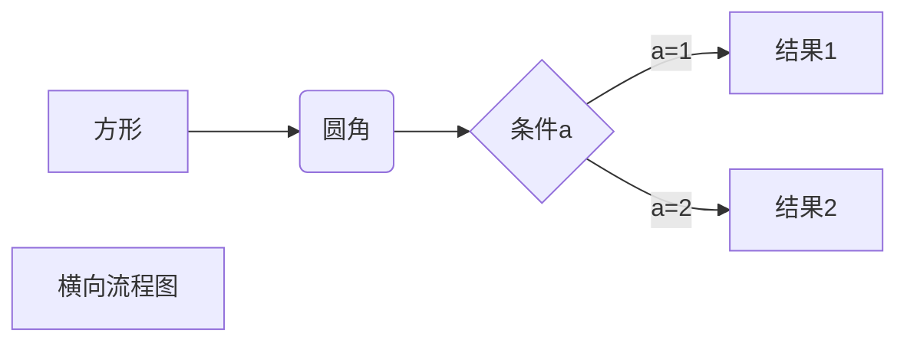
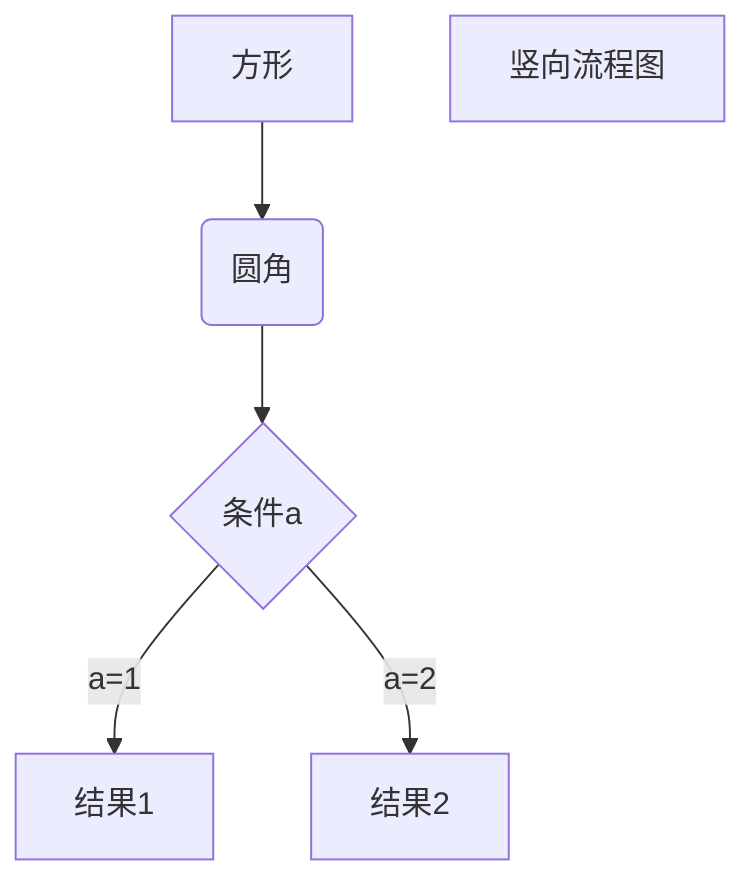

__阅读更多__

<!--more-->

# 1 Math

[Hexo渲染LaTeX公式](https://www.jianshu.com/p/9b9c241146bc)

[MathJax-配置](http://theme-next.iissnan.com/third-party-services.html#mathjax)

__禁止markdown对`-`、`\\`、`\{`、`\}`等进行转义__：修改配置文件`node_modules/marked/lib/marked.js`

将

```
escape: /^\\([\\`*{}\[\]()# +\-.!_>])/,
```

替换为

```
escape: /^\\([`*\[\]()# +\-.!_>])/,
```

将

```
em: /^\b_((?:[^_]|__)+?)_\b|^\*((?:\*\*|[\s\S])+?)\*(?!\*)/,
```

替换为

```
em: /^\*((?:\*\*|[\s\S])+?)\*(?!\*)/,
```

# 2 来必力评论系统

[来必力-配置](http://theme-next.iissnan.com/third-party-services.html#livere)

# 3 mermaid流程图

[hexo-filter-mermaid-diagrams](https://github.com/webappdevelp/hexo-filter-mermaid-diagrams)

__步骤1：安装插件__

```sh
npm install hexo-filter-mermaid-diagrams --save
```

__步骤2：修改主题配置文件`themes/next/_config.yml`，找到`mermaid`的配置项，将`enable`改为true即可__

## 3.1 效果：横向流程图

__源码：__

```
graph LR
A[方形] -->B(圆角)
    B --> C{条件a}
    C -->|a=1| D[结果1]
    C -->|a=2| E[结果2]
    F[横向流程图]
```

__渲染后：__



## 3.2 效果：竖向流程图

__源码：__

```
graph TD
A[方形] --> B(圆角)
    B --> C{条件a}
    C --> |a=1| D[结果1]
    C --> |a=2| E[结果2]
    F[竖向流程图]
```

__渲染后：__



# 4 plantuml时序图

__步骤1：安装插件__

```sh
npm install hexo-filter-plantuml --save
```

## 4.1 效果

__源码：__

```
skinparam backgroundColor #EEEBDC
skinparam handwritten true

skinparam sequence {
	ArrowColor DeepSkyBlue
	ActorBorderColor DeepSkyBlue
	LifeLineBorderColor blue
	LifeLineBackgroundColor #A9DCDF
	
	ParticipantBorderColor DeepSkyBlue
	ParticipantBackgroundColor DodgerBlue
	ParticipantFontName Impact
	ParticipantFontSize 17
	ParticipantFontColor #A9DCDF
	
	ActorBackgroundColor aqua
	ActorFontColor DeepSkyBlue
	ActorFontSize 17
	ActorFontName Aapex
}

actor User
box "foo1"
participant "First Class" as A
end box
box "foo2"
participant "Second Class" as B
end box
box "foo3"
participant "Last Class" as C
end box

User -> A: DoWork
activate A

A -> B: Create Request
activate B

B -> C: DoWork
activate C
C --> B: WorkDone
destroy C

B --> A: Request Created
deactivate B

A --> User: Done
deactivate A
```

__渲染后：__

```plantuml
skinparam backgroundColor #EEEBDC
skinparam handwritten true

skinparam sequence {
	ArrowColor DeepSkyBlue
	ActorBorderColor DeepSkyBlue
	LifeLineBorderColor blue
	LifeLineBackgroundColor #A9DCDF
	
	ParticipantBorderColor DeepSkyBlue
	ParticipantBackgroundColor DodgerBlue
	ParticipantFontName Impact
	ParticipantFontSize 17
	ParticipantFontColor #A9DCDF
	
	ActorBackgroundColor aqua
	ActorFontColor DeepSkyBlue
	ActorFontSize 17
	ActorFontName Aapex
}

actor User
box "foo1"
participant "First Class" as A
end box
box "foo2"
participant "Second Class" as B
end box
box "foo3"
participant "Last Class" as C
end box

User -> A: DoWork
activate A

A -> B: Create Request
activate B

B -> C: DoWork
activate C
C --> B: WorkDone
destroy C

B --> A: Request Created
deactivate B

A --> User: Done
deactivate A
```

# 5 flow流程图

[hexo-filter-flowchart](https://github.com/bubkoo/hexo-filter-flowchart)

__步骤1：安装插件__

```sh
npm install hexo-filter-flowchart --save 
```

## 5.1 效果：纵向流程图

__源码：__

```
st=>start: 开始框
op=>operation: 处理框
cond=>condition: 判断框(是或否?)
sub1=>subroutine: 子流程
io=>inputoutput: 输入输出框
e=>end: 结束框
st->op->cond
cond(yes)->io->e
cond(no)->sub1(right)->op
```

__渲染后：__

```flow
st=>start: 开始框
op=>operation: 处理框
cond=>condition: 判断框(是或否?)
sub1=>subroutine: 子流程
io=>inputoutput: 输入输出框
e=>end: 结束框
st->op->cond
cond(yes)->io->e
cond(no)->sub1(right)->op
```

## 5.2 效果：横向流程图

__源码：__

```
st=>start: 开始框
op=>operation: 处理框
cond=>condition: 判断框(是或否?)
sub1=>subroutine: 子流程
io=>inputoutput: 输入输出框
e=>end: 结束框
st(right)->op(right)->cond
cond(yes)->io(bottom)->e
cond(no)->sub1(right)->op
```

__渲染后：__

```flow
st=>start: 开始框
op=>operation: 处理框
cond=>condition: 判断框(是或否?)
sub1=>subroutine: 子流程
io=>inputoutput: 输入输出框
e=>end: 结束框
st(right)->op(right)->cond
cond(yes)->io(bottom)->e
cond(no)->sub1(right)->op
```

# 6 sequence时序图

[hexo-filter-sequence](https://github.com/bubkoo/hexo-filter-sequence)

# 7 目录功能

[hexo-toc](https://github.com/bubkoo/hexo-toc)

# 8 访问统计

[阅读次数统计-配置](http://theme-next.iissnan.com/third-party-services.html#analytics-tencent-mta)

# 9 本地搜索

[本地搜索-配置](http://theme-next.iissnan.com/third-party-services.html#local-search)

[搜索失效](https://www.v2ex.com/amp/t/298727)

[Mac 上的 VSCode 编写 Markdown 总是出现隐藏字符？](https://www.zhihu.com/question/61638859)

# 10 背景动画

[背景动画-配置](http://theme-next.iissnan.com/theme-settings.html#use-bg-animation)

# 11 增加菜单

`hexo new page "explore"`

修改主题配置文件`/themes/next/_config.yml`

```
menu:
  home: / || home
  about: /about/ || user
  tags: /tags/ || tags
  categories: /categories/ || th
  archives: /archives/ || archive
  explore: /explore/ || sitemap # 添加这个
```

修改国际化配置文件`/themes/next/languages/_en.yml`

```
menu:
  home: Home
  archives: Archives
  categories: Categories
  tags: Tags
  about: About
  explore: Explore  # 添加这个
  search: Search
  schedule: Schedule
  sitemap: Sitemap
  commonweal: Commonweal 404
```

修改国际化配置文件`/themes/next/languages/zh-CN.yml`

```
menu:
  home: 首页
  archives: 归档
  categories: 分类
  tags: 标签
  about: 关于
  explore: 发现  # 添加这个
  search: 搜索
  schedule: 日程表
  sitemap: 站点地图
  commonweal: 公益404
```

# 12 hexo相关的项目

| 项目 | 描述 |
|:--|:--|
| [theme-yilia](https://github.com/litten/hexo-theme-yilia) | hexo主题 |
| [theme-next](https://github.com/theme-next/hexo-theme-next) | hexo主题 |
| [hexo-filter-sequence](https://github.com/bubkoo/hexo-filter-sequence) | hexo插件-序列图 |
| [hexo-filter-mermaid-diagrams](https://github.com/webappdevelp/hexo-filter-mermaid-diagrams) | hexo插件-序列图 |
| [hexo-filter-plantuml](https://github.com/wafer-li/hexo-filter-plantuml) | hexo插件-高级时序图 |
| [hexo-filter-flowchart](https://github.com/bubkoo/hexo-filter-flowchart) | hexo插件-流程图 |
| [hexo-toc](https://github.com/bubkoo/hexo-toc) | hexo插件-目录 |
| [hexo-wordcount](https://github.com/willin/hexo-wordcount) | hexo插件-字数统计 |
| [hexo-symbols-count-time](https://github.com/theme-next/hexo-symbols-count-time) | 阅读时间统计 |

# 13 取消侧栏编号

主题配置文件修改如下配置，将number改为false即可

```sh
toc:
  enable: true

  # Automatically add list number to toc.
  number: false 

  # If true, all words will placed on next lines if header width longer then sidebar width.
  wrap: false
```

# 14 修改行内代码样式

修改方式：在`themes/next/source/css/_custom/custom.styl`中增加如下代码

```css
// Custom styles.
code {
    color: #C33258;
    background: #F9F2F4;
    margin: 2px;
}
```

# 15 修改链接样式

链接即如下的语法

```

[description](url)
```

修改方式：在`themes\next\source\css\_common\components\post\post.styl`中增加如下代码

```css
// 文章链接文本样式
.post-body p a{
  color: #0593d3;
  border-bottom: none;
  border-bottom: 1px solid #0593d3;
  &:hover {
    color: #fc6423;
    border-bottom: none;
    border-bottom: 1px solid #fc6423;
  }
}
```

# 16 deploy

```sh
npm install hexo-deployer-git --save
```

[nodejs更新后hexo没法deploy](https://blog.csdn.net/qq_41535611/article/details/106309335)

# 17 参考

* [next官方文档](http://theme-next.iissnan.com/getting-started.html)
* [搭建一个支持LaTEX的hexo博客](http://blog.csdn.net/emptyset110/article/details/50123231)
* [用 Hexo 搭建个人博客-02：进阶试验](http://www.jianshu.com/p/6c1196f12302)
* [Hexo文章简单加密访问](https://www.jianshu.com/p/a2330937de6c)
* [hexo的next主题个性化配置教程](https://segmentfault.com/a/1190000009544924)
* [icon库](https://fontawesome.com/icons?d=gallery)
* [Leancloud访客统计插件重大安全漏洞修复指南](https://leaferx.online/2018/02/11/lc-security/)
* [hexo的next主题个性化教程:打造炫酷网站](http://shenzekun.cn/hexo%E7%9A%84next%E4%B8%BB%E9%A2%98%E4%B8%AA%E6%80%A7%E5%8C%96%E9%85%8D%E7%BD%AE%E6%95%99%E7%A8%8B.html)
* [hexo-filter-plantuml](https://github.com/wafer-li/hexo-filter-plantuml)
* [时序图](http://plantuml.com/sequence-diagram)
* [Hexo中引入Mermaid流程图](https://tyloafer.github.io/posts/7790/)
