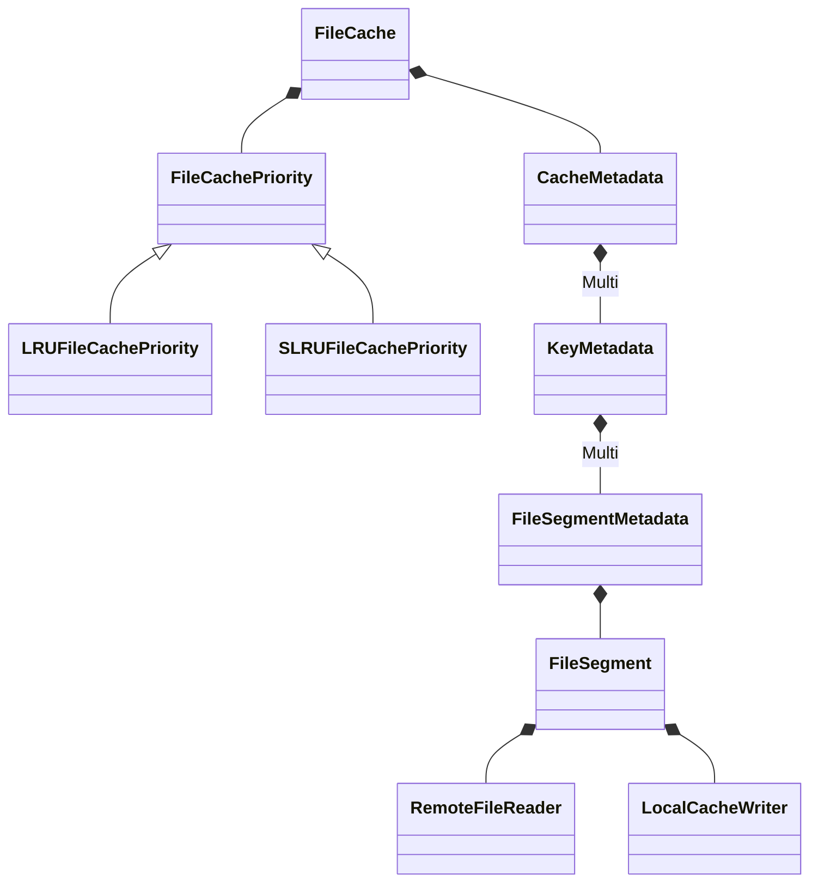

# 1 Storage

## 1.1 File Cache

* [Local cache for remote filesystem (RFC)](https://github.com/ClickHouse/ClickHouse/issues/28961)
* [Local cache for remote filesystem](https://github.com/ClickHouse/ClickHouse/pull/33717)

## 1.2 User Space Cache

* [Userspace page cache again](https://github.com/ClickHouse/ClickHouse/pull/60552)

# 2 RoadMap

[Roadmap 2025 (discussion)](https://github.com/ClickHouse/ClickHouse/issues/74046)

# 3 Assorted

1. [COW.h](https://github.com/ClickHouse/ClickHouse/blob/master/src/Common/COW.h)
