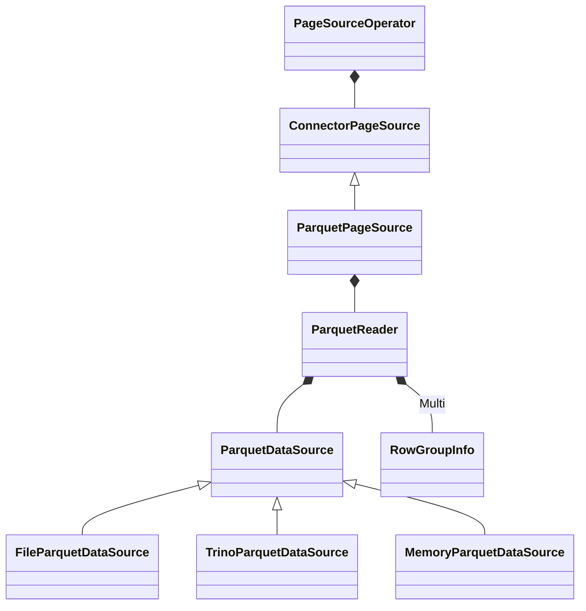

# 1 Concept

* `Page`: A `Page` represents a single unit of data that the engine processes at one time. Each page contains a collection of rows, but unlike traditional row-based storage, Trino structures these in a columnar format for processing efficiency
* `Block`: A `Block` is the core data structure within a `Page`. Each block represents the data for a single column within a page
* `ConnectorPageSource`: `ConnectorPageSource` is an interface that data connectors implement to read data from a specific data source. It abstracts the details of how data is accessed from underlying storage systems, whether those are relational databases, NoSQL databases, file systems, or cloud storage. Each connector tailored to a particular storage system implements this interface to translate data from the storage-specific format to the format Trino uses for processing

# 2 Data Lake

